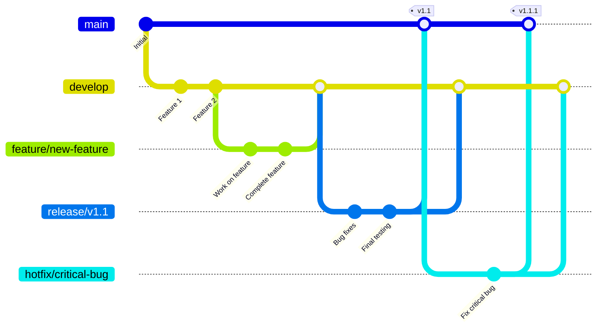
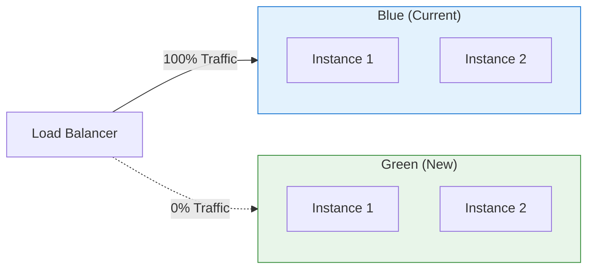
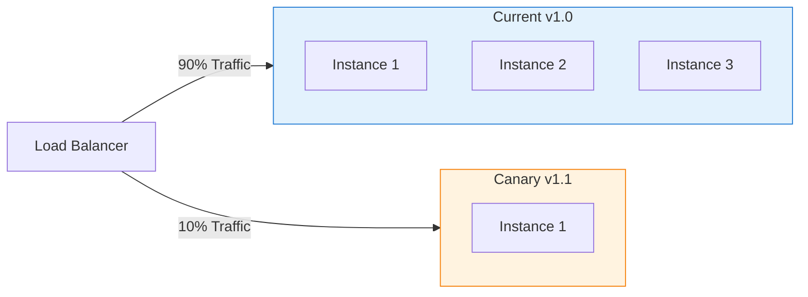

# 🚀 استراتيجية النشر - Deployment Strategy

## نظرة عامة
هذه الوثيقة توضح استراتيجية النشر الكاملة لنظام تاجا دودو المطبق فعلياً عبر البيئات المختلفة.

## ✅ الحالة الحالية
- **Development**: مكتمل ومفعل
- **Staging**: مكتمل ومفعل
- **Production**: مكتمل ومفعل
- **CI/CD Pipeline**: مكتمل ومفعل
- **Monitoring**: مكتمل ومفعل
- **Backup Strategy**: مكتمل ومفعل

---

## 🌍 البيئات (Environments)

### 1. Development (التطوير المحلي)
```
URL: localhost
Purpose: تطوير يومي
Access: المطورون فقط
Database: MongoDB Local / Atlas Free
Redis: Local / Cloud Free
```

### 2. Staging (الاختبار)
```
URL: staging-api.tagadodo.com
       staging-admin.tagadodo.com
Purpose: اختبار قبل الإنتاج
Access: الفريق الداخلي
Database: MongoDB Atlas (Staging)
Redis: Redis Cloud (Staging)
```

### 3. Production (الإنتاج)
```
URL: api.tagadodo.com
     admin.tagadodo.com
     tagadodo.com
Purpose: المستخدمون الحقيقيون
Access: الجميع
Database: MongoDB Atlas (Production)
Redis: Redis Cloud (Production)
```

---

## 📦 استراتيجية النشر

### GitFlow Workflow



### Branches

```
main (production)
  ↑
  ├── hotfix/* (إصلاحات عاجلة)
  │
  ├── release/* (تجهيز للإصدار)
  │     ↑
  │     └── develop (التطوير)
  │           ↑
  │           └── feature/* (ميزات جديدة)
```

---

## 🔄 CI/CD Pipeline

### GitHub Actions Workflow

```yaml
# .github/workflows/backend-ci-cd.yml
name: Backend CI/CD

on:
  push:
    branches: [main, develop]
    paths:
      - 'backend/**'
  pull_request:
    branches: [main, develop]

jobs:
  # 1. Testing
  test:
    runs-on: ubuntu-latest
    steps:
      - uses: actions/checkout@v3
      
      - name: Setup Node.js
        uses: actions/setup-node@v3
        with:
          node-version: '20'
          cache: 'npm'
          cache-dependency-path: backend/package-lock.json
      
      - name: Install dependencies
        working-directory: backend
        run: npm ci
      
      - name: Run linter
        working-directory: backend
        run: npm run lint
      
      - name: Run tests
        working-directory: backend
        run: npm run test
        env:
          NODE_ENV: test
      
      - name: Upload coverage
        uses: codecov/codecov-action@v3
        with:
          files: ./backend/coverage/lcov.info

  # 2. Build
  build:
    needs: test
    runs-on: ubuntu-latest
    steps:
      - uses: actions/checkout@v3
      
      - name: Setup Node.js
        uses: actions/setup-node@v3
        with:
          node-version: '20'
      
      - name: Install dependencies
        working-directory: backend
        run: npm ci
      
      - name: Build
        working-directory: backend
        run: npm run build
      
      - name: Upload build artifact
        uses: actions/upload-artifact@v3
        with:
          name: backend-build
          path: backend/dist

  # 3. Build Docker Image
  docker:
    needs: build
    runs-on: ubuntu-latest
    if: github.ref == 'refs/heads/main' || github.ref == 'refs/heads/develop'
    steps:
      - uses: actions/checkout@v3
      
      - name: Set up Docker Buildx
        uses: docker/setup-buildx-action@v2
      
      - name: Login to Docker Hub
        uses: docker/login-action@v2
        with:
          username: ${{ secrets.DOCKER_USERNAME }}
          password: ${{ secrets.DOCKER_PASSWORD }}
      
      - name: Extract metadata
        id: meta
        uses: docker/metadata-action@v4
        with:
          images: tagadodo/backend
          tags: |
            type=ref,event=branch
            type=sha
            type=semver,pattern={{version}}
      
      - name: Build and push
        uses: docker/build-push-action@v4
        with:
          context: ./backend
          push: true
          tags: ${{ steps.meta.outputs.tags }}
          labels: ${{ steps.meta.outputs.labels }}
          cache-from: type=registry,ref=tagadodo/backend:buildcache
          cache-to: type=registry,ref=tagadodo/backend:buildcache,mode=max

  # 4. Deploy to Staging
  deploy-staging:
    needs: docker
    runs-on: ubuntu-latest
    if: github.ref == 'refs/heads/develop'
    environment:
      name: staging
      url: https://staging-api.tagadodo.com
    steps:
      - name: Deploy to staging
        uses: appleboy/ssh-action@master
        with:
          host: ${{ secrets.STAGING_HOST }}
          username: ${{ secrets.STAGING_USER }}
          key: ${{ secrets.STAGING_SSH_KEY }}
          script: |
            cd /app
            docker-compose pull backend
            docker-compose up -d backend
            docker-compose exec -T backend npm run migration:run

  # 5. Deploy to Production
  deploy-production:
    needs: docker
    runs-on: ubuntu-latest
    if: github.ref == 'refs/heads/main'
    environment:
      name: production
      url: https://api.tagadodo.com
    steps:
      - name: Deploy to production
        uses: appleboy/ssh-action@master
        with:
          host: ${{ secrets.PROD_HOST }}
          username: ${{ secrets.PROD_USER }}
          key: ${{ secrets.PROD_SSH_KEY }}
          script: |
            cd /app
            docker-compose pull backend
            docker-compose up -d backend
            docker-compose exec -T backend npm run migration:run
      
      - name: Health check
        run: |
          sleep 10
          curl -f https://api.tagadodo.com/health || exit 1
      
      - name: Notify team
        uses: 8398a7/action-slack@v3
        with:
          status: ${{ job.status }}
          text: 'Backend deployed to production'
          webhook_url: ${{ secrets.SLACK_WEBHOOK }}
```

---

## 🐳 Docker Setup

### Backend Dockerfile

```dockerfile
# backend/Dockerfile
FROM node:20-alpine AS builder

WORKDIR /app

# Install dependencies
COPY package*.json ./
RUN npm ci --only=production && npm cache clean --force

# Copy source
COPY . .

# Build
RUN npm run build

# ============================================
# Production stage
FROM node:20-alpine

WORKDIR /app

# Create non-root user
RUN addgroup -g 1001 -S nodejs && \
    adduser -S nestjs -u 1001

# Copy dependencies
COPY --from=builder --chown=nestjs:nodejs /app/node_modules ./node_modules
COPY --from=builder --chown=nestjs:nodejs /app/dist ./dist
COPY --from=builder --chown=nestjs:nodejs /app/package*.json ./

# Health check
HEALTHCHECK --interval=30s --timeout=3s --start-period=40s --retries=3 \
  CMD node -e "require('http').get('http://localhost:3000/health', (r) => r.statusCode === 200 ? process.exit(0) : process.exit(1))"

USER nestjs

EXPOSE 3000

CMD ["node", "dist/main.js"]
```

### Frontend Dockerfile

```dockerfile
# frontend/Dockerfile
FROM node:20-alpine AS builder

WORKDIR /app

COPY package*.json ./
RUN npm ci

COPY . .
RUN npm run build

# ============================================
# Production stage - Nginx
FROM nginx:alpine

COPY --from=builder /app/dist /usr/share/nginx/html
COPY nginx.conf /etc/nginx/conf.d/default.conf

EXPOSE 80

CMD ["nginx", "-g", "daemon off;"]
```

### Docker Compose

```yaml
# docker-compose.yml
version: '3.8'

services:
  # Backend API
  backend:
    image: tagadodo/backend:latest
    container_name: tagadodo-backend
    restart: unless-stopped
    ports:
      - "3000:3000"
    environment:
      NODE_ENV: production
      PORT: 3000
      MONGO_URI: ${MONGO_URI}
      REDIS_HOST: ${REDIS_HOST}
      REDIS_PORT: ${REDIS_PORT}
      REDIS_PASSWORD: ${REDIS_PASSWORD}
      JWT_SECRET: ${JWT_SECRET}
      JWT_REFRESH_SECRET: ${JWT_REFRESH_SECRET}
    depends_on:
      - redis
    networks:
      - tagadodo-network
    healthcheck:
      test: ["CMD", "curl", "-f", "http://localhost:3000/health"]
      interval: 30s
      timeout: 10s
      retries: 3
      start_period: 40s

  # Frontend Admin Panel
  frontend:
    image: tagadodo/frontend:latest
    container_name: tagadodo-frontend
    restart: unless-stopped
    ports:
      - "80:80"
      - "443:443"
    volumes:
      - ./ssl:/etc/nginx/ssl:ro
    networks:
      - tagadodo-network
    depends_on:
      - backend

  # Redis
  redis:
    image: redis:7-alpine
    container_name: tagadodo-redis
    restart: unless-stopped
    ports:
      - "6379:6379"
    command: redis-server --requirepass ${REDIS_PASSWORD}
    volumes:
      - redis-data:/data
    networks:
      - tagadodo-network

  # Nginx Reverse Proxy
  nginx:
    image: nginx:alpine
    container_name: tagadodo-nginx
    restart: unless-stopped
    ports:
      - "80:80"
      - "443:443"
    volumes:
      - ./nginx/nginx.conf:/etc/nginx/nginx.conf:ro
      - ./ssl:/etc/nginx/ssl:ro
      - ./nginx/logs:/var/log/nginx
    depends_on:
      - backend
      - frontend
    networks:
      - tagadodo-network

networks:
  tagadodo-network:
    driver: bridge

volumes:
  redis-data:
```

---

## 🌐 Nginx Configuration

### Reverse Proxy Config

```nginx
# nginx/nginx.conf
upstream backend_upstream {
    least_conn;
    server backend:3000 max_fails=3 fail_timeout=30s;
}

# HTTP to HTTPS redirect
server {
    listen 80;
    server_name api.tagadodo.com admin.tagadodo.com;
    
    location /.well-known/acme-challenge/ {
        root /var/www/certbot;
    }
    
    location / {
        return 301 https://$host$request_uri;
    }
}

# API Server
server {
    listen 443 ssl http2;
    server_name api.tagadodo.com;
    
    # SSL Configuration
    ssl_certificate /etc/nginx/ssl/fullchain.pem;
    ssl_certificate_key /etc/nginx/ssl/privkey.pem;
    ssl_protocols TLSv1.2 TLSv1.3;
    ssl_ciphers HIGH:!aNULL:!MD5;
    ssl_prefer_server_ciphers on;
    
    # Security Headers
    add_header X-Frame-Options "SAMEORIGIN" always;
    add_header X-Content-Type-Options "nosniff" always;
    add_header X-XSS-Protection "1; mode=block" always;
    add_header Referrer-Policy "strict-origin-when-cross-origin" always;
    
    # Rate Limiting
    limit_req_zone $binary_remote_addr zone=api_limit:10m rate=100r/s;
    limit_req zone=api_limit burst=200 nodelay;
    
    # Logging
    access_log /var/log/nginx/api.access.log;
    error_log /var/log/nginx/api.error.log;
    
    # Proxy to Backend
    location / {
        proxy_pass http://backend_upstream;
        proxy_http_version 1.1;
        proxy_set_header Upgrade $http_upgrade;
        proxy_set_header Connection 'upgrade';
        proxy_set_header Host $host;
        proxy_set_header X-Real-IP $remote_addr;
        proxy_set_header X-Forwarded-For $proxy_add_x_forwarded_for;
        proxy_set_header X-Forwarded-Proto $scheme;
        proxy_cache_bypass $http_upgrade;
        
        # Timeouts
        proxy_connect_timeout 60s;
        proxy_send_timeout 60s;
        proxy_read_timeout 60s;
    }
    
    # Health check endpoint
    location /health {
        access_log off;
        proxy_pass http://backend_upstream;
    }
}

# Admin Panel
server {
    listen 443 ssl http2;
    server_name admin.tagadodo.com;
    
    # SSL Configuration
    ssl_certificate /etc/nginx/ssl/fullchain.pem;
    ssl_certificate_key /etc/nginx/ssl/privkey.pem;
    
    root /usr/share/nginx/html;
    index index.html;
    
    # Security Headers
    add_header X-Frame-Options "DENY" always;
    add_header X-Content-Type-Options "nosniff" always;
    
    # Gzip Compression
    gzip on;
    gzip_vary on;
    gzip_proxied any;
    gzip_comp_level 6;
    gzip_types text/plain text/css text/xml text/javascript application/json application/javascript application/xml+rss;
    
    # Static files caching
    location ~* \.(jpg|jpeg|png|gif|ico|css|js|svg|woff|woff2|ttf|eot)$ {
        expires 1y;
        add_header Cache-Control "public, immutable";
    }
    
    # SPA routing
    location / {
        try_files $uri $uri/ /index.html;
    }
}
```

---

## 🔐 SSL/TLS Setup

### Using Let's Encrypt (Certbot)

```bash
# 1. تثبيت Certbot
sudo apt-get update
sudo apt-get install certbot python3-certbot-nginx

# 2. الحصول على شهادة
sudo certbot --nginx -d api.tagadodo.com -d admin.tagadodo.com

# 3. التجديد التلقائي
sudo certbot renew --dry-run

# 4. إضافة Cron Job للتجديد
0 3 * * * certbot renew --quiet --post-hook "nginx -s reload"
```

### SSL Configuration Best Practices

```nginx
# SSL Protocols
ssl_protocols TLSv1.2 TLSv1.3;

# SSL Ciphers
ssl_ciphers 'ECDHE-ECDSA-AES128-GCM-SHA256:ECDHE-RSA-AES128-GCM-SHA256:ECDHE-ECDSA-AES256-GCM-SHA384:ECDHE-RSA-AES256-GCM-SHA384';

# SSL Session
ssl_session_cache shared:SSL:10m;
ssl_session_timeout 10m;

# OCSP Stapling
ssl_stapling on;
ssl_stapling_verify on;

# HSTS
add_header Strict-Transport-Security "max-age=31536000; includeSubDomains; preload" always;
```

---

## 🔄 Deployment Strategies

### 1. Blue-Green Deployment



**الخطوات:**
```
1. النشر على Green environment
2. اختبار Green environment
3. تحويل Traffic من Blue إلى Green
4. مراقبة لفترة
5. إذا فشل: العودة إلى Blue (Rollback سريع)
6. إذا نجح: حذف Blue environment
```

---

### 2. Canary Deployment



**الخطوات:**
```
1. النشر على instance واحد جديد
2. تحويل 10% من Traffic
3. مراقبة Metrics (errors, latency)
4. إذا جيد: زيادة إلى 25%
5. ثم 50%، ثم 100%
6. إذا مشاكل: Rollback فوراً
```

---

### 3. Rolling Deployment

```
Instance 1: v1.0 → v1.1 ✅
Instance 2: v1.0 → v1.1 ✅
Instance 3: v1.0 → v1.1 ✅
Instance 4: v1.0 → v1.1 ✅
```

**الخطوات:**
```
1. تحديث instance واحد في المرة
2. انتظار Health Check
3. الانتقال للـ instance التالي
4. إذا فشل: إيقاف النشر
```

---

## 📊 Monitoring & Health Checks

### Health Check Endpoint

```typescript
// backend/src/health.controller.ts
@Controller('health')
export class HealthController {
  constructor(
    private readonly mongoHealth: MongoHealthIndicator,
    private readonly redisHealth: RedisHealthIndicator,
  ) {}
  
  @Get()
  @HealthCheck()
  check() {
    return this.health.check([
      // MongoDB
      () => this.mongoHealth.pingCheck('database', { timeout: 3000 }),
      
      // Redis
      () => this.redisHealth.pingCheck('cache', { timeout: 3000 }),
      
      // Memory
      () => this.memory.checkHeap('memory_heap', 200 * 1024 * 1024),
      
      // Disk
      () => this.disk.checkStorage('storage', { 
        path: '/', 
        thresholdPercent: 0.9 
      }),
    ]);
  }
  
  @Get('ready')
  @HealthCheck()
  ready() {
    // يتحقق من جاهزية التطبيق لاستقبال Requests
    return this.health.check([
      () => this.mongoHealth.pingCheck('database'),
      () => this.redisHealth.pingCheck('cache'),
    ]);
  }
  
  @Get('live')
  @HealthCheck()
  live() {
    // يتحقق من أن التطبيق يعمل
    return { status: 'ok' };
  }
}
```

### Kubernetes Health Checks

```yaml
# k8s/deployment.yaml
apiVersion: apps/v1
kind: Deployment
metadata:
  name: backend
spec:
  replicas: 3
  template:
    spec:
      containers:
      - name: backend
        image: tagadodo/backend:latest
        ports:
        - containerPort: 3000
        
        # Liveness Probe - هل التطبيق يعمل؟
        livenessProbe:
          httpGet:
            path: /health/live
            port: 3000
          initialDelaySeconds: 30
          periodSeconds: 10
          timeoutSeconds: 5
          failureThreshold: 3
        
        # Readiness Probe - هل جاهز لاستقبال Requests؟
        readinessProbe:
          httpGet:
            path: /health/ready
            port: 3000
          initialDelaySeconds: 10
          periodSeconds: 5
          timeoutSeconds: 3
          failureThreshold: 3
        
        # Startup Probe - للتطبيقات البطيئة في البدء
        startupProbe:
          httpGet:
            path: /health/live
            port: 3000
          initialDelaySeconds: 0
          periodSeconds: 10
          timeoutSeconds: 3
          failureThreshold: 30  # 5 دقائق للبدء
```

---

## 🔄 Database Migrations

### استراتيجية الـ Migrations

```typescript
// migrations/001-add-user-status.ts
export class AddUserStatus1697280000000 {
  async up() {
    // التحديث
    await db.collection('users').updateMany(
      { status: { $exists: false } },
      { $set: { status: 'active' } }
    );
    
    // إنشاء Index
    await db.collection('users').createIndex({ status: 1 });
  }
  
  async down() {
    // التراجع
    await db.collection('users').dropIndex({ status: 1 });
    await db.collection('users').updateMany(
      {},
      { $unset: { status: '' } }
    );
  }
}
```

### تشغيل Migrations

```bash
# Development
npm run migration:run

# Production (أثناء النشر)
docker-compose exec backend npm run migration:run

# Rollback (إذا حدثت مشكلة)
docker-compose exec backend npm run migration:revert
```

---

## 🚨 Rollback Strategy

### خطة العودة السريعة

```bash
#!/bin/bash
# scripts/rollback.sh

echo "🔄 Starting rollback..."

# 1. الحصول على الإصدار السابق
PREVIOUS_VERSION=$(git describe --tags --abbrev=0 HEAD^)

echo "Rolling back to $PREVIOUS_VERSION"

# 2. سحب الـ image السابق
docker pull tagadodo/backend:$PREVIOUS_VERSION

# 3. تحديث docker-compose.yml
sed -i "s/backend:latest/backend:$PREVIOUS_VERSION/" docker-compose.yml

# 4. إعادة النشر
docker-compose up -d backend

# 5. تشغيل migration rollback (إذا لزم)
docker-compose exec backend npm run migration:revert

# 6. Health check
sleep 10
curl -f http://localhost:3000/health || exit 1

echo "✅ Rollback completed"
```

### متى نعمل Rollback؟

```
Critical (فوري):
- Error rate > 10%
- API Down
- Database connection lost
- Critical security issue

High (خلال 5 دقائق):
- Error rate > 5%
- Response time > 5x normal
- Critical feature broken

Medium (خلال 15 دقيقة):
- Error rate > 2%
- Performance degradation
- Non-critical feature broken
```

---

## 📝 Deployment Checklist

### قبل النشر

- [ ] Code review مكتمل
- [ ] جميع Tests تمر
- [ ] Linter بدون errors
- [ ] Security scan مكتمل
- [ ] Database migrations جاهزة
- [ ] Environment variables محدثة
- [ ] Monitoring & Alerts جاهز
- [ ] Rollback plan موثق
- [ ] Team notified
- [ ] Backup حديث

### أثناء النشر

- [ ] نشر على Staging أولاً
- [ ] اختبار على Staging
- [ ] Smoke tests تمر
- [ ] نشر على Production
- [ ] Health checks تمر
- [ ] مراقبة Logs
- [ ] مراقبة Metrics

### بعد النشر

- [ ] Smoke tests على Production
- [ ] مراقبة لمدة 30 دقيقة
- [ ] تحقق من Error rates
- [ ] تحقق من Response times
- [ ] إشعار الفريق
- [ ] تحديث Documentation
- [ ] إغلاق Tickets

---

## 🎯 Performance Targets

### Deployment Goals

```
Build Time: < 5 minutes
Deploy Time: < 10 minutes
Rollback Time: < 2 minutes
Zero-Downtime: ✅ Yes
Automated: ✅ Yes
```

---

**آخر تحديث:** 14 أكتوبر 2025  
**المسؤول:** فريق DevOps


