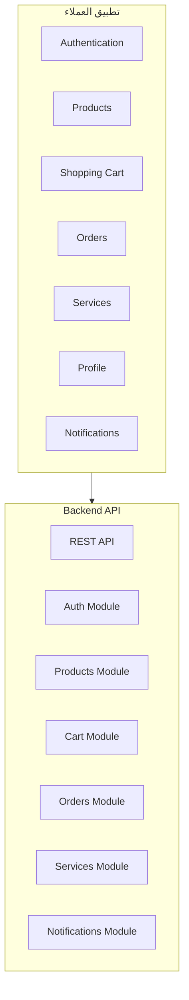
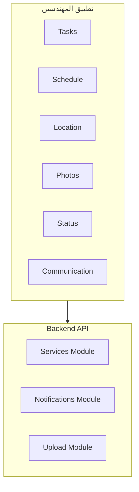

# 📱 استراتيجية تطبيق الهاتف - Mobile App Strategy

## نظرة عامة
هذه الوثيقة توضح استراتيجية تطوير تطبيقات الهاتف المحمول لنظام تاجا دودو.

## ✅ الحالة الحالية
- **Admin Dashboard**: مكتمل ومفعل (React + TypeScript)
- **Backend API**: مكتمل ومفعل (21 وحدة)
- **Mobile Apps**: مخطط للمستقبل
- **API Ready**: جاهز للتطبيقات المحمولة

---

## 🎯 استراتيجية التطوير

### المرحلة 1: إعداد البنية التحتية (مكتمل)
- ✅ **Backend API**: REST API كامل
- ✅ **Authentication**: JWT + OTP
- ✅ **Database**: MongoDB محسن
- ✅ **Security**: Rate Limiting + CORS
- ✅ **Analytics**: تتبع الأحداث

### المرحلة 2: تطوير التطبيقات (مخطط)
- 🔄 **Customer App**: تطبيق العملاء
- 🔄 **Engineer App**: تطبيق المهندسين
- 🔄 **Admin App**: تطبيق الإدارة المحمول

---

## 📱 تطبيق العملاء (Customer App)

### التقنيات المقترحة
```typescript
// الخيار 1: React Native
{
  framework: "React Native",
  language: "TypeScript",
  stateManagement: "Zustand",
  navigation: "React Navigation",
  ui: "React Native Elements"
}

// الخيار 2: Flutter
{
  framework: "Flutter",
  language: "Dart",
  stateManagement: "Bloc/Riverpod",
  navigation: "Go Router",
  ui: "Material Design"
}
```

### الميزات المطلوبة
- ✅ **Authentication**: OTP Login
- ✅ **Product Browsing**: تصفح المنتجات
- ✅ **Shopping Cart**: سلة الشراء
- ✅ **Order Management**: إدارة الطلبات
- ✅ **Service Requests**: طلب الخدمات
- ✅ **Push Notifications**: الإشعارات
- ✅ **Offline Support**: العمل بدون إنترنت
- ✅ **Location Services**: خدمات الموقع
- ✅ **Camera Integration**: التكامل مع الكاميرا

### التصميم


---

## 🔧 تطبيق المهندسين (Engineer App)

### الميزات المطلوبة
- ✅ **Task Management**: إدارة المهام
- ✅ **Schedule Management**: إدارة المواعيد
- ✅ **Location Tracking**: تتبع الموقع
- ✅ **Photo Upload**: رفع الصور
- ✅ **Status Updates**: تحديث الحالة
- ✅ **Customer Communication**: التواصل مع العملاء

### التصميم


---

## 👨‍💼 تطبيق الإدارة المحمول (Admin Mobile App)

### الميزات المطلوبة
- ✅ **Dashboard**: لوحة التحكم
- ✅ **Analytics**: التحليلات
- ✅ **Order Management**: إدارة الطلبات
- ✅ **User Management**: إدارة المستخدمين
- ✅ **Service Management**: إدارة الخدمات
- ✅ **Support Management**: إدارة الدعم

---

## 🚀 خطة التطوير

### المرحلة 1: إعداد البيئة (شهر 1)
- [ ] إعداد React Native/Flutter
- [ ] إعداد CI/CD للهاتف
- [ ] إعداد Firebase للمشاريع
- [ ] إعداد App Store/Google Play

### المرحلة 2: تطبيق العملاء (شهر 2-3)
- [ ] Authentication
- [ ] Product Browsing
- [ ] Shopping Cart
- [ ] Order Management
- [ ] Push Notifications

### المرحلة 3: تطبيق المهندسين (شهر 4)
- [ ] Task Management
- [ ] Location Services
- [ ] Photo Upload
- [ ] Status Updates

### المرحلة 4: تطبيق الإدارة (شهر 5)
- [ ] Dashboard
- [ ] Analytics
- [ ] Management Features

---

## 📊 مقاييس النجاح

### تقنية
- **Performance**: < 3 ثوانٍ لفتح التطبيق
- **Crash Rate**: < 0.1%
- **Battery Usage**: محسن
- **Network Usage**: محسن

### تجربة المستخدم
- **User Rating**: > 4.5/5
- **Retention Rate**: > 70% بعد شهر
- **Session Duration**: > 5 دقائق
- **Feature Adoption**: > 80%

---

## 🔒 الأمان

### حماية البيانات
- ✅ **Certificate Pinning**: حماية الاتصال
- ✅ **Data Encryption**: تشفير البيانات
- ✅ **Secure Storage**: تخزين آمن
- ✅ **Biometric Auth**: المصادقة البيومترية

### حماية التطبيق
- ✅ **Code Obfuscation**: إخفاء الكود
- ✅ **Anti-Debugging**: منع التصحيح
- ✅ **Root/Jailbreak Detection**: كشف التعديل
- ✅ **Runtime Protection**: حماية وقت التشغيل

---

## 📈 التوسع المستقبلي

### المرحلة 1: تحسينات الأداء
- **Image Optimization**: تحسين الصور
- **Caching Strategy**: استراتيجية التخزين المؤقت
- **Offline Support**: دعم العمل بدون إنترنت
- **Background Sync**: مزامنة في الخلفية

### المرحلة 2: ميزات متقدمة
- **AR Integration**: تكامل الواقع المعزز
- **AI Recommendations**: توصيات ذكية
- **Voice Commands**: الأوامر الصوتية
- **Wearable Integration**: تكامل الأجهزة القابلة للارتداء

### المرحلة 3: التوسع العالمي
- **Multi-language**: دعم لغات متعددة
- **Localization**: التخصيص المحلي
- **Regional Features**: ميزات إقليمية
- **Compliance**: الامتثال للقوانين

---

## 📝 الخلاصة

نظام تاجا دودو جاهز تماماً لتطوير التطبيقات المحمولة مع:

- ✅ **Backend API**: مكتمل وجاهز
- ✅ **Authentication**: نظام مصادقة متقدم
- ✅ **Security**: حماية شاملة
- ✅ **Analytics**: تتبع متقدم
- ✅ **Infrastructure**: بنية تحتية قوية

الخطوة التالية هي اختيار التقنية (React Native أو Flutter) وبدء التطوير.

---

**تاريخ التحديث**: 2025-01-14  
**الحالة**: مخطط للمستقبل  
**الأولوية**: متوسطة
