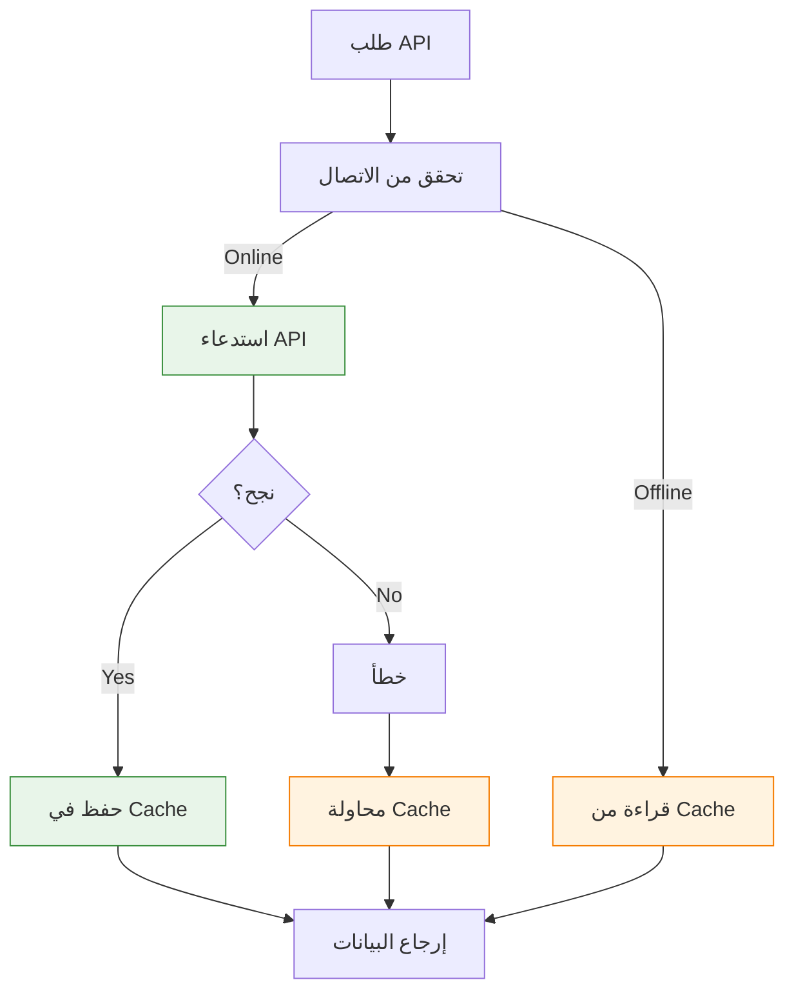

# 📱 استراتيجية تطبيق الهاتف - Mobile App Strategy

## نظرة عامة
هذه الوثيقة توضح الخطة الكاملة لتطوير تطبيقات الهاتف (iOS + Android) لنظام تاجا دودو.

---

## 🎯 الأهداف

### الأساسية
- ✅ تطبيق واحد للعملاء (Customer App)
- ✅ تجربة مستخدم سلسة ومتناسقة
- ✅ دعم كامل للعربية (RTL)
- ✅ أداء عالي وسريع
- ✅ Offline-first عند الإمكان

### المستقبلية
- 🔄 تطبيق للمهندسين (Engineer App)
- 🔄 Widget للشاشة الرئيسية
- 🔄 Apple Watch / Wear OS support
- 🔄 Deep Linking
- 🔄 App Clips / Instant Apps

---

## 🛠️ اختيار التقنية

### الخيارات المتاحة

#### 1. React Native ✅ (الخيار المفضل)

**المزايا:**
- ✅ نفس لغة الـ Backend (TypeScript/JavaScript)
- ✅ مشاركة الكود بين iOS و Android (~90%)
- ✅ Hot Reload للتطوير السريع
- ✅ مجتمع ضخم ونشط
- ✅ Libraries كثيرة
- ✅ Expo للتطوير السريع
- ✅ Performance جيد (قريب من Native)

**العيوب:**
- ⚠️ بعض الميزات تحتاج Native Modules
- ⚠️ حجم التطبيق أكبر قليلاً

**Stack المقترح:**
```typescript
Framework: React Native
Language: TypeScript
State Management: Zustand / Redux Toolkit
Navigation: React Navigation
UI Library: React Native Paper / NativeBase
API Client: Axios / React Query
Storage: AsyncStorage / SecureStore
Push Notifications: Firebase Cloud Messaging
Analytics: Firebase Analytics
Crash Reporting: Firebase Crashlytics
```

---

#### 2. Flutter

**المزايا:**
- ✅ أداء ممتاز (Compiled to native)
- ✅ UI جميلة جداً
- ✅ Widget-based architecture
- ✅ مدعوم من Google

**العيوب:**
- ⚠️ لغة مختلفة (Dart)
- ⚠️ مجتمع أصغر من React Native
- ⚠️ الفريق يحتاج تعلم لغة جديدة

---

#### 3. Native (Swift + Kotlin)

**المزايا:**
- ✅ أفضل أداء ممكن
- ✅ الوصول لكل ميزات المنصة
- ✅ تجربة مستخدم أصلية 100%

**العيوب:**
- ❌ تطويرين منفصلين تماماً
- ❌ تكلفة أعلى (2x development)
- ❌ وقت أطول

---

### القرار النهائي: React Native ✅

**الأسباب:**
1. فريق واحد للـ Backend والـ Mobile
2. مشاركة الكود والـ logic
3. تطوير أسرع (MVP في 2-3 أشهر)
4. تكلفة أقل
5. مناسب لحجم المشروع

---

## 📐 معمارية التطبيق

### هيكل المشروع

```
mobile-app/
├── src/
│   ├── api/                    # API calls
│   │   ├── client.ts
│   │   ├── auth.ts
│   │   ├── products.ts
│   │   └── orders.ts
│   │
│   ├── components/             # مكونات قابلة لإعادة الاستخدام
│   │   ├── common/
│   │   │   ├── Button.tsx
│   │   │   ├── Card.tsx
│   │   │   └── Input.tsx
│   │   ├── product/
│   │   │   ├── ProductCard.tsx
│   │   │   └── ProductList.tsx
│   │   └── cart/
│   │       └── CartItem.tsx
│   │
│   ├── screens/                # الشاشات
│   │   ├── auth/
│   │   │   ├── LoginScreen.tsx
│   │   │   └── OTPScreen.tsx
│   │   ├── home/
│   │   │   └── HomeScreen.tsx
│   │   ├── products/
│   │   │   ├── ProductListScreen.tsx
│   │   │   └── ProductDetailScreen.tsx
│   │   ├── cart/
│   │   │   └── CartScreen.tsx
│   │   ├── checkout/
│   │   │   └── CheckoutScreen.tsx
│   │   └── profile/
│   │       └── ProfileScreen.tsx
│   │
│   ├── navigation/             # التنقل
│   │   ├── AppNavigator.tsx
│   │   ├── AuthNavigator.tsx
│   │   └── MainNavigator.tsx
│   │
│   ├── store/                  # State Management
│   │   ├── authStore.ts
│   │   ├── cartStore.ts
│   │   └── productsStore.ts
│   │
│   ├── hooks/                  # Custom Hooks
│   │   ├── useAuth.ts
│   │   ├── useCart.ts
│   │   └── useProducts.ts
│   │
│   ├── services/               # Services
│   │   ├── storage.ts
│   │   ├── notifications.ts
│   │   └── analytics.ts
│   │
│   ├── utils/                  # Utilities
│   │   ├── formatters.ts
│   │   ├── validators.ts
│   │   └── constants.ts
│   │
│   ├── i18n/                   # الترجمات
│   │   ├── ar.json
│   │   └── en.json
│   │
│   ├── types/                  # TypeScript Types
│   │   ├── api.ts
│   │   └── models.ts
│   │
│   └── App.tsx                 # Entry point
│
├── android/                    # Android native
├── ios/                        # iOS native
├── assets/                     # الصور والملفات
└── app.json                    # Config
```

---

## 🎨 التصميم والـ UI/UX

### Design System

```typescript
// colors.ts
export const colors = {
  primary: '#FF6B35',      // البرتقالي (الطاقة الشمسية)
  secondary: '#004E89',    // الأزرق (الثقة)
  success: '#06D6A0',
  warning: '#FFD23F',
  error: '#EF476F',
  
  // Neutrals
  background: '#F7F7F7',
  card: '#FFFFFF',
  text: '#1A1A1A',
  textSecondary: '#666666',
  border: '#E0E0E0',
};

// typography.ts
export const typography = {
  h1: {
    fontFamily: 'Cairo-Bold',
    fontSize: 28,
    lineHeight: 36,
  },
  h2: {
    fontFamily: 'Cairo-Bold',
    fontSize: 24,
    lineHeight: 32,
  },
  body: {
    fontFamily: 'Cairo-Regular',
    fontSize: 16,
    lineHeight: 24,
  },
  caption: {
    fontFamily: 'Cairo-Regular',
    fontSize: 12,
    lineHeight: 16,
  },
};

// spacing.ts
export const spacing = {
  xs: 4,
  sm: 8,
  md: 16,
  lg: 24,
  xl: 32,
  xxl: 48,
};
```

### Fonts
```
Primary: Cairo (للعربية)
Secondary: Inter (للإنجليزية)
```

### RTL Support
```typescript
// في كل screen
import { I18nManager } from 'react-native';

// تفعيل RTL
I18nManager.forceRTL(true);
I18nManager.allowRTL(true);

// في الـ styles
const styles = StyleSheet.create({
  container: {
    flexDirection: I18nManager.isRTL ? 'row-reverse' : 'row',
  },
});
```

---

## 🔌 التكامل مع Backend API

### API Client Setup

```typescript
// api/client.ts
import axios from 'axios';
import AsyncStorage from '@react-native-async-storage/async-storage';

const apiClient = axios.create({
  baseURL: 'https://api.tagadodo.com',
  timeout: 10000,
  headers: {
    'Content-Type': 'application/json',
  },
});

// Request Interceptor - إضافة Token
apiClient.interceptors.request.use(
  async (config) => {
    const token = await AsyncStorage.getItem('access_token');
    if (token) {
      config.headers.Authorization = `Bearer ${token}`;
    }
    
    // إضافة اللغة
    const language = await AsyncStorage.getItem('language');
    config.headers['Accept-Language'] = language || 'ar';
    
    return config;
  },
  (error) => Promise.reject(error)
);

// Response Interceptor - Refresh Token
apiClient.interceptors.response.use(
  (response) => response,
  async (error) => {
    const originalRequest = error.config;
    
    // إذا انتهى الـ Token
    if (error.response?.status === 401 && !originalRequest._retry) {
      originalRequest._retry = true;
      
      try {
        const refreshToken = await AsyncStorage.getItem('refresh_token');
        const { data } = await axios.post('/auth/refresh', {
          refreshToken
        });
        
        // حفظ Tokens الجديدة
        await AsyncStorage.setItem('access_token', data.accessToken);
        await AsyncStorage.setItem('refresh_token', data.refreshToken);
        
        // إعادة المحاولة
        originalRequest.headers.Authorization = `Bearer ${data.accessToken}`;
        return apiClient(originalRequest);
      } catch (refreshError) {
        // فشل الـ refresh = تسجيل خروج
        await AsyncStorage.clear();
        // Navigate to login
        return Promise.reject(refreshError);
      }
    }
    
    return Promise.reject(error);
  }
);

export default apiClient;
```

---

## 💾 Offline Support

### استراتيجية Offline-First



### التنفيذ

```typescript
// services/storage.ts
import AsyncStorage from '@react-native-async-storage/async-storage';

class OfflineStorage {
  // حفظ البيانات
  async save(key: string, data: any, ttl?: number) {
    const item = {
      data,
      timestamp: Date.now(),
      ttl: ttl || 3600000, // 1 ساعة افتراضياً
    };
    await AsyncStorage.setItem(key, JSON.stringify(item));
  }
  
  // قراءة البيانات
  async get(key: string) {
    const item = await AsyncStorage.getItem(key);
    if (!item) return null;
    
    const parsed = JSON.parse(item);
    
    // تحقق من انتهاء الصلاحية
    if (Date.now() - parsed.timestamp > parsed.ttl) {
      await AsyncStorage.removeItem(key);
      return null;
    }
    
    return parsed.data;
  }
  
  // حذف البيانات
  async remove(key: string) {
    await AsyncStorage.removeItem(key);
  }
}

export default new OfflineStorage();
```

### ما يُخزن Offline

```typescript
// البيانات التي يمكن استخدامها offline
{
  products: true,        // المنتجات (read-only)
  categories: true,      // الفئات (read-only)
  cart: true,            // السلة (يمكن التعديل offline)
  favorites: true,       // المفضلة (يمكن التعديل offline)
  profile: true,         // الملف الشخصي (read-only)
  orders: true,          // الطلبات السابقة (read-only)
}

// البيانات التي تحتاج online
{
  checkout: false,       // الشراء
  payment: false,        // الدفع
  otp: false,           // OTP
}
```

### مزامنة عند العودة Online

```typescript
// hooks/useNetworkSync.ts
import NetInfo from '@react-native-community/netinfo';

export function useNetworkSync() {
  useEffect(() => {
    const unsubscribe = NetInfo.addEventListener(state => {
      if (state.isConnected) {
        // عاد الاتصال - مزامنة
        syncPendingActions();
      }
    });
    
    return () => unsubscribe();
  }, []);
  
  async function syncPendingActions() {
    // 1. إرسال الإجراءات المعلقة
    const pendingActions = await storage.get('pending_actions');
    if (pendingActions) {
      for (const action of pendingActions) {
        try {
          await executeAction(action);
        } catch (error) {
          // تسجيل الخطأ
        }
      }
      await storage.remove('pending_actions');
    }
    
    // 2. تحديث البيانات المحلية
    await refreshLocalData();
  }
}
```

---

## 🔔 Push Notifications

### إعداد Firebase Cloud Messaging

```typescript
// services/notifications.ts
import messaging from '@react-native-firebase/messaging';
import AsyncStorage from '@react-native-async-storage/async-storage';

class NotificationService {
  async init() {
    // طلب الإذن
    const authStatus = await messaging().requestPermission();
    const enabled =
      authStatus === messaging.AuthorizationStatus.AUTHORIZED ||
      authStatus === messaging.AuthorizationStatus.PROVISIONAL;
    
    if (enabled) {
      // الحصول على FCM Token
      const fcmToken = await messaging().getToken();
      await this.saveFCMToken(fcmToken);
      
      // الاستماع للإشعارات
      this.setupListeners();
    }
  }
  
  async saveFCMToken(token: string) {
    await AsyncStorage.setItem('fcm_token', token);
    // إرسال Token للـ Backend
    await apiClient.post('/users/fcm-token', { token });
  }
  
  setupListeners() {
    // إشعار عند التطبيق مفتوح
    messaging().onMessage(async remoteMessage => {
      console.log('Foreground notification:', remoteMessage);
      // عرض notification محلي
      this.showLocalNotification(remoteMessage);
    });
    
    // إشعار عند التطبيق مغلق/background
    messaging().setBackgroundMessageHandler(async remoteMessage => {
      console.log('Background notification:', remoteMessage);
    });
    
    // عند النقر على الإشعار
    messaging().onNotificationOpenedApp(remoteMessage => {
      console.log('Notification opened app:', remoteMessage);
      this.handleNotificationNavigation(remoteMessage);
    });
    
    // عند فتح التطبيق من إشعار (killed state)
    messaging()
      .getInitialNotification()
      .then(remoteMessage => {
        if (remoteMessage) {
          this.handleNotificationNavigation(remoteMessage);
        }
      });
  }
  
  handleNotificationNavigation(message: any) {
    // التنقل حسب نوع الإشعار
    const { type, orderId } = message.data;
    
    switch (type) {
      case 'order_update':
        navigate('OrderDetail', { orderId });
        break;
      case 'promotion':
        navigate('Promotions');
        break;
      // ...
    }
  }
  
  showLocalNotification(message: any) {
    // عرض notification داخل التطبيق
    // باستخدام library مثل react-native-notifications
  }
}

export default new NotificationService();
```

---

## 🔐 الأمان

### 1. Secure Storage

```typescript
// للـ Tokens
import * as SecureStore from 'expo-secure-store';

// حفظ
await SecureStore.setItemAsync('access_token', token);

// قراءة
const token = await SecureStore.getItemAsync('access_token');
```

### 2. Certificate Pinning

```typescript
// منع Man-in-the-Middle attacks
// react-native-ssl-pinning
import { fetch } from 'react-native-ssl-pinning';

fetch('https://api.tagadodo.com/products', {
  method: 'GET',
  sslPinning: {
    certs: ['cert-hash-1', 'cert-hash-2'],
  }
});
```

### 3. Biometric Authentication

```typescript
// hooks/useBiometric.ts
import * as LocalAuthentication from 'expo-local-authentication';

export function useBiometric() {
  async function authenticate() {
    // تحقق من الدعم
    const hasHardware = await LocalAuthentication.hasHardwareAsync();
    const isEnrolled = await LocalAuthentication.isEnrolledAsync();
    
    if (!hasHardware || !isEnrolled) {
      return false;
    }
    
    // المصادقة
    const result = await LocalAuthentication.authenticateAsync({
      promptMessage: 'تسجيل الدخول',
      fallbackLabel: 'استخدم الرقم السري',
      cancelLabel: 'إلغاء',
    });
    
    return result.success;
  }
  
  return { authenticate };
}
```

---

## 📊 Analytics & Tracking

```typescript
// services/analytics.ts
import analytics from '@react-native-firebase/analytics';

class AnalyticsService {
  // تتبع الشاشات
  async logScreen(screenName: string) {
    await analytics().logScreenView({
      screen_name: screenName,
      screen_class: screenName,
    });
  }
  
  // تتبع الأحداث
  async logEvent(eventName: string, params?: object) {
    await analytics().logEvent(eventName, params);
  }
  
  // أحداث E-commerce
  async logViewProduct(product: Product) {
    await analytics().logViewItem({
      items: [{
        item_id: product.id,
        item_name: product.name,
        price: product.price,
      }],
    });
  }
  
  async logAddToCart(product: Product, quantity: number) {
    await analytics().logAddToCart({
      items: [{
        item_id: product.id,
        item_name: product.name,
        price: product.price,
        quantity,
      }],
    });
  }
  
  async logPurchase(order: Order) {
    await analytics().logPurchase({
      transaction_id: order.id,
      value: order.total,
      currency: 'SAR',
      items: order.items.map(item => ({
        item_id: item.productId,
        item_name: item.name,
        price: item.price,
        quantity: item.quantity,
      })),
    });
  }
}

export default new AnalyticsService();
```

---

## 🚀 البناء والنشر

### iOS (App Store)

```bash
# 1. البناء
cd ios
pod install
cd ..
npx react-native run-ios --configuration Release

# 2. Archive في Xcode
# Product > Archive

# 3. Upload to App Store Connect
# Distribute App > App Store Connect

# 4. Submit for Review
# في App Store Connect
```

### Android (Google Play)

```bash
# 1. توليد Signing Key
keytool -genkeypair -v -storetype PKCS12 \
  -keystore tagadodo.keystore \
  -alias tagadodo \
  -keyalg RSA \
  -keysize 2048 \
  -validity 10000

# 2. إعداد build.gradle
# android/app/build.gradle

# 3. البناء
cd android
./gradlew bundleRelease

# 4. Upload إلى Google Play Console
# app/build/outputs/bundle/release/app-release.aab
```

### CI/CD with GitHub Actions

```yaml
# .github/workflows/mobile.yml
name: Mobile CI/CD

on:
  push:
    branches: [main]

jobs:
  build-ios:
    runs-on: macos-latest
    steps:
      - uses: actions/checkout@v3
      - name: Install dependencies
        run: npm install
      - name: Build iOS
        run: npx react-native run-ios --configuration Release
  
  build-android:
    runs-on: ubuntu-latest
    steps:
      - uses: actions/checkout@v3
      - name: Install dependencies
        run: npm install
      - name: Build Android
        run: cd android && ./gradlew bundleRelease
```

---

## 📈 خطة التطوير

### المرحلة 1: MVP (2-3 أشهر)
```
✅ التسجيل والدخول (OTP)
✅ تصفح المنتجات
✅ البحث والفلترة
✅ سلة الشراء
✅ الشراء والدفع
✅ الملف الشخصي
✅ Push Notifications الأساسية
```

### المرحلة 2: التحسينات (1-2 شهر)
```
🔄 المفضلة
🔄 تتبع الطلبات
🔄 تاريخ الطلبات
🔄 العناوين المحفوظة
🔄 طلب الخدمات
🔄 Offline Mode
```

### المرحلة 3: ميزات متقدمة (2-3 أشهر)
```
🔄 Biometric Login
🔄 Deep Linking
🔄 Share Products
🔄 Reviews & Ratings
🔄 Referral Program
🔄 Loyalty Points
```

---

## 📝 متطلبات النشر

### App Store (iOS)
```
- Apple Developer Account ($99/سنة)
- Privacy Policy
- Terms of Service
- App Screenshots (مطلوب)
- App Preview Video (اختياري)
- App Description (AR + EN)
- Keywords
- Support URL
- Marketing URL
```

### Google Play (Android)
```
- Google Play Developer Account ($25 مرة واحدة)
- Privacy Policy
- Terms of Service
- Screenshots (مطلوب)
- Feature Graphic
- App Description (AR + EN)
- Content Rating
```

---

**آخر تحديث:** 14 أكتوبر 2025  
**الحالة:** 📋 مخطط  
**المسؤول:** فريق تطوير الهاتف

