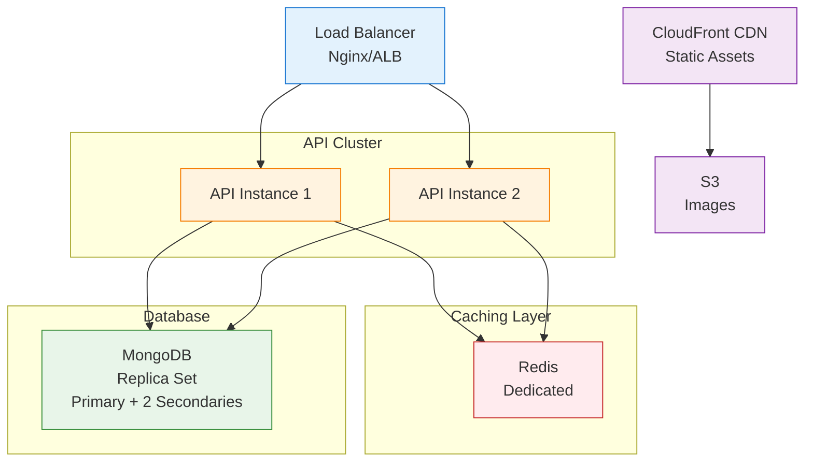
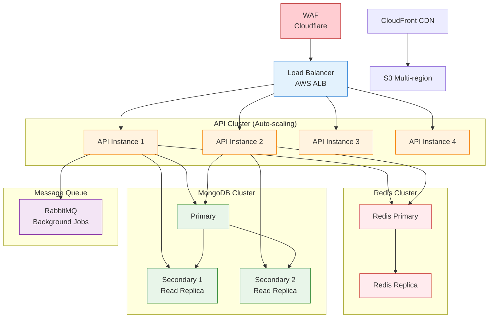
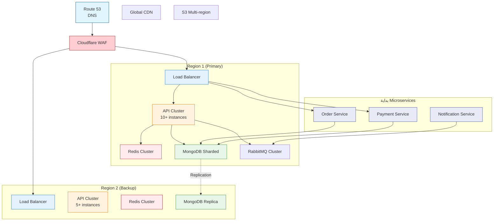
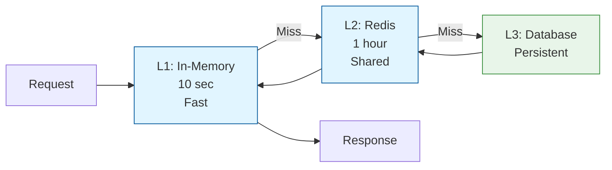

# 📈 استراتيجية التوسع - Scaling Strategy

## نظرة عامة
هذه الوثيقة توضح كيفية توسيع نظام تاجا دودو المطبق فعلياً للتعامل مع النمو والأحمال العالية.

## ✅ الحالة الحالية
- **النظام**: Modular Monolith مكتمل
- **الوحدات**: 21 وحدة مكتملة
- **الأداء**: محسن ومتسارع
- **المراقبة**: مكتملة ومتطورة
- **التخزين المؤقت**: Redis مفعل
- **قاعدة البيانات**: MongoDB محسنة

---

## 🎯 مراحل النمو

### المرحلة 1: MVP (الوضع الحالي)
```
المستخدمون: 100 - 1,000
الطلبات: 10 - 100 طلب يومياً
Architecture: Modular Monolith
Infrastructure: Single server
```

**الحل الحالي:**
```
├── Backend API (1 instance)
├── MongoDB (Shared cluster)
├── Redis (Shared instance)
└── S3/Cloudinary
```

---

### المرحلة 2: النمو المبكر (3-6 أشهر)
```
المستخدمون: 1,000 - 10,000
الطلبات: 100 - 500 طلب يومياً
Traffic: 10,000 - 50,000 requests/day
```

**الحل:**


**التحسينات:**
- ✅ Horizontal scaling للـ API (2-3 instances)
- ✅ Load Balancer أمام API
- ✅ MongoDB Replica Set (للـ high availability)
- ✅ Redis مخصص (dedicated instance)
- ✅ CDN للصور والـ static assets
- ✅ Database indexing محسّن
- ✅ Caching strategy متقدمة

---

### المرحلة 3: النمو المتوسط (6-12 شهر)
```
المستخدمون: 10,000 - 50,000
الطلبات: 500 - 2,000 طلب يومياً
Traffic: 50,000 - 200,000 requests/day
```

**الحل:**


**التحسينات:**
- ✅ WAF (Web Application Firewall) - Cloudflare
- ✅ Auto-scaling للـ API (4-10 instances)
- ✅ Redis Cluster (Primary + Replica)
- ✅ Read Replicas للـ MongoDB
- ✅ Message Queue (RabbitMQ) للـ async tasks
- ✅ Multi-region S3
- ✅ Advanced monitoring (Datadog/New Relic)
- ✅ Database Query optimization
- ✅ API Response caching

---

### المرحلة 4: النمو الكبير (1-2 سنة)
```
المستخدمون: 50,000 - 200,000+
الطلبات: 2,000 - 10,000+ طلب يومياً
Traffic: 200,000 - 1M+ requests/day
```

**الحل:**


**التحسينات:**
- ✅ Multi-region deployment
- ✅ MongoDB Sharding للتوسع الأفقي
- ✅ بداية الانتقال إلى Microservices (خدمات حرجة)
- ✅ Event-driven architecture
- ✅ Kubernetes orchestration
- ✅ Service Mesh (Istio)
- ✅ Advanced analytics
- ✅ ML-based recommendations

---

## 🔄 استراتيجيات التوسع

### 1. Horizontal Scaling (التوسع الأفقي)

#### API Scaling
```yaml
# Kubernetes Auto-scaling
apiVersion: autoscaling/v2
kind: HorizontalPodAutoscaler
metadata:
  name: api-hpa
spec:
  scaleTargetRef:
    apiVersion: apps/v1
    kind: Deployment
    name: api-deployment
  minReplicas: 2
  maxReplicas: 10
  metrics:
  - type: Resource
    resource:
      name: cpu
      target:
        type: Utilization
        averageUtilization: 70
  - type: Resource
    resource:
      name: memory
      target:
        type: Utilization
        averageUtilization: 80
```

#### Load Balancing Strategies
```
1. Round Robin - توزيع متساوي
2. Least Connections - الأقل اتصالات
3. IP Hash - نفس الـ IP لنفس الـ server (للـ session affinity)
4. Weighted - أوزان مختلفة
```

---

### 2. Database Scaling

#### MongoDB Replica Set
```javascript
// Configuration
{
  _id: "tagadodo-rs",
  members: [
    { _id: 0, host: "mongo1:27017", priority: 2 },  // Primary
    { _id: 1, host: "mongo2:27017", priority: 1 },  // Secondary
    { _id: 2, host: "mongo3:27017", priority: 1 },  // Secondary
  ]
}
```

#### Read Preference
```typescript
// توزيع القراءة على Secondaries
await Product.find()
  .read('secondaryPreferred')  // يقرأ من Secondary إذا متوفر
  .exec();

// الكتابة دائماً على Primary
await Product.create({ ... });  // يكتب على Primary
```

#### MongoDB Sharding (للبيانات الكبيرة جداً)
```javascript
// Shard Key Selection
sh.shardCollection("tagadodo.products", { category: 1, _id: 1 })
sh.shardCollection("tagadodo.orders", { userId: 1, createdAt: 1 })

// Distribution
Shard 1: Categories A-M
Shard 2: Categories N-Z
```

---

### 3. Caching Strategy

#### Multi-level Caching



#### Cache Invalidation Strategy

```typescript
// 1. Time-based (TTL)
await redis.set('product:123', data, 'EX', 3600);  // 1 ساعة

// 2. Event-based (on update)
async updateProduct(id: string, data: any) {
  await this.productModel.updateOne({ _id: id }, data);
  
  // إلغاء Cache
  await this.redis.del(`product:${id}`);
  await this.redis.del('products:list:*');  // كل القوائم
}

// 3. Tag-based
await redis.set('product:123', data, 'EX', 3600);
await redis.sadd('tag:products', 'product:123');

// عند التحديث
const keys = await redis.smembers('tag:products');
await redis.del(...keys);
```

---

### 4. CDN Strategy

```
CloudFront Distribution:
├── Origin: S3 Bucket
├── Edge Locations: Global
├── Cache Behavior:
│   ├── Images: 1 year
│   ├── CSS/JS: 1 month
│   └── HTML: No cache
└── Compression: Gzip/Brotli
```

#### Cache Headers
```typescript
// API Response headers
{
  'Cache-Control': 'public, max-age=3600',  // 1 ساعة
  'ETag': 'W/"abc123"',
  'Last-Modified': new Date().toUTCString(),
}
```

---

### 5. Database Query Optimization

#### Indexing Strategy

```typescript
// Products Collection
@Index({ sku: 1 }, { unique: true })
@Index({ slug: 1 })
@Index({ category: 1, status: 1 })
@Index({ status: 1, featured: 1, createdAt: -1 })
@Index({ 'name.ar': 'text', 'name.en': 'text' })  // Text search

// Orders Collection
@Index({ userId: 1, createdAt: -1 })
@Index({ status: 1, createdAt: -1 })
@Index({ 'items.product': 1 })

// Compound Indexes للاستعلامات الشائعة
@Index({ category: 1, status: 1, price: 1 })
```

#### Query Optimization

```typescript
// ❌ سيء: N+1 Query Problem
const orders = await Order.find({ userId });
for (const order of orders) {
  order.user = await User.findById(order.userId);  // N queries!
}

// ✅ جيد: Populate (1 query + 1 lookup)
const orders = await Order.find({ userId })
  .populate('user')
  .exec();

// ✅ أفضل: Aggregation Pipeline
const orders = await Order.aggregate([
  { $match: { userId: new ObjectId(userId) } },
  { $lookup: {
      from: 'users',
      localField: 'userId',
      foreignField: '_id',
      as: 'user'
  }},
  { $unwind: '$user' },
]);
```

#### Pagination Optimization

```typescript
// ❌ سيء: Offset pagination (بطيء للصفحات الكبيرة)
const products = await Product.find()
  .skip(page * limit)
  .limit(limit);

// ✅ جيد: Cursor-based pagination
const products = await Product.find({
  _id: { $gt: lastId }  // أسرع بكثير
})
.limit(limit)
.sort({ _id: 1 });
```

---

## 📊 Monitoring & Metrics

### Key Performance Indicators (KPIs)

#### Application Metrics
```typescript
{
  // Response Times
  'api.response_time.p50': '<100ms',
  'api.response_time.p95': '<500ms',
  'api.response_time.p99': '<1000ms',
  
  // Throughput
  'api.requests_per_second': 100-1000,
  
  // Error Rates
  'api.error_rate': '<1%',
  'api.5xx_rate': '<0.1%',
  
  // Database
  'db.query_time.p95': '<100ms',
  'db.connections': 'متابعة',
  
  // Cache
  'cache.hit_rate': '>80%',
  'cache.memory_usage': '<80%',
}
```

#### Infrastructure Metrics
```typescript
{
  // CPU & Memory
  'server.cpu_usage': '<70%',
  'server.memory_usage': '<80%',
  
  // Network
  'network.bandwidth': 'متابعة',
  'network.latency': '<50ms',
  
  // Disk
  'disk.usage': '<80%',
  'disk.iops': 'متابعة',
}
```

### Monitoring Tools

```yaml
# Monitoring Stack
Metrics Collection: Prometheus
Visualization: Grafana
Alerting: PagerDuty / Slack
APM: Datadog / New Relic
Logs: ELK Stack (Elasticsearch, Logstash, Kibana)
Uptime: Pingdom / UptimeRobot
```

---

## 🚨 Alert Rules

```yaml
# Critical Alerts (فوري)
- api_error_rate > 5%
- api_response_time_p95 > 2000ms
- database_connections > 90%
- disk_usage > 90%
- api_down

# Warning Alerts (خلال 15 دقيقة)
- api_error_rate > 2%
- api_response_time_p95 > 1000ms
- cpu_usage > 80%
- memory_usage > 85%
- cache_hit_rate < 70%

# Info Alerts (خلال ساعة)
- unusual_traffic_pattern
- high_number_of_slow_queries
- cache_miss_rate_increase
```

---

## 💰 Cost Optimization

### المرحلة 1 (MVP)
```
Backend: $20-50/month (Heroku/DigitalOcean)
Database: $15-30/month (MongoDB Atlas M10)
Redis: $10-20/month (Redis Cloud)
Storage: $5-10/month (S3)
CDN: $10-20/month (CloudFront)
---
Total: ~$60-130/month
```

### المرحلة 2 (النمو المبكر)
```
Backend: $100-200/month (2-3 instances)
Database: $50-100/month (Replica Set)
Redis: $30-50/month (Dedicated)
Storage: $20-40/month
CDN: $30-60/month
Monitoring: $20-50/month
---
Total: ~$250-500/month
```

### المرحلة 3 (النمو المتوسط)
```
Backend: $500-1000/month (Auto-scaling)
Database: $200-400/month (Sharded)
Redis: $100-200/month (Cluster)
Storage: $100-200/month
CDN: $100-300/month
Monitoring: $100-200/month
Queue: $50-100/month
---
Total: ~$1,150-2,400/month
```

---

## 🎯 Performance Targets

### Current (MVP)
```
- Response Time (P95): <1000ms
- Throughput: 10-50 req/sec
- Uptime: 99% (7 ساعات downtime/سنة)
- Concurrent Users: 100
```

### Goal (6 months)
```
- Response Time (P95): <500ms
- Throughput: 100-500 req/sec
- Uptime: 99.9% (45 دقيقة downtime/سنة)
- Concurrent Users: 1,000
```

### Goal (12 months)
```
- Response Time (P95): <300ms
- Throughput: 500-2000 req/sec
- Uptime: 99.95% (22 دقيقة downtime/سنة)
- Concurrent Users: 10,000
```

---

## ✅ Scaling Checklist

### قبل كل مرحلة
- [ ] Load testing مكتمل
- [ ] Bottlenecks محددة
- [ ] Database indexes محسّنة
- [ ] Caching strategy محدثة
- [ ] Monitoring جاهز
- [ ] Rollback plan جاهزة
- [ ] Team مدرّب
- [ ] Budget مُعتمد

---

**آخر تحديث:** 14 أكتوبر 2025  
**المسؤول:** فريق البنية التحتية

