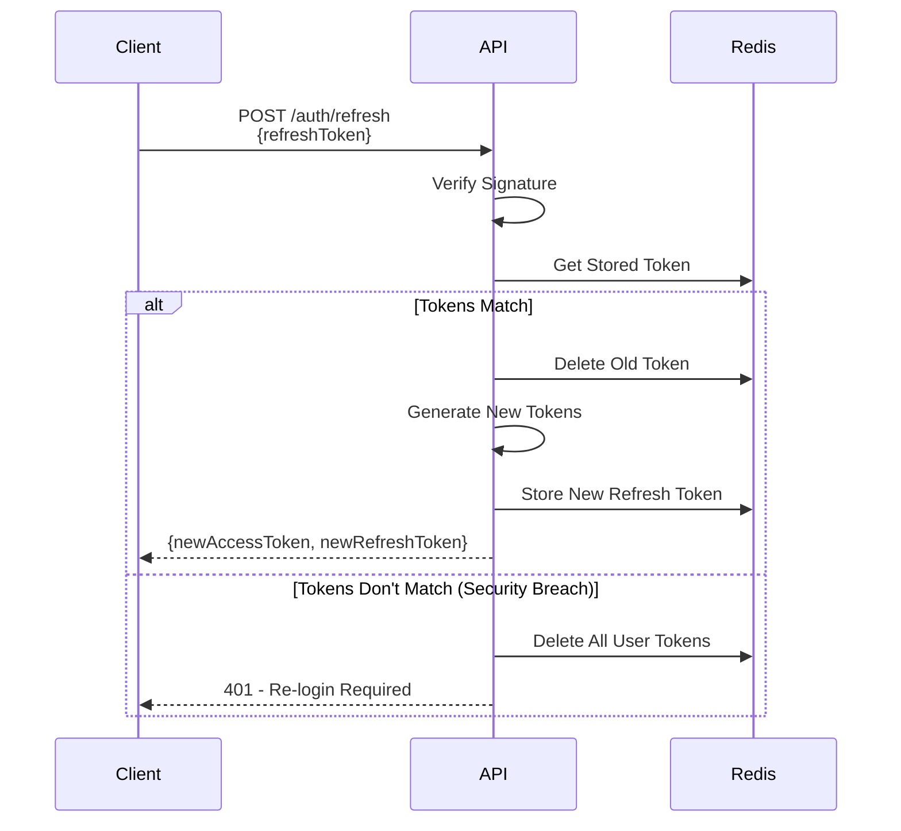
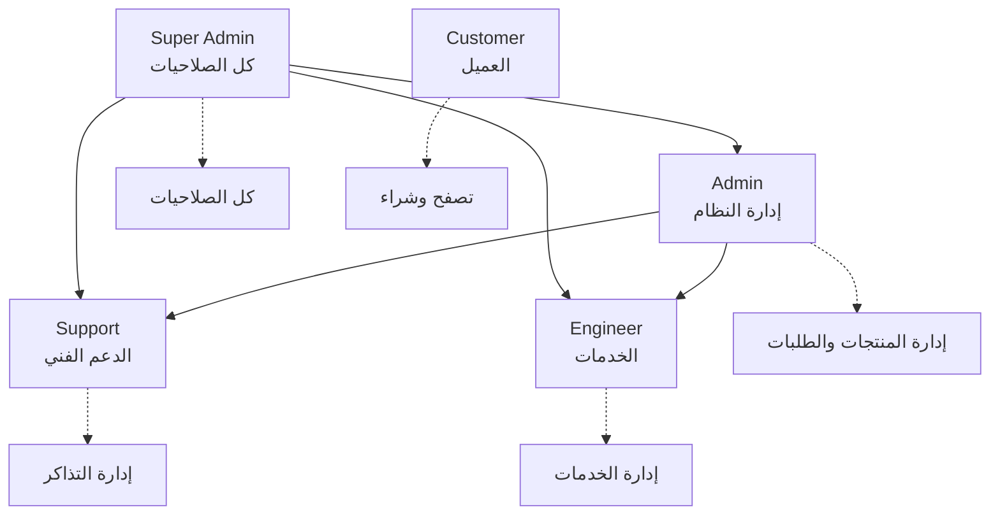

# 🛡️ استراتيجية الأمان - Security Strategy

## نظرة عامة
هذه الوثيقة تحدد استراتيجية الأمان الشاملة لنظام تاجا دودو المطبق فعلياً على جميع المستويات.

## ✅ الحالة الحالية
- **نظام الأمان**: مكتمل ومتقدم
- **Rate Limiting**: مطبق ومفعل
- **CORS Protection**: مطبق ومفعل
- **JWT Authentication**: مطبق ومفعل
- **OTP Authentication**: مطبق ومفعل
- **Security Guards**: مطبق ومفعل
- **Input Validation**: مطبق ومفعل
- **Security Headers**: مطبق ومفعل

---

## 🎯 مبادئ الأمان

### 1. **Defense in Depth** (الدفاع متعدد الطبقات)
```
User → CDN/WAF → Load Balancer → API → Database
       ↓         ↓                 ↓      ↓
     Security  Firewall         Guards  Encryption
```

### 2. **Principle of Least Privilege**
- كل مستخدم له صلاحيات محددة فقط
- Role-Based Access Control (RBAC)
- لا admin access بدون حاجة

### 3. **Security by Default**
- جميع endpoints محمية بشكل افتراضي
- HTTPS فقط (no HTTP)
- Secure headers بشكل افتراضي

### 4. **Zero Trust**
- التحقق من كل طلب
- لا trust implicit
- Session timeout

---

## 🔐 المصادقة (Authentication)

### استراتيجية JWT

#### Access Token
```typescript
{
  type: 'access',
  userId: '123',
  role: 'customer',
  permissions: ['products.view', 'cart.manage'],
  iat: 1697280000,
  exp: 1697280900  // 15 دقيقة
}
```

#### Refresh Token
```typescript
{
  type: 'refresh',
  userId: '123',
  tokenId: 'uuid',
  iat: 1697280000,
  exp: 1697884800  // 7 أيام
}
```

#### تدوير Refresh Tokens


### OTP Security

#### توليد OTP
```typescript
// 6 أرقام عشوائية (100,000 - 999,999)
const otp = crypto.randomInt(100000, 999999);

// تخزين مع hash
const hashedOtp = await bcrypt.hash(otp.toString(), 10);
await redis.set(`otp:${phone}`, hashedOtp, 'EX', 300); // 5 دقائق
```

#### Rate Limiting لـ OTP
```typescript
{
  '/auth/send-otp': {
    points: 3,        // 3 محاولات
    duration: 300,    // في 5 دقائق
    blockDuration: 900 // حظر لـ 15 دقيقة بعد الاستنفاذ
  },
  '/auth/verify-otp': {
    points: 5,        // 5 محاولات
    duration: 300,    // في 5 دقائق
    blockDuration: 1800 // حظر لـ 30 دقيقة
  }
}
```

#### منع Brute Force
```typescript
// بعد 3 محاولات خاطئة
- زيادة وقت الانتظار تدريجياً
- إرسال تنبيه للمستخدم
- تسجيل المحاولات المشبوهة
- حظر IP مؤقت إذا لزم الأمر
```

---

## 🔑 التفويض (Authorization)

### Role-Based Access Control (RBAC)



### Permission-Based Access

```typescript
// الصلاحيات الدقيقة
enum Permission {
  // المنتجات
  PRODUCTS_VIEW = 'products.view',
  PRODUCTS_CREATE = 'products.create',
  PRODUCTS_UPDATE = 'products.update',
  PRODUCTS_DELETE = 'products.delete',
  
  // الطلبات
  ORDERS_VIEW_ALL = 'orders.view_all',
  ORDERS_VIEW_OWN = 'orders.view_own',
  ORDERS_UPDATE = 'orders.update',
  ORDERS_CANCEL = 'orders.cancel',
  ORDERS_REFUND = 'orders.refund',
  
  // المستخدمين
  USERS_VIEW = 'users.view',
  USERS_CREATE = 'users.create',
  USERS_UPDATE = 'users.update',
  USERS_DELETE = 'users.delete',
  USERS_MANAGE_ROLES = 'users.manage_roles',
  
  // الخدمات
  SERVICES_VIEW_ALL = 'services.view_all',
  SERVICES_VIEW_ASSIGNED = 'services.view_assigned',
  SERVICES_UPDATE = 'services.update',
  SERVICES_ASSIGN = 'services.assign',
  
  // الإعدادات
  SETTINGS_VIEW = 'settings.view',
  SETTINGS_UPDATE = 'settings.update',
  
  // التحليلات
  ANALYTICS_VIEW = 'analytics.view',
  ANALYTICS_EXPORT = 'analytics.export',
}
```

### Guards Implementation

```typescript
// 1. JWT Guard - التحقق من Token
@UseGuards(JwtAuthGuard)

// 2. Role Guard - التحقق من الدور
@UseGuards(RolesGuard)
@Roles('admin', 'super_admin')

// 3. Permission Guard - التحقق من الصلاحية
@UseGuards(PermissionsGuard)
@RequirePermissions('products.delete')

// 4. Resource Owner Guard - التحقق من الملكية
@UseGuards(ResourceOwnerGuard)
// يسمح للمستخدم بالوصول لبياناته فقط
```

---

## 🌐 أمان API

### 1. Rate Limiting

#### قواعد عامة
```typescript
const rateLimitRules = {
  // عام
  '/api/*': {
    points: 100,
    duration: 60,  // 100 طلب في الدقيقة
  },
  
  // حساسة
  '/auth/send-otp': {
    points: 3,
    duration: 300,  // 3 في 5 دقائق
  },
  '/auth/verify-otp': {
    points: 5,
    duration: 300,  // 5 في 5 دقائق
  },
  '/auth/login': {
    points: 5,
    duration: 900,  // 5 في 15 دقيقة
  },
  
  // Admin - أكثر سماحاً
  '/admin/*': {
    points: 200,
    duration: 60,  // 200 في الدقيقة
  },
  
  // Upload - محدود أكثر
  '/upload/*': {
    points: 10,
    duration: 60,  // 10 في الدقيقة
  },
};
```

#### استراتيجية الحظر
```typescript
// Progressive blocking
if (attempts > limit) {
  if (attempts <= limit * 2) {
    // Soft block: slow down
    await sleep(2000); // 2 ثانية
  } else if (attempts <= limit * 3) {
    // Medium block: 5 دقائق
    throw new TooManyRequestsException('5 minutes');
  } else {
    // Hard block: 1 ساعة
    throw new TooManyRequestsException('1 hour');
  }
}
```

### 2. Input Validation

#### استخدام DTOs مع class-validator
```typescript
export class CreateProductDto {
  @IsNotEmpty()
  @IsString()
  @MaxLength(200)
  name: string;

  @IsNotEmpty()
  @IsNumber()
  @Min(0)
  price: number;

  @IsOptional()
  @IsUrl()
  imageUrl?: string;

  @IsNotEmpty()
  @IsMongoId()
  categoryId: string;
}
```

#### Sanitization
```typescript
// تنظيف HTML
import * as sanitizeHtml from 'sanitize-html';

sanitizeHtml(input, {
  allowedTags: [], // لا نسمح بأي tags
  allowedAttributes: {},
});

// تنظيف MongoDB queries
// Mongoose يمنع injection تلقائياً
// لكن نحتاج للحذر من:
{ $where: '...' }  // ممنوع
```

### 3. CORS Configuration

```typescript
// CORS Config
{
  origin: [
    'https://admin.tagadodo.com',
    'https://tagadodo.com',
    'http://localhost:5173',  // Dev only
  ],
  credentials: true,
  methods: ['GET', 'POST', 'PATCH', 'DELETE'],
  allowedHeaders: [
    'Content-Type',
    'Authorization',
    'X-Requested-With',
    'Accept-Language',
  ],
  exposedHeaders: [
    'X-RateLimit-Limit',
    'X-RateLimit-Remaining',
    'X-RateLimit-Reset',
  ],
  maxAge: 86400,  // 24 ساعة (Preflight cache)
}
```

### 4. Security Headers (Helmet)

```typescript
// Helmet configuration
helmet({
  // Content Security Policy
  contentSecurityPolicy: {
    directives: {
      defaultSrc: ["'self'"],
      styleSrc: ["'self'", "'unsafe-inline'", 'https:'],
      scriptSrc: ["'self'"],
      imgSrc: ["'self'", 'data:', 'https:'],
      connectSrc: ["'self'", 'https://api.tagadodo.com'],
    },
  },
  
  // Strict Transport Security
  hsts: {
    maxAge: 31536000,  // 1 سنة
    includeSubDomains: true,
    preload: true,
  },
  
  // X-Frame-Options
  frameguard: { action: 'deny' },
  
  // X-Content-Type-Options
  noSniff: true,
  
  // Referrer-Policy
  referrerPolicy: { policy: 'strict-origin-when-cross-origin' },
})
```

### 5. Request Size Limits

```typescript
// Body size limits
{
  json: { limit: '10mb' },    // JSON requests
  urlencoded: { limit: '10mb', extended: true },
  
  // File upload limits
  fileSize: 5 * 1024 * 1024,  // 5MB per file
  files: 10,                   // max 10 files
}
```

---

## 🗄️ أمان قاعدة البيانات

### 1. Connection Security

```typescript
// MongoDB connection with SSL
mongoose.connect(MONGO_URI, {
  ssl: true,
  sslValidate: true,
  authSource: 'admin',
  
  // Connection pool
  maxPoolSize: 10,
  minPoolSize: 2,
  
  // Timeouts
  serverSelectionTimeoutMS: 5000,
  socketTimeoutMS: 45000,
});
```

### 2. Encryption at Rest

```yaml
# MongoDB Atlas - تشفير تلقائي
- البيانات مشفرة على disk
- النسخ الاحتياطي مشفر
- استخدام KMS (Key Management Service)
```

### 3. Field-Level Encryption (للحقول الحساسة)

```typescript
// تشفير البيانات الحساسة قبل الحفظ
import * as crypto from 'crypto';

// تشفير
function encrypt(text: string): string {
  const cipher = crypto.createCipheriv(
    'aes-256-gcm',
    Buffer.from(ENCRYPTION_KEY, 'hex'),
    Buffer.from(IV, 'hex')
  );
  
  let encrypted = cipher.update(text, 'utf8', 'hex');
  encrypted += cipher.final('hex');
  
  return encrypted;
}

// فك التشفير
function decrypt(encrypted: string): string {
  const decipher = crypto.createDecipheriv(
    'aes-256-gcm',
    Buffer.from(ENCRYPTION_KEY, 'hex'),
    Buffer.from(IV, 'hex')
  );
  
  let decrypted = decipher.update(encrypted, 'hex', 'utf8');
  decrypted += decipher.final('utf8');
  
  return decrypted;
}
```

### 4. MongoDB Injection Prevention

```typescript
// ✅ جيد: استخدام Mongoose (يمنع injection)
await Product.findOne({ _id: productId });

// ✅ جيد: مع معاملات محددة
await User.findOne({ phone: phone });

// ❌ سيء: $where (تجنبه)
await Product.find({ $where: userInput });  // خطر!

// ❌ سيء: تمرير object مباشرة من user
await Product.find(req.query);  // خطر!

// ✅ جيد: التحقق من الـ query
const allowedFilters = ['status', 'category'];
const filters = {};
for (const key of allowedFilters) {
  if (req.query[key]) {
    filters[key] = req.query[key];
  }
}
await Product.find(filters);
```

### 5. Database User Permissions

```javascript
// MongoDB Users
{
  // Application user - محدود
  app_user: {
    roles: [
      { role: 'readWrite', db: 'tagadodo_prod' }
    ]
  },
  
  // Backup user - قراءة فقط
  backup_user: {
    roles: [
      { role: 'read', db: 'tagadodo_prod' }
    ]
  },
  
  // Admin user - للصيانة فقط
  admin_user: {
    roles: [
      { role: 'dbAdmin', db: 'tagadodo_prod' }
    ]
  }
}
```

---

## 🔒 أمان البيانات الحساسة

### 1. Password Hashing

```typescript
import * as bcrypt from 'bcrypt';

// Hash password
const saltRounds = 12;  // أعلى = أبطأ = أكثر أماناً
const hashedPassword = await bcrypt.hash(password, saltRounds);

// Compare
const isMatch = await bcrypt.compare(password, hashedPassword);
```

### 2. Sensitive Data Masking

```typescript
// عند إرجاع بيانات المستخدم
class UserResponseDto {
  id: string;
  name: string;
  phone: string;  // نعرض آخر 4 أرقام فقط
  
  // ❌ لا نرجع
  // password
  // otp
  // refreshToken
}

// Masking
function maskPhone(phone: string): string {
  return phone.replace(/(\d{3})\d+(\d{4})/, '$1****$2');
  // +966123456789 => +966123****6789
}
```

### 3. Secrets Management

```env
# ❌ لا تحفظ في Git
JWT_SECRET=super_secret_key_123
DATABASE_URL=mongodb://...

# ✅ استخدم
# - Environment Variables
# - AWS Secrets Manager
# - HashiCorp Vault
# - Azure Key Vault
```

```typescript
// في الكود
const jwtSecret = process.env.JWT_SECRET;
if (!jwtSecret) {
  throw new Error('JWT_SECRET is not defined');
}
```

---

## 📱 أمان تطبيق الهاتف

### 1. Certificate Pinning

```typescript
// React Native - SSL Pinning
import { fetch } from 'react-native-ssl-pinning';

fetch('https://api.tagadodo.com/products', {
  method: 'GET',
  sslPinning: {
    certs: ['cert1', 'cert2'],  // Certificate hashes
  }
});
```

### 2. Secure Storage

```typescript
// تخزين آمن للـ Tokens
import * as SecureStore from 'expo-secure-store';

// حفظ
await SecureStore.setItemAsync('access_token', token);

// استرجاع
const token = await SecureStore.getItemAsync('access_token');

// حذف
await SecureStore.deleteItemAsync('access_token');
```

### 3. Biometric Authentication

```typescript
// استخدام بصمة الإصبع / Face ID
import * as LocalAuthentication from 'expo-local-authentication';

const result = await LocalAuthentication.authenticateAsync({
  promptMessage: 'تسجيل الدخول',
  fallbackLabel: 'استخدم الرقم السري',
});

if (result.success) {
  // السماح بالدخول
}
```

---

## 🔍 Logging & Monitoring

### 1. Security Logging

```typescript
// تسجيل الأحداث الأمنية
logger.security({
  event: 'failed_login_attempt',
  userId: '123',
  ip: '192.168.1.1',
  userAgent: '...',
  timestamp: new Date(),
});

logger.security({
  event: 'suspicious_activity',
  type: 'multiple_failed_otp',
  phone: '+966xxxxxxxxx',
  attempts: 5,
  timestamp: new Date(),
});
```

### 2. Audit Trail

```typescript
// تتبع التغييرات المهمة
@Schema()
class AuditLog {
  @Prop()
  userId: string;
  
  @Prop()
  action: string;  // 'create', 'update', 'delete'
  
  @Prop()
  resource: string;  // 'product', 'order', 'user'
  
  @Prop()
  resourceId: string;
  
  @Prop({ type: Object })
  changes: {
    before: any;
    after: any;
  };
  
  @Prop()
  ip: string;
  
  @Prop()
  userAgent: string;
  
  @Prop({ default: Date.now })
  timestamp: Date;
}
```

### 3. Alerts & Notifications

```typescript
// تنبيهات أمنية
const securityAlerts = {
  // محاولات فاشلة كثيرة
  multiple_failed_logins: {
    threshold: 10,
    window: '5m',
    action: 'alert_admin',
  },
  
  // نشاط غير طبيعي
  unusual_activity: {
    indicators: [
      'multiple_ips_same_user',
      'rapid_requests',
      'unusual_time',
    ],
    action: 'block_and_alert',
  },
  
  // تغييرات حساسة
  sensitive_changes: {
    resources: ['user_roles', 'permissions', 'settings'],
    action: 'alert_admin',
  },
};
```

---

## 🔐 Payment Security

### 1. PCI DSS Compliance

```
✅ لا نخزن بيانات البطاقات
✅ نستخدم Payment Gateway معتمد (Stripe/PayPal)
✅ HTTPS فقط
✅ Tokenization للمدفوعات
```

### 2. Webhook Verification

```typescript
// التحقق من Webhook من Payment Gateway
import * as crypto from 'crypto';

function verifyWebhook(payload: string, signature: string): boolean {
  const expectedSignature = crypto
    .createHmac('sha256', WEBHOOK_SECRET)
    .update(payload)
    .digest('hex');
  
  return crypto.timingSafeEqual(
    Buffer.from(signature),
    Buffer.from(expectedSignature)
  );
}

@Post('/webhooks/payment')
async handlePaymentWebhook(
  @Body() payload: any,
  @Headers('x-signature') signature: string,
) {
  // 1. التحقق من التوقيع
  if (!this.verifyWebhook(JSON.stringify(payload), signature)) {
    throw new UnauthorizedException('Invalid signature');
  }
  
  // 2. معالجة الطلب
  await this.processPayment(payload);
}
```

---

## 🚨 Incident Response Plan

### 1. اكتشاف الثغرة

```
1. Monitoring يكتشف نشاط مشبوه
2. Alert تلقائي للفريق
3. تحليل أولي (15 دقيقة)
4. تصنيف الخطورة (Critical/High/Medium/Low)
```

### 2. الاحتواء

```
Critical Incident:
- إيقاف الخدمة المتأثرة فوراً
- عزل النظام
- تفعيل Backup system

High Priority:
- Rate limit aggressive
- Block suspicious IPs
- Enable additional logging
```

### 3. الاستجابة

```
1. إصلاح الثغرة (Hot fix)
2. Deploy للـ production
3. اختبار شامل
4. مراجعة Logs
5. إشعار المستخدمين (إذا لزم)
```

### 4. ما بعد الحادثة

```
1. Post-mortem analysis
2. توثيق الحادثة
3. تحديث Security measures
4. تدريب الفريق
```

---

## ✅ Security Checklist

### قبل الإطلاق

- [ ] جميع endpoints محمية (JWT/Guards)
- [ ] Rate limiting مُفعّل
- [ ] HTTPS إلزامي (HSTS)
- [ ] CORS مُهيأ بشكل صحيح
- [ ] Input validation على كل endpoint
- [ ] Helmet headers مُفعّلة
- [ ] Secrets في environment variables فقط
- [ ] Database connection مشفر
- [ ] Password hashing (bcrypt)
- [ ] OTP rate limiting
- [ ] Audit logging مُفعّل
- [ ] Monitoring & alerts جاهز
- [ ] Backup strategy جاهزة
- [ ] Incident response plan موثق
- [ ] Security testing مكتمل
- [ ] Code review للـ security

---

## 📚 مصادر إضافية

- OWASP Top 10: https://owasp.org/www-project-top-ten/
- NestJS Security: https://docs.nestjs.com/security/helmet
- JWT Best Practices: https://tools.ietf.org/html/rfc8725

---

**آخر تحديث:** 14 أكتوبر 2025  
**المسؤول:** فريق الأمان

