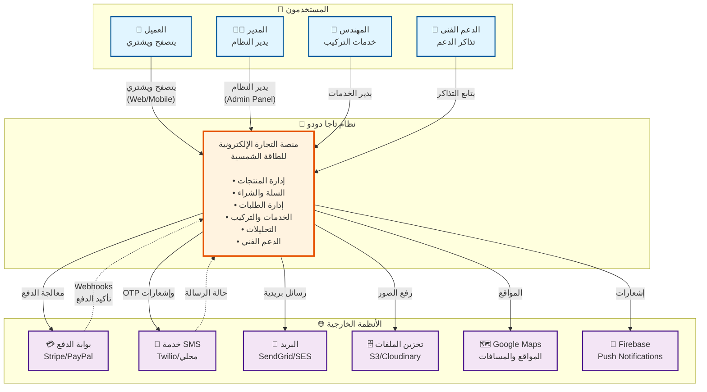
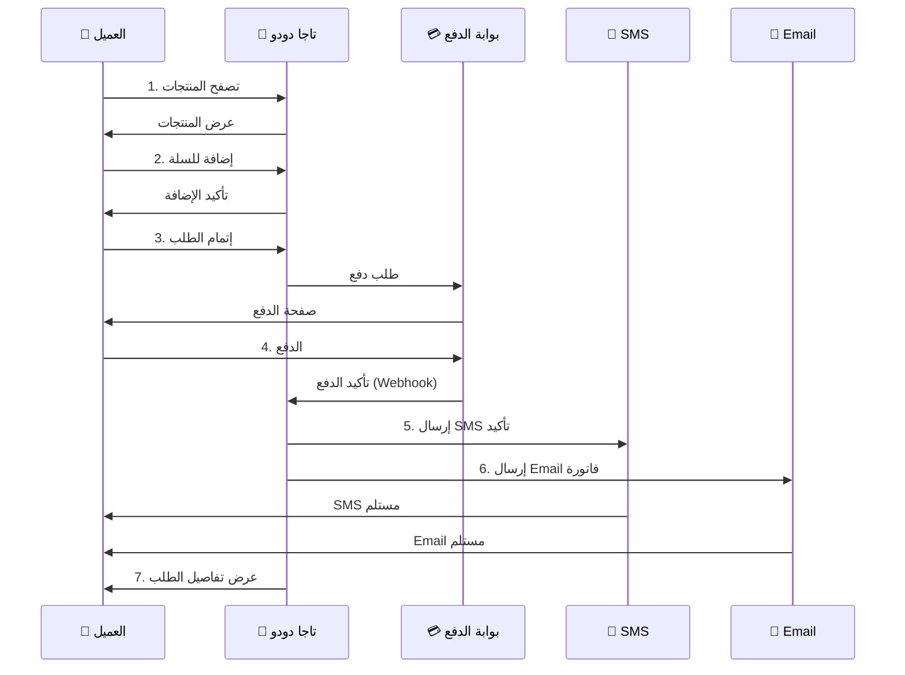

# 📊 C4 Model - Level 1: System Context

## نظرة عامة
هذا المستوى يوضح **السياق العام** لنظام تاجا دودو وكيف يتفاعل مع المستخدمين والأنظمة الخارجية.

---

## 🎯 مخطط السياق (PlantUML)

```plantuml
@startuml System Context
!include https://raw.githubusercontent.com/plantuml-stdlib/C4-PlantUML/master/C4_Context.puml

LAYOUT_WITH_LEGEND()

title System Context - نظام تاجا دودو للطاقة الشمسية

' المستخدمون
Person(customer, "العميل", "مستخدم يتصفح ويشتري منتجات الطاقة الشمسية")
Person(admin, "المدير", "يدير المنتجات والطلبات والمستخدمين")
Person(engineer, "المهندس", "يدير خدمات التركيب والصيانة")
Person(support, "الدعم الفني", "يتابع تذاكر الدعم والطلبات")

' النظام الرئيسي
System(tagadodo, "نظام تاجا دودو", "منصة تجارة إلكترونية متكاملة لبيع وتركيب منتجات الطاقة الشمسية")

' الأنظمة الخارجية
System_Ext(payment, "بوابة الدفع", "معالجة المدفوعات الإلكترونية (Stripe/PayPal/محلي)")
System_Ext(sms, "خدمة SMS", "إرسال رسائل OTP والإشعارات")
System_Ext(email, "خدمة البريد", "إرسال البريد الإلكتروني (SendGrid/SES)")
System_Ext(storage, "تخزين الملفات", "S3/Cloudinary لتخزين الصور")
System_Ext(maps, "خرائط Google", "عرض المواقع وحساب المسافات")
System_Ext(firebase, "Firebase", "Push Notifications للتطبيق")

' العلاقات - العملاء
Rel(customer, tagadodo, "يتصفح المنتجات، يضيف للسلة، يشتري", "HTTPS/Mobile App")
Rel(admin, tagadodo, "يدير النظام", "HTTPS/Admin Panel")
Rel(engineer, tagadodo, "يدير الخدمات والمواعيد", "HTTPS")
Rel(support, tagadodo, "يتابع التذاكر", "HTTPS")

' العلاقات - الأنظمة الخارجية
Rel(tagadodo, payment, "معالجة الدفع", "REST API/Webhook")
Rel(tagadodo, sms, "إرسال OTP/إشعارات", "REST API")
Rel(tagadodo, email, "إرسال رسائل", "SMTP/REST API")
Rel(tagadodo, storage, "رفع وعرض الصور", "REST API")
Rel(tagadodo, maps, "الموقع والمسافات", "REST API")
Rel(tagadodo, firebase, "Push Notifications", "Firebase SDK")

' عكس العلاقات
Rel(payment, tagadodo, "تأكيد الدفع", "Webhook")
Rel_Back(sms, tagadodo, "حالة الرسالة", "Callback")

@enduml
```

---

## 🎯 مخطط السياق (Mermaid)



---

## 👥 المستخدمون (Actors)

### 1. 🛒 العميل (Customer)
**الوصف**: المستخدم النهائي الذي يستخدم النظام للشراء

**القنوات**:
- 🌐 موقع الويب (Web Application)
- 📱 تطبيق الهاتف (Mobile App - iOS/Android)

**الوظائف الرئيسية**:
- ✅ تصفح المنتجات والفئات
- ✅ البحث والفلترة
- ✅ إضافة المنتجات للسلة
- ✅ الشراء والدفع الإلكتروني
- ✅ تتبع الطلبات
- ✅ طلب خدمات التركيب
- ✅ الدعم الفني
- ✅ المفضلة (Favorites)
- ✅ إدارة العناوين
- ✅ عرض الفواتير

---

### 2. 👨‍💼 المدير (Admin)
**الوصف**: مدير النظام الذي يتحكم بكل شيء

**القناة**:
- 💻 لوحة تحكم الإدارة (Admin Panel)

**الوظائف الرئيسية**:
- ✅ إدارة المنتجات والفئات
- ✅ إدارة الطلبات
- ✅ إدارة المستخدمين والصلاحيات
- ✅ إدارة الخدمات والمواعيد
- ✅ إدارة الكوبونات والعروض
- ✅ التحليلات والتقارير
- ✅ إدارة البنرات والإعلانات
- ✅ إدارة الماركات
- ✅ إعدادات النظام
- ✅ مراجعة الدعم الفني

---

### 3. 🔧 المهندس (Engineer)
**الوصف**: المهندس الذي يقوم بخدمات التركيب والصيانة

**القناة**:
- 📱 تطبيق الهاتف / لوحة تحكم مبسطة

**الوظائف الرئيسية**:
- ✅ عرض الطلبات المخصصة له
- ✅ تحديث حالة الخدمة
- ✅ إضافة ملاحظات فنية
- ✅ رفع صور العمل
- ✅ إدارة المواعيد
- ✅ عرض المواقع على الخريطة

---

### 4. 💬 الدعم الفني (Support)
**الوصف**: فريق الدعم الذي يتابع استفسارات العملاء

**القناة**:
- 💻 لوحة تحكم الدعم

**الوظائف الرئيسية**:
- ✅ عرض التذاكر
- ✅ الرد على الاستفسارات
- ✅ تصعيد المشاكل
- ✅ إغلاق التذاكر
- ✅ إضافة ملاحظات داخلية

---

## 🏢 النظام الرئيسي

### نظام تاجا دودو
**النوع**: منصة تجارة إلكترونية متكاملة

**التقنيات الأساسية**:
- Backend: NestJS + TypeScript
- Frontend: React + TypeScript
- Mobile: React Native (مخطط)
- Database: MongoDB
- Cache: Redis
- Storage: S3 / Cloudinary

**الوحدات الرئيسية**:
1. 🛍️ **Catalog** - عرض المنتجات
2. 🛒 **Cart** - سلة الشراء
3. 💳 **Checkout** - إتمام الطلب
4. 📦 **Orders** - إدارة الطلبات
5. 🔧 **Services** - خدمات التركيب
6. 💬 **Support** - الدعم الفني
7. 📊 **Analytics** - التحليلات
8. 🔐 **Auth** - المصادقة والتفويض
9. 🏷️ **Promotions** - العروض والكوبونات
10. 🔔 **Notifications** - الإشعارات

---

## 🌐 الأنظمة الخارجية

### 1. 💳 بوابة الدفع (Payment Gateway)
**الغرض**: معالجة المدفوعات الإلكترونية

**الخيارات**:
- Stripe (دولي)
- PayPal
- بوابة محلية (السعودية: HyperPay, PayTabs)

**الاتصال**:
- REST API للبدء
- Webhooks للتأكيد

**البيانات المتبادلة**:
- معلومات الدفع (مبلغ، عملة)
- حالة المعاملة
- معرف المعاملة

---

### 2. 📱 خدمة SMS
**الغرض**: إرسال رسائل نصية

**الاستخدامات**:
- OTP لتسجيل الدخول
- تأكيد الطلبات
- تحديثات حالة الطلب

**الخيارات**:
- Twilio (دولي)
- خدمة محلية

---

### 3. 📧 خدمة البريد الإلكتروني
**الغرض**: إرسال رسائل بريدية

**الاستخدامات**:
- تأكيد التسجيل
- الفواتير
- تحديثات الطلبات
- التسويق

**الخيارات**:
- SendGrid
- AWS SES
- Mailgun

---

### 4. 🗄️ تخزين الملفات
**الغرض**: تخزين الصور والملفات

**الاستخدامات**:
- صور المنتجات
- صور الملف الشخصي
- مرفقات الدعم الفني
- فواتير PDF

**الخيارات**:
- AWS S3
- Cloudinary (مع معالجة الصور)

---

### 5. 🗺️ Google Maps
**الغرض**: الخرائط والمواقع

**الاستخدامات**:
- عرض المواقع
- حساب المسافات
- تقدير الشحن
- تحديد موقع العميل

---

### 6. 🔔 Firebase
**الغرض**: Push Notifications

**الاستخدامات**:
- إشعارات الطلبات (Mobile App)
- إشعارات الدعم
- إشعارات العروض

---

## 🔄 تدفق البيانات الرئيسي

### سيناريو: عميل يشتري منتج



---

## 📊 الإحصائيات المتوقعة

### المستخدمون المتوقعون:
- **العملاء**: 10,000 - 100,000 مستخدم
- **المديرون**: 5-20 مستخدم
- **المهندسون**: 10-50 مهندس
- **الدعم الفني**: 5-15 موظف

### الاستخدام المتوقع:
- **الطلبات**: 100-1000 طلب يومياً
- **المشاهدات**: 10,000-100,000 صفحة يومياً
- **الإشعارات**: 1,000-10,000 إشعار يومياً

---

## 🔒 اعتبارات الأمان

### 1. المصادقة
- JWT Tokens
- Refresh Tokens
- OTP للهاتف
- Password Hashing (bcrypt)

### 2. التفويض
- Role-Based Access Control (RBAC)
- صلاحيات دقيقة (Permissions)

### 3. حماية API
- Rate Limiting
- CORS Configuration
- Helmet Security Headers
- Input Validation
- SQL Injection Protection

### 4. البيانات الحساسة
- تشفير البيانات الحساسة
- PCI Compliance للدفع
- GDPR Compliance

---

## 📈 اعتبارات التوسع

### 1. Horizontal Scaling
- استخدام Load Balancer
- Docker Containers
- Kubernetes (مستقبلاً)

### 2. Database Scaling
- MongoDB Sharding
- Read Replicas
- Database Indexing

### 3. Caching Strategy
- Redis للجلسات
- Cache للمنتجات
- CDN للصور

### 4. Performance
- Image Optimization
- API Response Compression
- Database Query Optimization
- Lazy Loading

---

## 📝 ملاحظات

1. **Multi-language**: النظام يدعم العربية والإنجليزية (RTL/LTR)
2. **Mobile-First**: التصميم يركز على تجربة الهاتف
3. **Real-time**: بعض الميزات تتطلب تحديثات فورية (WebSockets)
4. **Offline**: التطبيق يجب أن يعمل جزئياً بدون إنترنت

---

**التالي**: [Level 2 - Container Diagram →](./02-container-diagram.md)

