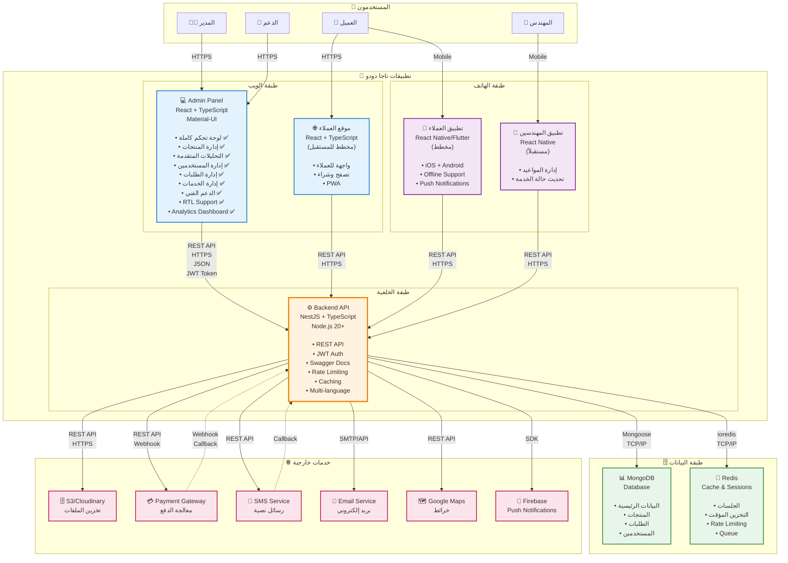
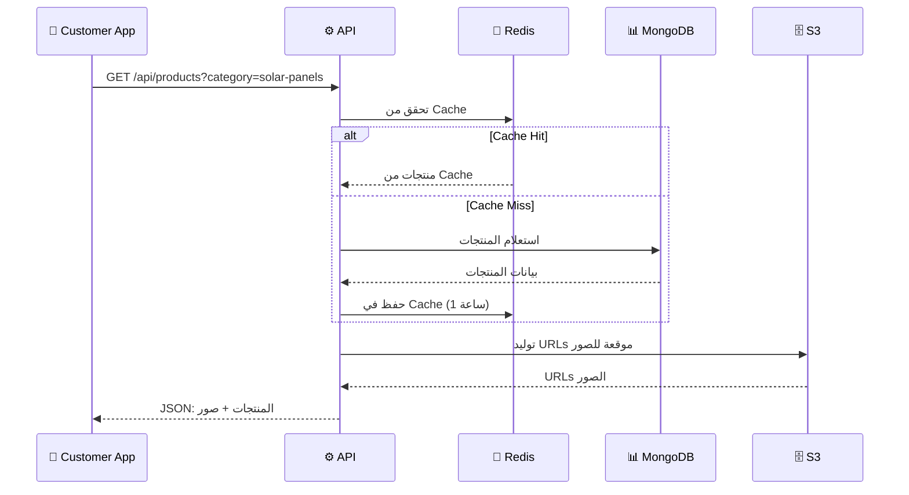
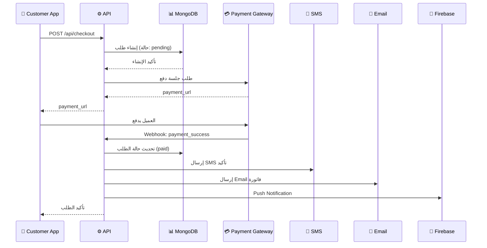
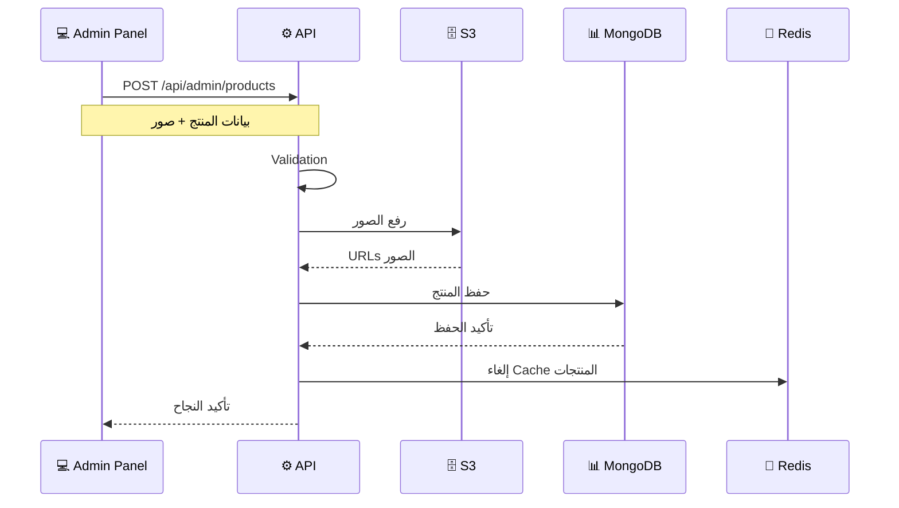
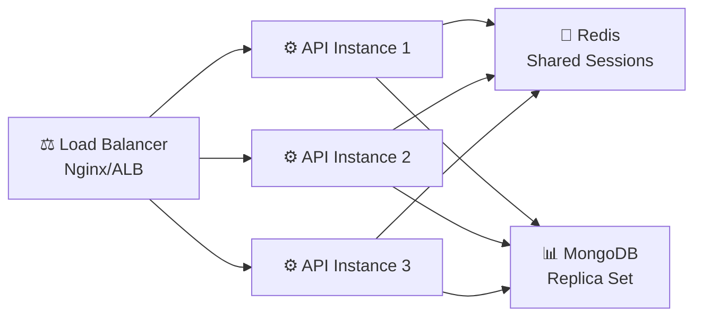

# 📊 C4 Model - Level 2: Container Diagram

## نظرة عامة
هذا المستوى يوضح **الحاويات الرئيسية** (Containers) في نظام تاجا دودو وكيف تتفاعل مع بعضها.

**ملاحظة**: Container هنا لا يعني Docker Container، بل يعني وحدة قابلة للنشر (Deployable Unit) مثل Web App, Mobile App, Database, إلخ.

---

## 🎯 مخطط الحاويات (Mermaid)



---

## 🎯 مخطط الحاويات (PlantUML)

```plantuml
@startuml Container Diagram
!include https://raw.githubusercontent.com/plantuml-stdlib/C4-PlantUML/master/C4_Container.puml

LAYOUT_WITH_LEGEND()

title Container Diagram - حاويات نظام تاجا دودو

Person(customer, "العميل", "المستخدم النهائي")
Person(admin, "المدير", "إدارة النظام")
Person(engineer, "المهندس", "خدمات التركيب")

System_Boundary(tagadodo, "نظام تاجا دودو") {
    
    Container(adminPanel, "Admin Panel", "React, TypeScript, Material-UI", "لوحة تحكم للإدارة الكاملة")
    Container(customerWeb, "موقع العملاء", "React, TypeScript (مستقبلاً)", "واجهة ويب للعملاء")
    Container(customerApp, "تطبيق العملاء", "React Native/Flutter", "تطبيق iOS + Android")
    Container(engineerApp, "تطبيق المهندسين", "React Native", "إدارة الخدمات الميدانية")
    
    Container(api, "Backend API", "NestJS, TypeScript, Node.js", "REST API - المنطق الأساسي للنظام")
    
    ContainerDb(mongodb, "MongoDB", "NoSQL Database", "البيانات الرئيسية")
    ContainerDb(redis, "Redis", "In-Memory Cache", "التخزين المؤقت والجلسات")
}

System_Ext(storage, "S3 / Cloudinary", "تخزين الملفات والصور")
System_Ext(payment, "Payment Gateway", "معالجة الدفع")
System_Ext(sms, "SMS Service", "رسائل نصية")
System_Ext(email, "Email Service", "بريد إلكتروني")
System_Ext(maps, "Google Maps", "خرائط ومواقع")
System_Ext(firebase, "Firebase", "Push Notifications")

' العلاقات - المستخدمون
Rel(admin, adminPanel, "يستخدم", "HTTPS")
Rel(customer, customerWeb, "يتصفح", "HTTPS")
Rel(customer, customerApp, "يستخدم", "Mobile")
Rel(engineer, engineerApp, "يستخدم", "Mobile")

' العلاقات - التطبيقات إلى API
Rel(adminPanel, api, "يستدعي", "REST/HTTPS, JSON")
Rel(customerWeb, api, "يستدعي", "REST/HTTPS, JSON")
Rel(customerApp, api, "يستدعي", "REST/HTTPS, JSON")
Rel(engineerApp, api, "يستدعي", "REST/HTTPS, JSON")

' العلاقات - API إلى البيانات
Rel(api, mongodb, "يقرأ ويكتب", "Mongoose/TCP")
Rel(api, redis, "يخزن مؤقتاً", "ioredis/TCP")

' العلاقات - API إلى الخدمات الخارجية
Rel(api, storage, "يرفع الملفات", "HTTPS/API")
Rel(api, payment, "يطلب دفع", "HTTPS/API")
Rel(api, sms, "يرسل SMS", "HTTPS/API")
Rel(api, email, "يرسل Email", "SMTP/API")
Rel(api, maps, "يستعلم", "HTTPS/API")
Rel(api, firebase, "يرسل إشعارات", "Firebase SDK")

' عكس العلاقات
Rel_Back(payment, api, "يؤكد الدفع", "Webhook")

@enduml
```

---

## 📦 تفاصيل الحاويات

### 1. 💻 Admin Panel (لوحة تحكم الإدارة)

**التقنيات**:
- React 18+
- TypeScript
- Material-UI (MUI)
- React Query
- Zustand (State Management)
- React Router

**المسؤوليات**:
- ✅ إدارة المنتجات والفئات والسمات
- ✅ إدارة الطلبات وتتبعها
- ✅ إدارة المستخدمين والصلاحيات
- ✅ إدارة الخدمات والمواعيد
- ✅ إدارة الكوبونات والعروض
- ✅ إدارة البنرات والماركات
- ✅ التحليلات والتقارير
- ✅ إعدادات النظام
- ✅ الدعم الفني

**المنافذ (Ports)**:
- **Inbound**: HTTPS (443)
- **Outbound**: API على HTTPS

**الأمان**:
- JWT Authentication
- Role-Based Access (Admin/Support/Engineer)
- HTTPS Only
- CORS Protected

**النشر**:
- Static Files على CDN
- Vercel / Netlify / S3 + CloudFront

---

### 2. 🌐 موقع العملاء (Customer Website)

**الحالة**: 🔄 مخطط للمستقبل

**التقنيات**:
- React 18+ / Next.js
- TypeScript
- Tailwind CSS / MUI
- PWA Support

**المسؤوليات**:
- ✅ تصفح المنتجات
- ✅ البحث والفلترة
- ✅ السلة والشراء
- ✅ تتبع الطلبات
- ✅ طلب الخدمات
- ✅ الدعم الفني

**المنافذ**:
- **Inbound**: HTTPS (443)
- **Outbound**: API على HTTPS

**ميزات خاصة**:
- SEO Optimized
- PWA (يعمل Offline جزئياً)
- Multi-language (AR/EN)
- RTL/LTR Support

---

### 3. 📱 تطبيق العملاء (Customer Mobile App)

**الحالة**: 🔄 مخطط

**التقنيات**:
- **الخيار 1**: React Native + TypeScript
- **الخيار 2**: Flutter

**المسؤوليات**:
- ✅ جميع وظائف موقع العملاء
- ✅ Push Notifications
- ✅ Biometric Login
- ✅ Location Services
- ✅ Camera (لصور الدعم)
- ✅ Offline Mode

**المنافذ**:
- **Inbound**: Push Notifications (Firebase)
- **Outbound**: API على HTTPS

**المنصات**:
- iOS 13+
- Android 8+

**ميزات خاصة**:
- Offline-First Architecture
- Background Sync
- Deep Linking
- Share Functionality

---

### 4. 🔧 تطبيق المهندسين (Engineer Mobile App)

**الحالة**: 🔄 مخطط للمستقبل

**التقنيات**:
- React Native + TypeScript

**المسؤوليات**:
- ✅ عرض المواعيد المخصصة
- ✅ تحديث حالة الخدمة
- ✅ إضافة ملاحظات
- ✅ رفع صور العمل
- ✅ التنقل إلى الموقع (GPS)

**المنافذ**:
- **Inbound**: Push Notifications
- **Outbound**: API على HTTPS

---

### 5. ⚙️ Backend API (الخلفية)

**التقنيات**:
- NestJS
- TypeScript
- Node.js 20+
- Express
- Mongoose (MongoDB ODM)
- ioredis (Redis Client)
- JWT
- Passport

**المسؤوليات**:
- ✅ المنطق الأساسي للنظام (Business Logic)
- ✅ المصادقة والتفويض
- ✅ إدارة البيانات
- ✅ التكامل مع الخدمات الخارجية
- ✅ معالجة الطلبات
- ✅ إرسال الإشعارات
- ✅ التحليلات
- ✅ الأمان (Rate Limiting, Validation)

**المنافذ**:
- **Inbound**: 
  - HTTPS (443 / 3000)
  - Webhooks (من Payment Gateway)
- **Outbound**:
  - MongoDB (27017)
  - Redis (6379)
  - خدمات خارجية (HTTPS)

**الوحدات المطبقة (Modules)**:
```
Backend API (21 وحدة مكتملة)
├── Auth (المصادقة) ✅
├── Users (المستخدمون) ✅
├── Products (المنتجات) ✅
├── Categories (الفئات) ✅
├── Attributes (السمات) ✅
├── Brands (الماركات) ✅
├── Catalog (العرض العام) ✅
├── Cart (السلة) ✅
├── Checkout (الشراء) ✅
├── Orders (الطلبات) ✅
├── Services (الخدمات) ✅
├── Support (الدعم الفني) ✅
├── Notifications (الإشعارات) ✅
├── Analytics (التحليلات) ✅
├── Marketing (التسويق) ✅
├── Addresses (العناوين) ✅
├── Favorites (المفضلة) ✅
├── Search (البحث) ✅
├── Security (الأمان) ✅
├── Exchange Rates (أسعار الصرف) ✅
└── Upload (رفع الملفات) ✅
```

**الأمان**:
- JWT + Refresh Tokens
- Role-Based Access Control (RBAC)
- Rate Limiting (Redis)
- Input Validation (class-validator)
- CORS Configuration
- Helmet Security Headers
- XSS Protection
- SQL Injection Protection (Mongoose)

**الأداء**:
- Redis Caching
- Database Indexing
- Query Optimization
- Response Compression
- Pagination

**التوثيق**:
- Swagger / OpenAPI على `/docs`
- Auto-generated من Decorators

---

### 6. 📊 MongoDB (قاعدة البيانات)

**النوع**: NoSQL Document Database

**الاستخدام**:
- البيانات الرئيسية للنظام
- المنتجات والفئات
- الطلبات والخدمات
- المستخدمون والصلاحيات
- الإشعارات والدعم

**المجموعات الرئيسية (Collections)**:
```
MongoDB
├── users
├── products
├── categories
├── attributes
├── brands
├── orders
├── services
├── cart
├── favorites
├── addresses
├── coupons
├── promotions
├── notifications
├── support-tickets
├── banners
└── analytics-events
```

**الميزات**:
- Indexes للأداء
- Transactions للعمليات الحرجة
- TTL Indexes للبيانات المؤقتة
- Text Indexes للبحث
- Geo Indexes للمواقع

**النشر**:
- MongoDB Atlas (Cloud)
- أو Self-Hosted

**النسخ الاحتياطي**:
- نسخ احتياطي تلقائي يومي
- Point-in-Time Recovery

---

### 7. 🔴 Redis (التخزين المؤقت)

**النوع**: In-Memory Data Store

**الاستخدام**:
- الجلسات (Sessions)
- التخزين المؤقت (Cache)
- Rate Limiting
- Queue (للمهام الخلفية)
- Real-time Data

**البيانات المخزنة**:
- `session:*` - جلسات المستخدمين
- `cache:product:*` - المنتجات المؤقتة
- `cache:category:*` - الفئات المؤقتة
- `ratelimit:*` - عدادات Rate Limiting
- `queue:*` - طوابير المهام

**TTL (Time To Live)**:
- Sessions: 7 أيام
- Product Cache: 1 ساعة
- Rate Limit: 15 دقيقة

**النشر**:
- Redis Cloud
- أو Self-Hosted

---

## 🔗 تدفق البيانات

### سيناريو 1: عميل يتصفح المنتجات



---

### سيناريو 2: عميل يشتري منتج



---

### سيناريو 3: مدير يضيف منتج



---

## 🔒 الأمان بين الحاويات

### 1. التطبيقات → API

**المصادقة**:
```
Authorization: Bearer <JWT_TOKEN>
```

**التحقق**:
- JWT Signature Verification
- Token Expiry Check
- User Active Check

**التشفير**:
- HTTPS Only (TLS 1.3)
- Certificate Pinning (Mobile Apps)

---

### 2. API → MongoDB

**المصادقة**:
- Username + Password
- IP Whitelist

**التشفير**:
- TLS/SSL Connection
- Data at Rest Encryption

---

### 3. API → Redis

**المصادقة**:
- Password (Redis AUTH)
- IP Whitelist

**التشفير**:
- TLS Connection (Production)

---

### 4. API → External Services

**المصادقة**:
- API Keys
- OAuth (بعض الخدمات)
- Webhooks Secret

**التحقق**:
- Webhook Signature Verification
- IP Whitelist (Webhooks)

---

## 📈 التوسع والأداء

### Horizontal Scaling



### استراتيجية التوسع:

1. **API Scaling**:
   - Docker Containers
   - Kubernetes (مستقبلاً)
   - Auto-scaling بناءً على CPU/Memory

2. **Database Scaling**:
   - MongoDB Replica Set (Read Replicas)
   - Sharding (عند الحاجة)

3. **Cache Scaling**:
   - Redis Cluster
   - Cache Layers (L1: Memory, L2: Redis)

4. **Storage Scaling**:
   - CDN للصور (CloudFront)
   - Multiple S3 Buckets

---

## 🚀 النشر (Deployment)

### Development
```
Frontend: localhost:5173
Backend API: localhost:3000
MongoDB: localhost:27017
Redis: localhost:6379
```

### Staging
```
Frontend: staging-admin.tagadodo.com
Backend API: staging-api.tagadodo.com
MongoDB: MongoDB Atlas (Staging Cluster)
Redis: Redis Cloud (Staging)
```

### Production
```
Frontend: admin.tagadodo.com
Backend API: api.tagadodo.com
Customer Web: tagadodo.com (مستقبلاً)
Mobile Apps: App Store + Google Play
MongoDB: MongoDB Atlas (Production Cluster)
Redis: Redis Cloud (Production)
```

---

## 📊 الإحصائيات المتوقعة

### حجم الحاويات:

| Container | Memory | CPU | Storage |
|-----------|--------|-----|---------|
| Admin Panel | - | - | ~50 MB (Static) |
| Customer App | - | - | ~100 MB (Download) |
| Backend API | 512 MB - 2 GB | 1-2 vCPU | Minimal |
| MongoDB | 2-8 GB | 2-4 vCPU | 50-500 GB |
| Redis | 512 MB - 2 GB | 1 vCPU | 1-10 GB |

### الاستخدام المتوقع:

| Metric | Development | Production |
|--------|-------------|------------|
| API Requests/sec | 1-10 | 100-1000 |
| Concurrent Users | 1-5 | 500-5000 |
| Database Queries/sec | 10-50 | 1000-5000 |
| Cache Hit Rate | - | 80-90% |

---

## 📝 ملاحظات تقنية

### 1. Multi-tenancy
- حالياً: Single Tenant
- مستقبلاً: يمكن إضافة Multi-tenancy

### 2. Real-time Features
- حالياً: Polling
- مستقبلاً: WebSockets / Server-Sent Events

### 3. GraphQL
- حالياً: REST API
- مستقبلاً: GraphQL كخيار إضافي

### 4. Message Queue
- حالياً: Redis Queue
- مستقبلاً: RabbitMQ / Apache Kafka

---

---

## 📝 ملخص التحديثات

### ✅ التحديثات المطبقة:
1. **تحديث وصف Admin Panel**: إضافة الميزات المطبقة فعلياً
2. **تحديث قائمة الوحدات**: من 10 وحدات إلى 21 وحدة مكتملة
3. **إضافة الوحدات الجديدة**: Exchange Rates, Upload, Security, Marketing
4. **تحديث حالة التطوير**: جميع الوحدات مكتملة ومطبقة
5. **تحديث الأمان**: نظام أمان متقدم مع Rate Limiting وCORS

### 📊 الإحصائيات المحدثة:
- **الوحدات المطبقة**: 21/21 (100%)
- **Admin Panel**: مكتمل بالكامل مع جميع الميزات
- **Backend API**: مكتمل مع جميع الوحدات
- **قاعدة البيانات**: MongoDB مع Redis للتخزين المؤقت
- **نظام الأمان**: متقدم مع حماية شاملة

---

**السابق**: [← Level 1 - System Context](./01-system-context.md)  
**التالي**: [Level 3 - Component Diagram →](./03-component-diagram.md)

