# 📊 C4 Model - Level 3: Component Diagram

## نظرة عامة
هذا المستوى يوضح **المكونات الداخلية** (Components) لحاوية **Backend API** وكيف تتفاعل مع بعضها.

---

## 🎯 معمارية Backend API

### النمط المعماري
**Modular Monolith with Layered Architecture**

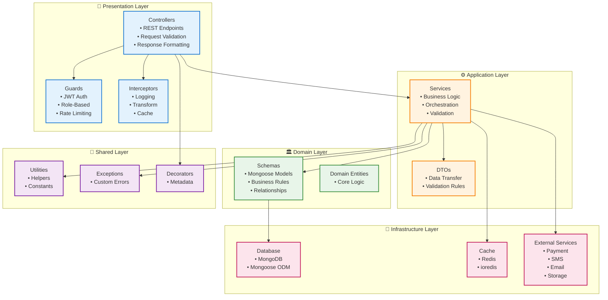

---

## 📦 الوحدات الرئيسية (Modules)

### هيكل الوحدات

```
src/
├── main.ts                    # نقطة البداية
├── app.module.ts              # الوحدة الرئيسية
│
├── config/                    # إعدادات النظام
│   └── env.validation.ts
│
├── modules/                   # وحدات الأعمال (21 وحدة مكتملة)
│   ├── auth/                  # 🔐 المصادقة ✅
│   ├── users/                 # 👥 المستخدمون ✅
│   ├── products/              # 📦 المنتجات ✅
│   ├── categories/            # 📂 الفئات ✅
│   ├── attributes/            # 🏷️ السمات ✅
│   ├── brands/                # 🔖 الماركات ✅
│   ├── catalog/               # 🛍️ الكتالوج ✅
│   ├── cart/                  # 🛒 السلة ✅
│   ├── checkout/              # 💳 الشراء ✅
│   ├── orders/                # 📦 الطلبات ✅
│   ├── services/              # 🔧 الخدمات ✅
│   ├── support/               # 💬 الدعم ✅
│   ├── notifications/         # 🔔 الإشعارات ✅
│   ├── analytics/             # 📊 التحليلات ✅
│   ├── marketing/             # 🎯 التسويق ✅
│   ├── addresses/             # 📍 العناوين ✅
│   ├── favorites/             # ❤️ المفضلة ✅
│   ├── search/                # 🔍 البحث ✅
│   ├── security/              # 🛡️ الأمان ✅
│   ├── exchange-rates/        # 💱 أسعار الصرف ✅
│   └── upload/                # 📤 الملفات ✅
│
└── shared/                    # مشتركات
    ├── cache/                 # Cache Module
    ├── decorators/            # Custom Decorators
    ├── exceptions/            # Custom Exceptions
    ├── filters/               # Exception Filters
    ├── guards/                # Custom Guards
    ├── interceptors/          # Interceptors
    ├── middleware/            # Middleware
    └── utils/                 # Utilities
```

---

## 🎨 Frontend Components (مكونات الواجهة الأمامية)

### Admin Dashboard Structure
```
admin-dashboard/src/
├── App.tsx                     # التطبيق الرئيسي ✅
├── main.tsx                    # نقطة البداية ✅
│
├── core/                       # الأساسيات ✅
│   ├── theme/                  # نظام الألوان والثيمات ✅
│   ├── router/                 # التوجيه ✅
│   ├── auth/                   # إدارة المصادقة ✅
│   ├── error/                  # معالجة الأخطاء ✅
│   └── i18n/                   # الترجمة ✅
│
├── features/                   # الميزات (21 ميزة مكتملة)
│   ├── auth/                   # 🔐 المصادقة ✅
│   ├── users/                  # 👥 المستخدمون ✅
│   ├── products/               # 📦 المنتجات ✅
│   ├── categories/             # 📂 الفئات ✅
│   ├── attributes/             # 🏷️ السمات ✅
│   ├── brands/                 # 🔖 الماركات ✅
│   ├── cart/                   # 🛒 السلة ✅
│   ├── orders/                 # 📦 الطلبات ✅
│   ├── services/               # 🔧 الخدمات ✅
│   ├── support/                # 💬 الدعم ✅
│   ├── notifications/          # 🔔 الإشعارات ✅
│   ├── analytics/              # 📊 التحليلات ✅
│   ├── marketing/              # 🎯 التسويق ✅
│   ├── addresses/              # 📍 العناوين ✅
│   ├── favorites/              # ❤️ المفضلة ✅
│   ├── media/                  # 📤 الملفات ✅
│   ├── exchange-rates/         # 💱 أسعار الصرف ✅
│   ├── banners/                # 🖼️ البنرات ✅
│   ├── coupons/                # 🎫 الكوبونات ✅
│   ├── promotions/             # 🎉 العروض ✅
│   └── dashboard/              # 📊 لوحة التحكم ✅
│
├── shared/                     # مشتركات ✅
│   ├── components/             # مكونات مشتركة ✅
│   ├── hooks/                  # Custom Hooks ✅
│   ├── types/                  # الأنواع ✅
│   └── utils/                  # الأدوات ✅
│
└── store/                      # إدارة الحالة ✅
    ├── authStore.ts            # حالة المصادقة ✅
    └── themeStore.ts           # حالة الثيم ✅
```

### المكونات الرئيسية المطبقة:
- ✅ **Dashboard**: لوحة تحكم شاملة مع إحصائيات
- ✅ **Analytics**: تحليلات متقدمة مع رسوم بيانية
- ✅ **Products Management**: إدارة المنتجات الكاملة
- ✅ **Orders Management**: إدارة الطلبات والتتبع
- ✅ **Users Management**: إدارة المستخدمين والأدوار
- ✅ **Services Management**: إدارة خدمات التركيب
- ✅ **Support System**: نظام دعم فني متكامل
- ✅ **Media Library**: مكتبة الملفات والصور
- ✅ **Marketing Tools**: أدوات التسويق والعروض
- ✅ **Settings**: إعدادات النظام

---

## 🔐 Auth Module (وحدة المصادقة)

### المكونات

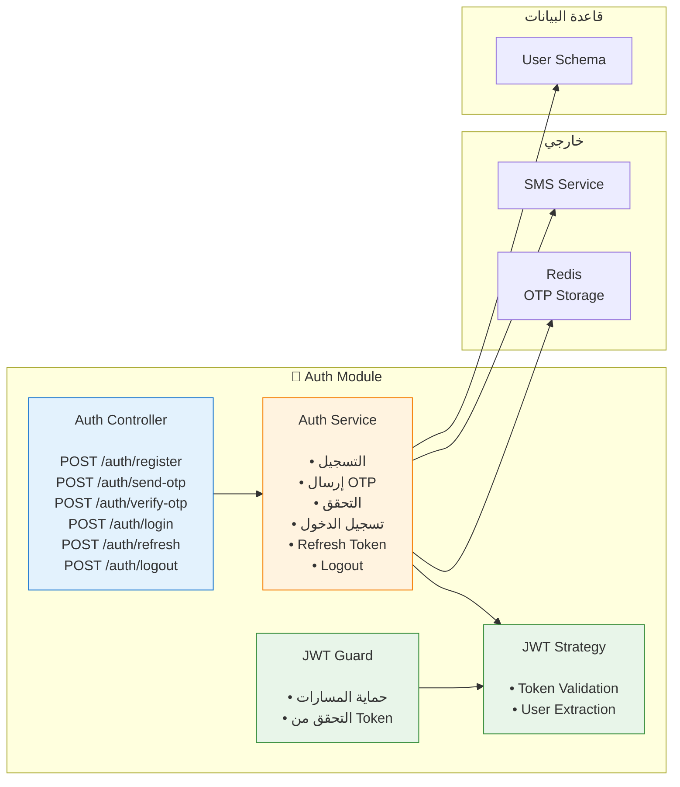

### المسؤوليات

**AuthController**:
- استقبال طلبات المصادقة
- التحقق من البيانات (DTOs)
- إرجاع Tokens

**AuthService**:
- منطق المصادقة
- توليد JWT Tokens
- إرسال OTP عبر SMS
- التحقق من OTP
- Refresh Token Management

**JWTStrategy & Guard**:
- التحقق من صحة Token
- استخراج معلومات المستخدم
- حماية المسارات

---

## 👥 Users Module (وحدة المستخدمين)

### المكونات

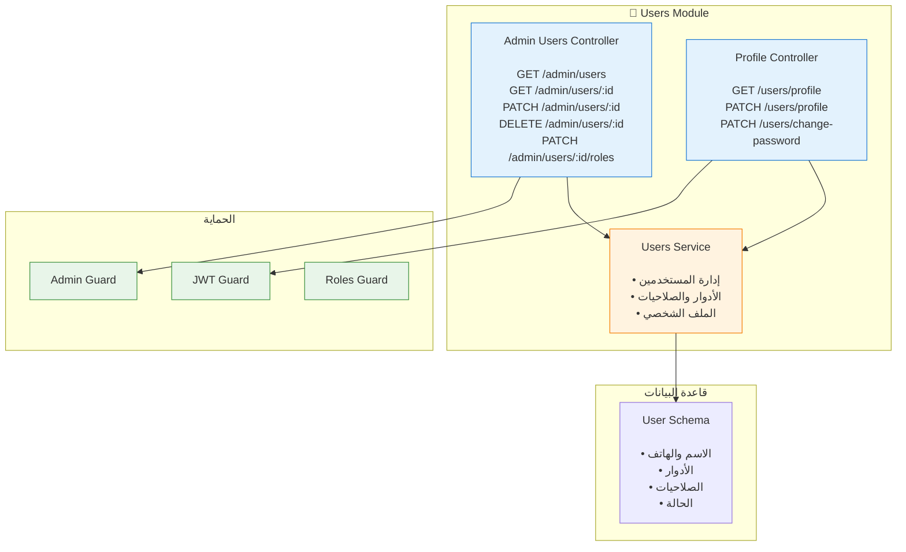

### الأدوار (Roles)

```typescript
enum UserRole {
  CUSTOMER = 'customer',      // العميل
  ADMIN = 'admin',            // المدير
  SUPER_ADMIN = 'super_admin', // المدير الأعلى
  ENGINEER = 'engineer',      // المهندس
  SUPPORT = 'support'         // الدعم الفني
}
```

### الصلاحيات (Permissions)

```typescript
// أمثلة على الصلاحيات
permissions: [
  'products.create',
  'products.update',
  'products.delete',
  'orders.view',
  'orders.update',
  'users.manage',
  // ... إلخ
]
```

---

## 📦 Products Module (وحدة المنتجات)

### المكونات

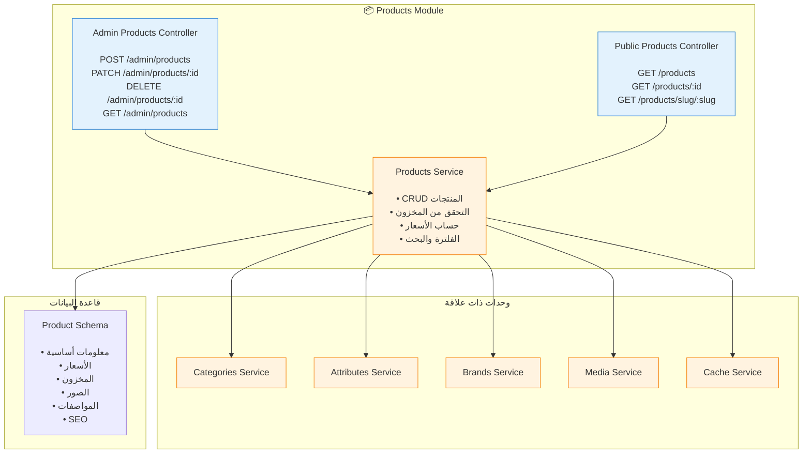

### Product Schema

```typescript
Product {
  _id: ObjectId
  name: { ar: string, en: string }
  description: { ar: string, en: string }
  slug: { ar: string, en: string }
  sku: string
  
  // السعر
  price: number
  compareAtPrice: number
  cost: number
  
  // المخزون
  stock: number
  lowStockThreshold: number
  trackInventory: boolean
  
  // العلاقات
  category: ObjectId -> Category
  brand: ObjectId -> Brand
  attributes: [{
    attribute: ObjectId -> Attribute
    value: string
  }]
  
  // الصور
  images: [{
    url: string
    alt: string
    isPrimary: boolean
  }]
  
  // المواصفات
  specifications: [{
    name: { ar: string, en: string }
    value: { ar: string, en: string }
  }]
  
  // SEO
  seo: {
    title: { ar: string, en: string }
    description: { ar: string, en: string }
    keywords: string[]
  }
  
  // الحالة
  status: 'draft' | 'active' | 'archived'
  featured: boolean
  
  // التواريخ
  createdAt: Date
  updatedAt: Date
}
```

---

## 🛒 Cart Module (وحدة السلة)

### المكونات

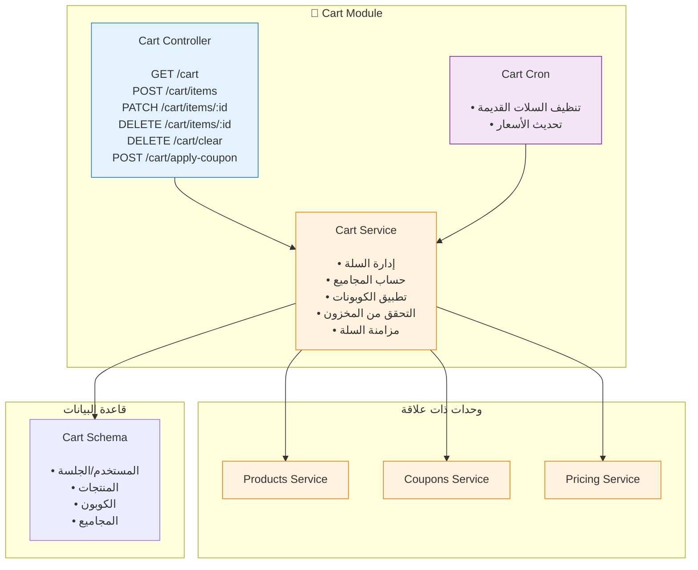

### Cart Schema

```typescript
Cart {
  _id: ObjectId
  
  // المالك
  user?: ObjectId -> User        // للمستخدمين المسجلين
  sessionId?: string             // للضيوف
  
  // المنتجات
  items: [{
    product: ObjectId -> Product
    quantity: number
    price: number                // السعر وقت الإضافة
    subtotal: number
  }]
  
  // الكوبون
  coupon?: {
    code: string
    discount: number
    type: 'percentage' | 'fixed'
  }
  
  // المجاميع
  subtotal: number               // قبل الخصم
  discount: number               // قيمة الخصم
  tax: number                    // الضريبة
  shipping: number               // الشحن
  total: number                  // المجموع النهائي
  
  // الحالة
  status: 'active' | 'abandoned' | 'converted'
  
  // التواريخ
  createdAt: Date
  updatedAt: Date
  expiresAt: Date               // تنتهي بعد 30 يوم
}
```

### منطق حساب السعر

```typescript
// 1. حساب المجموع الفرعي
subtotal = sum(item.price * item.quantity)

// 2. تطبيق الكوبون
if (coupon.type === 'percentage') {
  discount = subtotal * (coupon.discount / 100)
} else {
  discount = coupon.discount
}

// 3. حساب الضريبة (15% في السعودية)
tax = (subtotal - discount) * 0.15

// 4. حساب الشحن (حسب المنطقة)
shipping = calculateShipping(address, weight)

// 5. المجموع النهائي
total = subtotal - discount + tax + shipping
```

---

## 💳 Checkout Module (وحدة الشراء)

### المكونات

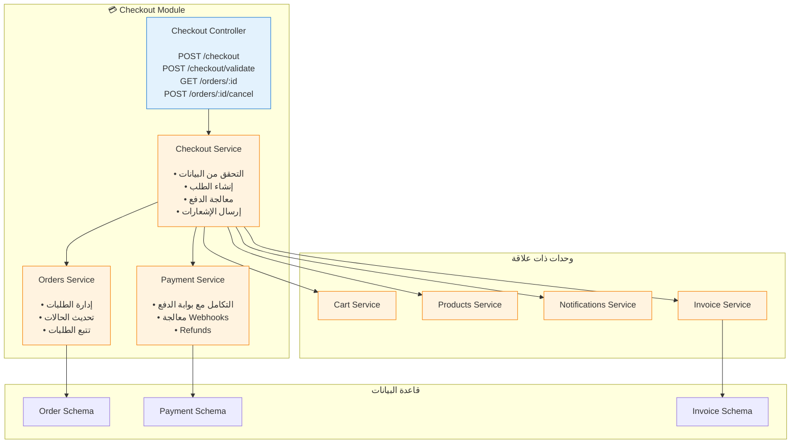

### تدفق عملية الشراء

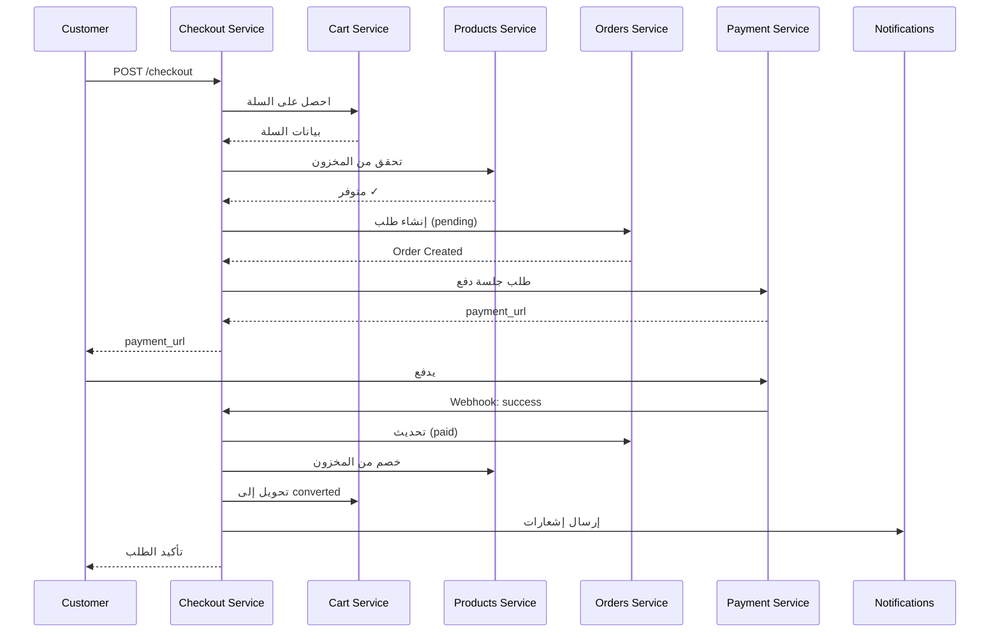

### Order States

```typescript
enum OrderStatus {
  PENDING = 'pending',              // في انتظار الدفع
  PAYMENT_FAILED = 'payment_failed', // فشل الدفع
  PAID = 'paid',                    // تم الدفع
  CONFIRMED = 'confirmed',          // تم التأكيد
  PROCESSING = 'processing',        // قيد التجهيز
  SHIPPED = 'shipped',              // تم الشحن
  OUT_FOR_DELIVERY = 'out_for_delivery', // في الطريق
  DELIVERED = 'delivered',          // تم التوصيل
  CANCELLED = 'cancelled',          // ملغي
  REFUNDED = 'refunded'            // مسترد
}
```

---

## 🔧 Services Module (وحدة الخدمات)

### المكونات

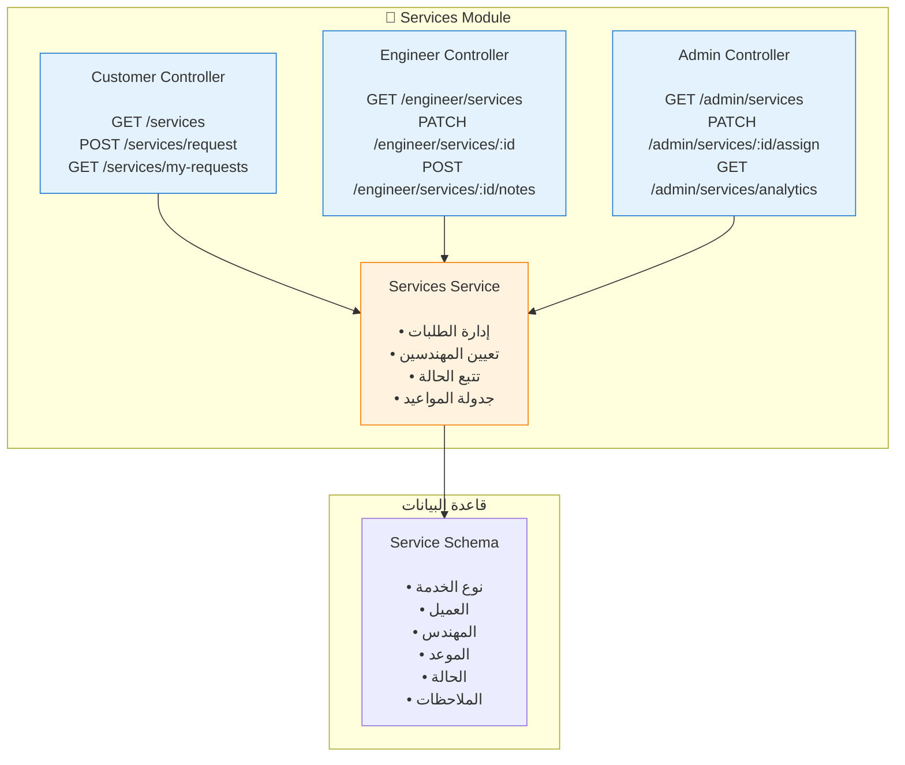

---

## 🔔 Notifications Module (وحدة الإشعارات)

### المكونات

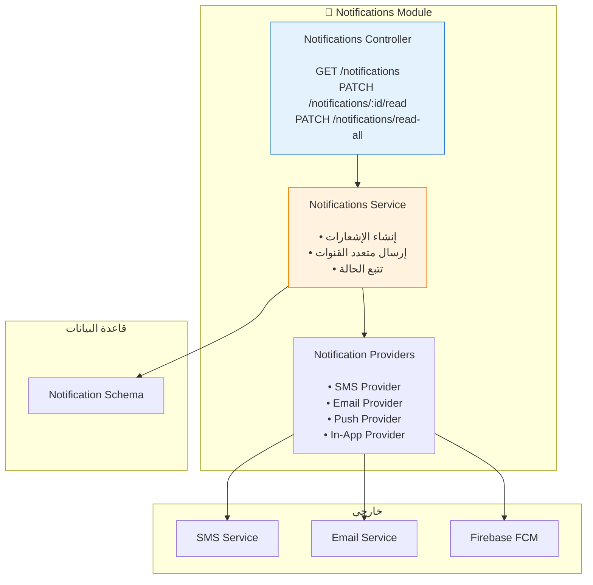

### أنواع الإشعارات

```typescript
enum NotificationType {
  // الطلبات
  ORDER_CREATED = 'order_created',
  ORDER_PAID = 'order_paid',
  ORDER_CONFIRMED = 'order_confirmed',
  ORDER_SHIPPED = 'order_shipped',
  ORDER_DELIVERED = 'order_delivered',
  ORDER_CANCELLED = 'order_cancelled',
  
  // الخدمات
  SERVICE_REQUESTED = 'service_requested',
  SERVICE_ASSIGNED = 'service_assigned',
  SERVICE_SCHEDULED = 'service_scheduled',
  SERVICE_COMPLETED = 'service_completed',
  
  // الدعم
  TICKET_CREATED = 'ticket_created',
  TICKET_REPLIED = 'ticket_replied',
  TICKET_CLOSED = 'ticket_closed',
  
  // النظام
  SYSTEM_ANNOUNCEMENT = 'system_announcement',
  PROMOTION = 'promotion',
  LOW_STOCK = 'low_stock'
}
```

---

## 📊 Analytics Module (وحدة التحليلات)

### المكونات

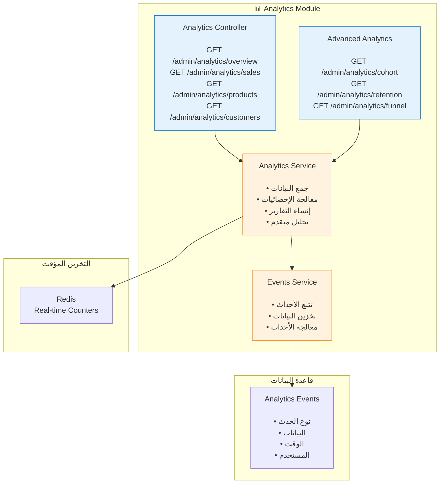

### الأحداث المتتبعة

```typescript
// أحداث المنتجات
- product_viewed
- product_added_to_cart
- product_removed_from_cart
- product_purchased

// أحداث الطلبات
- order_created
- order_completed
- order_cancelled

// أحداث المستخدمين
- user_registered
- user_logged_in
- user_profile_updated

// أحداث البحث
- search_performed
- search_no_results
```

---

## 🛡️ Security Module (وحدة الأمان)

### المكونات

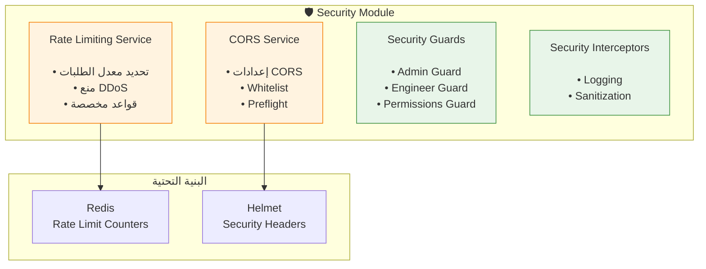

### Rate Limiting Rules

```typescript
// قواعد عامة
{
  '/api': { points: 100, duration: 60 },  // 100 طلب في الدقيقة
  
  // حساسة
  '/auth/send-otp': { points: 3, duration: 300 },   // 3 في 5 دقائق
  '/auth/verify-otp': { points: 5, duration: 300 }, // 5 في 5 دقائق
  '/auth/login': { points: 5, duration: 900 },      // 5 في 15 دقيقة
  
  // Admin
  '/admin': { points: 200, duration: 60 },  // 200 في الدقيقة
}
```

---

## 🔄 Shared Layer (الطبقة المشتركة)

### المكونات

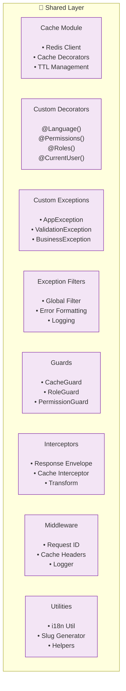

### Cache Strategy

```typescript
// استراتيجية التخزين المؤقت

// 1. Products - 1 ساعة
@CacheTTL(3600)
getProduct(id: string): Promise<Product>

// 2. Categories - 6 ساعات
@CacheTTL(21600)
getCategories(): Promise<Category[]>

// 3. User Profile - 15 دقيقة
@CacheTTL(900)
getUserProfile(userId: string): Promise<User>

// 4. Cart - لا يُخزن مؤقتاً (Dynamic)
getCart(userId: string): Promise<Cart>
```

---

## 🔌 التكامل مع الخدمات الخارجية

### Architecture Pattern: Ports & Adapters

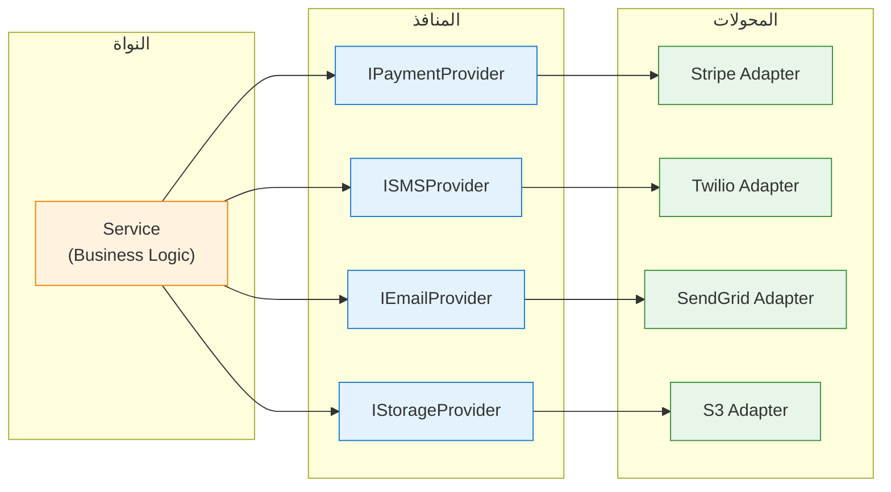

### فوائد هذا النمط:
1. **سهولة تبديل الخدمات**: يمكن تغيير Stripe إلى PayPal بسهولة
2. **قابلية الاختبار**: يمكن عمل Mock للمحولات
3. **فصل المسؤوليات**: النواة لا تعتمد على تفاصيل الخدمات الخارجية

---

## 📈 الأداء والتحسينات

### 1. Database Indexing

```typescript
// Product Schema
@Schema({ timestamps: true })
class Product {
  @Index()
  sku: string;
  
  @Index()
  slug: { ar: string, en: string };
  
  @Index()
  category: ObjectId;
  
  @Index()
  status: string;
  
  @Index({ featured: 1, status: 1 })
  // Compound index
}
```

### 2. Query Optimization

```typescript
// ✅ جيد: استعلام محسّن
const products = await this.productModel
  .find({ status: 'active' })
  .select('name price images')
  .limit(20)
  .lean(); // لا نحتاج Mongoose Document

// ❌ سيء: استعلام غير محسّن
const products = await this.productModel.find();
```

### 3. Pagination

```typescript
// Cursor-based pagination (أفضل للبيانات الكبيرة)
async findProducts(cursor?: string, limit = 20) {
  const query = cursor 
    ? { _id: { $gt: cursor } }
    : {};
    
  const products = await this.productModel
    .find(query)
    .limit(limit)
    .sort({ _id: 1 });
    
  return {
    data: products,
    nextCursor: products.length === limit 
      ? products[products.length - 1]._id 
      : null
  };
}
```

### 4. Caching Strategy

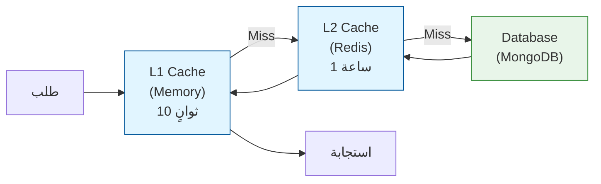

---

## 🔄 Event-Driven Architecture (مستقبلاً)

### الرؤية المستقبلية

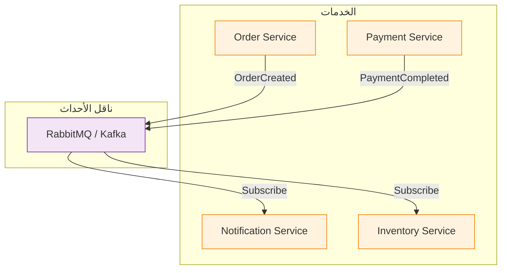

---

## 📊 مقاييس الأداء المتوقعة

### Response Times

| Endpoint | المتوقع | المقبول | حرج |
|----------|---------|---------|-----|
| GET /products | < 100ms | < 300ms | > 500ms |
| POST /checkout | < 500ms | < 1000ms | > 2000ms |
| GET /cart | < 50ms | < 150ms | > 300ms |
| POST /auth/login | < 300ms | < 600ms | > 1000ms |

### Cache Hit Rates

| Resource | المستهدف |
|----------|---------|
| Products | > 85% |
| Categories | > 95% |
| User Profile | > 70% |
| Overall | > 80% |

---

---

## 📝 ملخص التحديثات

### ✅ التحديثات المطبقة:
1. **إضافة Frontend Components**: هيكل كامل للواجهة الأمامية
2. **تحديث Backend Modules**: من 10 وحدات إلى 21 وحدة مكتملة
3. **إضافة الوحدات الجديدة**: Exchange Rates, Upload, Security, Marketing
4. **تحديث حالة التطوير**: جميع الوحدات مكتملة ومطبقة
5. **إضافة المكونات الأمامية**: 21 ميزة مكتملة في Admin Dashboard

### 📊 الإحصائيات المحدثة:
- **Backend Modules**: 21/21 (100%)
- **Frontend Features**: 21/21 (100%)
- **Admin Dashboard**: مكتمل بالكامل
- **Core Components**: مكتملة ومحسنة
- **Shared Components**: مكتملة ومتطورة

### 🎯 المكونات الرئيسية المطبقة:
- ✅ **Dashboard**: لوحة تحكم شاملة
- ✅ **Analytics**: تحليلات متقدمة
- ✅ **Products**: إدارة المنتجات
- ✅ **Orders**: إدارة الطلبات
- ✅ **Users**: إدارة المستخدمين
- ✅ **Services**: إدارة الخدمات
- ✅ **Support**: نظام الدعم الفني
- ✅ **Security**: نظام الأمان المتقدم

---

**السابق**: [← Level 2 - Container Diagram](./02-container-diagram.md)  
**التالي**: [Level 4 - Code Diagrams →](./04-code-diagrams.md)

