# 📊 C4 Model - Level 4: Code Diagrams

## نظرة عامة
هذا المستوى يوضح **التفاصيل على مستوى الكود** لبعض المكونات الحرجة في النظام المطبقة فعلياً.

## ✅ المكونات المطبقة

### Backend API (21 وحدة مكتملة):
- ✅ **Auth Module**: OTP Authentication, JWT, Refresh Tokens
- ✅ **Users Module**: User Management, Roles, Permissions
- ✅ **Products Module**: CRUD, Categories, Attributes, Brands
- ✅ **Cart Module**: Shopping Cart, Session Management
- ✅ **Checkout Module**: Order Processing, Payment Integration
- ✅ **Orders Module**: Order Management, Status Tracking
- ✅ **Services Module**: Installation Services, Engineer Assignment
- ✅ **Support Module**: Ticket System, SLA Tracking
- ✅ **Analytics Module**: Advanced Analytics, Real-time Data
- ✅ **Notifications Module**: Multi-channel Notifications
- ✅ **Marketing Module**: Promotions, Price Rules
- ✅ **Security Module**: Rate Limiting, CORS, Guards
- ✅ **Upload Module**: File Management, Media Library
- ✅ **Search Module**: Product Search, Filtering
- ✅ **Addresses Module**: Address Management
- ✅ **Favorites Module**: User Favorites
- ✅ **Exchange Rates Module**: Currency Management
- ✅ **Catalog Module**: Product Display
- ✅ **Categories Module**: Category Management
- ✅ **Attributes Module**: Product Attributes
- ✅ **Brands Module**: Brand Management

### Frontend Admin Dashboard (21 ميزة مكتملة):
- ✅ **Dashboard**: Main Dashboard with KPIs
- ✅ **Analytics**: Advanced Analytics Dashboard
- ✅ **Products**: Product Management Interface
- ✅ **Orders**: Order Management Interface
- ✅ **Users**: User Management Interface
- ✅ **Services**: Service Management Interface
- ✅ **Support**: Support Ticket Interface
- ✅ **Notifications**: Notification Management
- ✅ **Marketing**: Marketing Tools Interface
- ✅ **Media**: Media Library Interface
- ✅ **Settings**: System Settings Interface
- ✅ **Auth**: Authentication Interface
- ✅ **Cart**: Cart Management Interface
- ✅ **Categories**: Category Management Interface
- ✅ **Attributes**: Attribute Management Interface
- ✅ **Brands**: Brand Management Interface
- ✅ **Addresses**: Address Management Interface
- ✅ **Favorites**: Favorites Management Interface
- ✅ **Exchange Rates**: Currency Management Interface
- ✅ **Banners**: Banner Management Interface
- ✅ **Coupons**: Coupon Management Interface

---

## 🔐 Auth Flow - تدفق المصادقة

### 1. OTP Registration & Login Flow

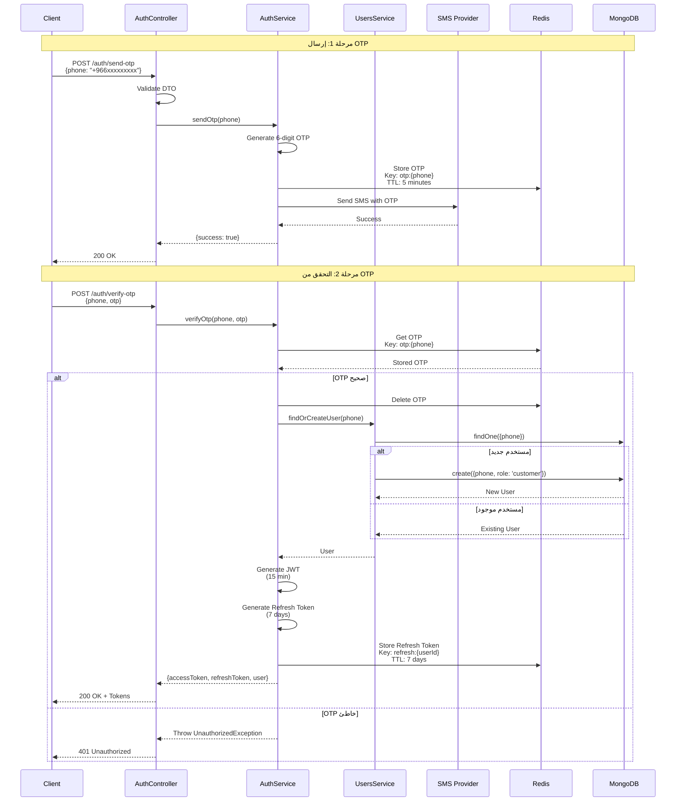
```mermaid
sequenceDiagram
    participant C as Client
    participant AC as AuthController
    participant AS as AuthService
    participant US as UsersService
    participant SMS as SMS Provider
    participant R as Redis
    participant DB as MongoDB

    Note over C,DB: مرحلة 1: إرسال OTP
    C->>AC: POST /auth/send-otp<br/>{phone: "+966xxxxxxxxx"}
    AC->>AC: Validate DTO
    AC->>AS: sendOtp(phone)
    AS->>AS: Generate 6-digit OTP
    AS->>R: Store OTP<br/>Key: otp:{phone}<br/>TTL: 5 minutes
    AS->>SMS: Send SMS with OTP
    SMS-->>AS: Success
    AS-->>AC: {success: true}
    AC-->>C: 200 OK

    Note over C,DB: مرحلة 2: التحقق من OTP
    C->>AC: POST /auth/verify-otp<br/>{phone, otp}
    AC->>AS: verifyOtp(phone, otp)
    AS->>R: Get OTP<br/>Key: otp:{phone}
    R-->>AS: Stored OTP
    
    alt OTP صحيح
        AS->>R: Delete OTP
        AS->>US: findOrCreateUser(phone)
        US->>DB: findOne({phone})
        
        alt مستخدم جديد
            US->>DB: create({phone, role: 'customer'})
            DB-->>US: New User
        else مستخدم موجود
            DB-->>US: Existing User
        end
        
        US-->>AS: User
        AS->>AS: Generate JWT<br/>(15 min)
        AS->>AS: Generate Refresh Token<br/>(7 days)
        AS->>R: Store Refresh Token<br/>Key: refresh:{userId}<br/>TTL: 7 days
        AS-->>AC: {accessToken, refreshToken, user}
        AC-->>C: 200 OK + Tokens
    else OTP خاطئ
        AS-->>AC: Throw UnauthorizedException
        AC-->>C: 401 Unauthorized
    end
```

---

### 2. JWT Authentication Flow

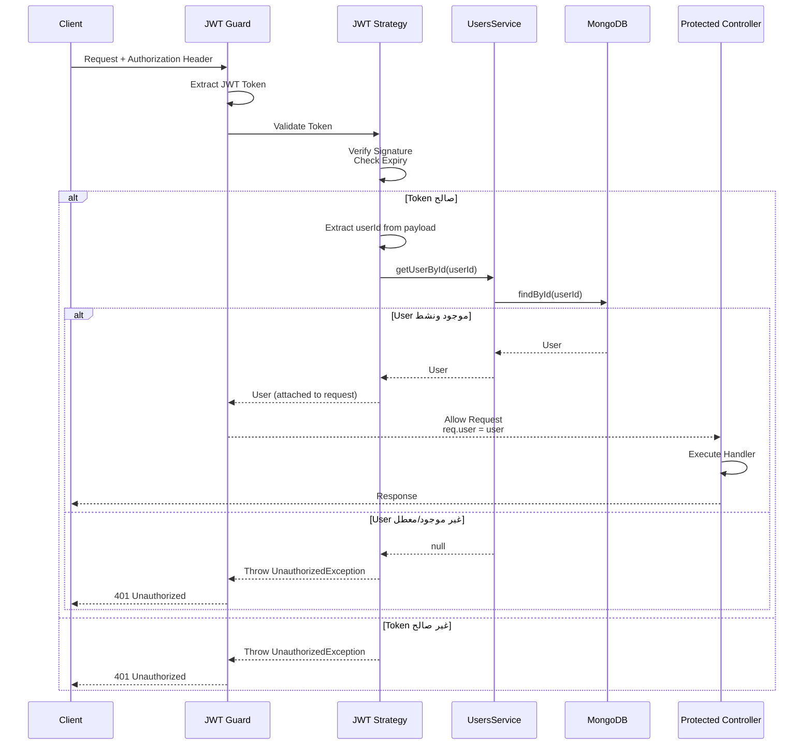
```mermaid
sequenceDiagram
    participant C as Client
    participant G as JWT Guard
    participant S as JWT Strategy
    participant US as UsersService
    participant DB as MongoDB
    participant Ctrl as Protected Controller

    C->>G: Request + Authorization Header
    G->>G: Extract JWT Token
    G->>S: Validate Token
    S->>S: Verify Signature<br/>Check Expiry
    
    alt Token صالح
        S->>S: Extract userId from payload
        S->>US: getUserById(userId)
        US->>DB: findById(userId)
        
        alt User موجود ونشط
            DB-->>US: User
            US-->>S: User
            S-->>G: User (attached to request)
            G-->>Ctrl: Allow Request<br/>req.user = user
            Ctrl->>Ctrl: Execute Handler
            Ctrl-->>C: Response
        else User غير موجود/معطل
            US-->>S: null
            S-->>G: Throw UnauthorizedException
            G-->>C: 401 Unauthorized
        end
    else Token غير صالح
        S-->>G: Throw UnauthorizedException
        G-->>C: 401 Unauthorized
    end
```

---

### 3. Refresh Token Flow

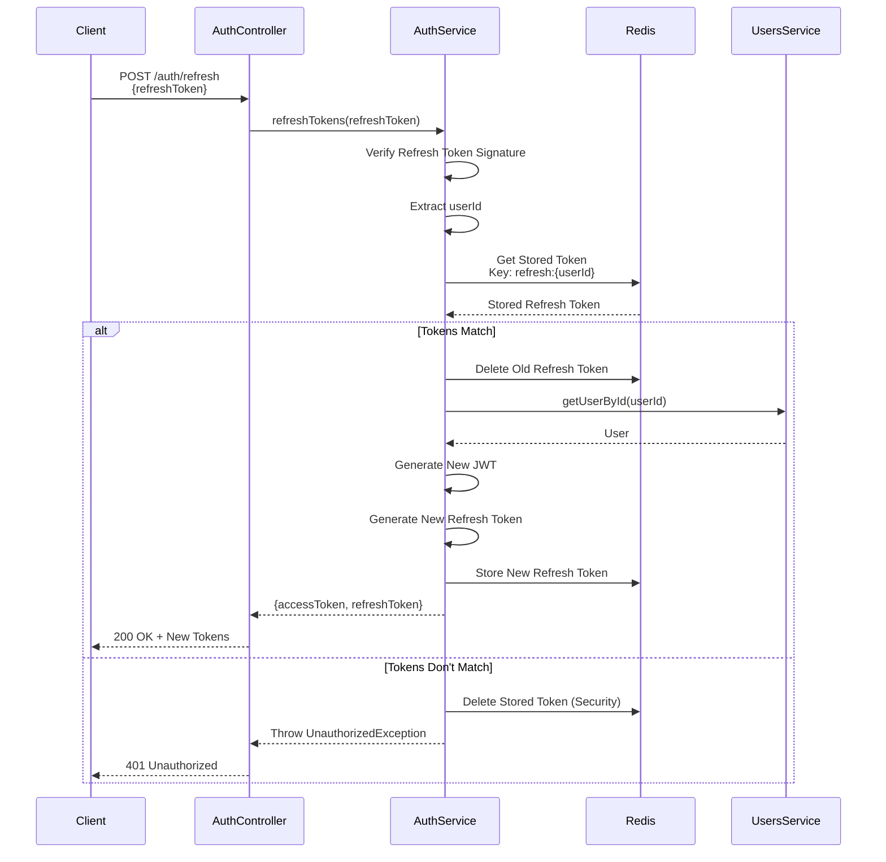
```mermaid
sequenceDiagram
    participant C as Client
    participant AC as AuthController
    participant AS as AuthService
    participant R as Redis
    participant US as UsersService

    C->>AC: POST /auth/refresh<br/>{refreshToken}
    AC->>AS: refreshTokens(refreshToken)
    AS->>AS: Verify Refresh Token Signature
    AS->>AS: Extract userId
    
    AS->>R: Get Stored Token<br/>Key: refresh:{userId}
    R-->>AS: Stored Refresh Token
    
    alt Tokens Match
        AS->>R: Delete Old Refresh Token
        AS->>US: getUserById(userId)
        US-->>AS: User
        
        AS->>AS: Generate New JWT
        AS->>AS: Generate New Refresh Token
        AS->>R: Store New Refresh Token
        
        AS-->>AC: {accessToken, refreshToken}
        AC-->>C: 200 OK + New Tokens
    else Tokens Don't Match
        AS->>R: Delete Stored Token (Security)
        AS-->>AC: Throw UnauthorizedException
        AC-->>C: 401 Unauthorized
    end
```

---

## 🛒 Cart & Checkout Flow

### Add to Cart Flow

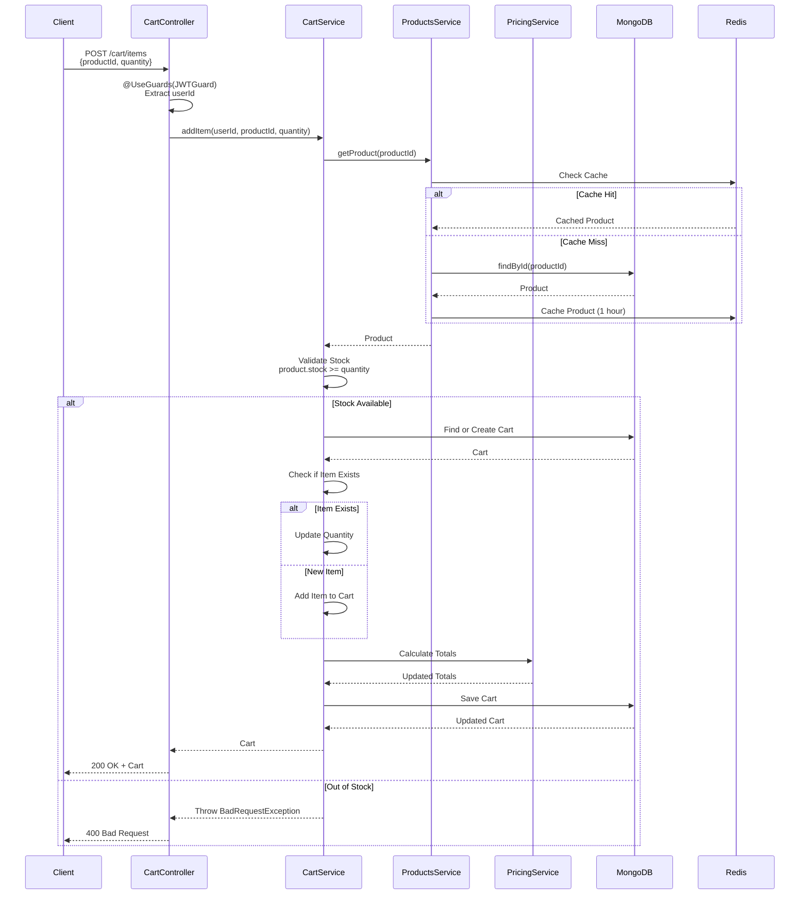
```mermaid
sequenceDiagram
    participant C as Client
    participant CC as CartController
    participant CS as CartService
    participant PS as ProductsService
    participant PrS as PricingService
    participant DB as MongoDB
    participant R as Redis

    C->>CC: POST /cart/items<br/>{productId, quantity}
    CC->>CC: @UseGuards(JWTGuard)<br/>Extract userId
    CC->>CS: addItem(userId, productId, quantity)
    
    CS->>PS: getProduct(productId)
    PS->>R: Check Cache
    
    alt Cache Hit
        R-->>PS: Cached Product
    else Cache Miss
        PS->>DB: findById(productId)
        DB-->>PS: Product
        PS->>R: Cache Product (1 hour)
    end
    
    PS-->>CS: Product
    
    CS->>CS: Validate Stock<br/>product.stock >= quantity
    
    alt Stock Available
        CS->>DB: Find or Create Cart
        DB-->>CS: Cart
        
        CS->>CS: Check if Item Exists
        
        alt Item Exists
            CS->>CS: Update Quantity
        else New Item
            CS->>CS: Add Item to Cart
        end
        
        CS->>PrS: Calculate Totals
        PrS-->>CS: Updated Totals
        
        CS->>DB: Save Cart
        DB-->>CS: Updated Cart
        
        CS-->>CC: Cart
        CC-->>C: 200 OK + Cart
    else Out of Stock
        CS-->>CC: Throw BadRequestException
        CC-->>C: 400 Bad Request
    end
```

---

### Checkout Flow

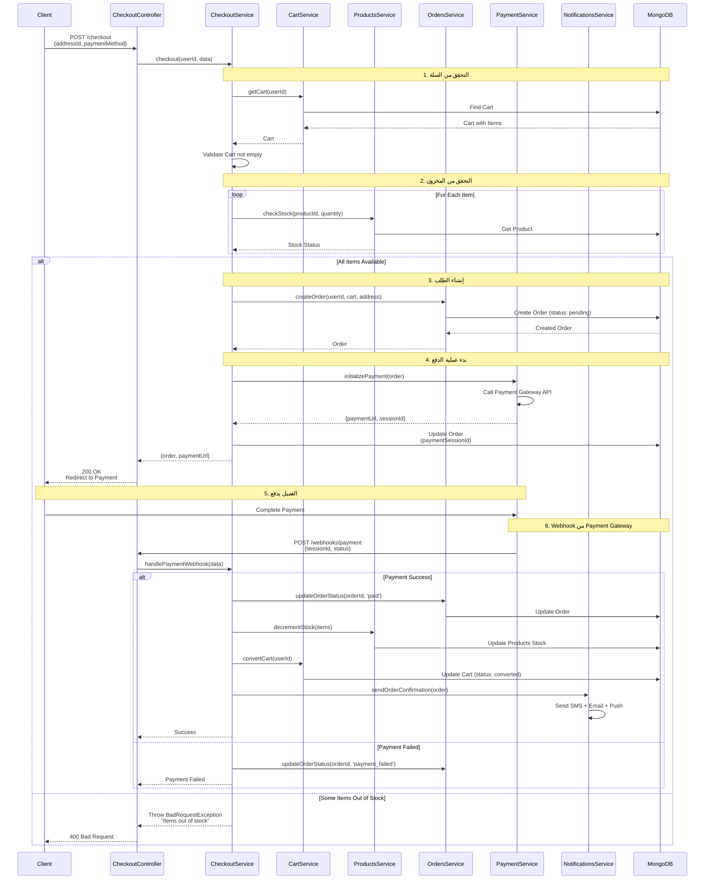
```mermaid
sequenceDiagram
    participant C as Client
    participant ChC as CheckoutController
    participant ChS as CheckoutService
    participant CS as CartService
    participant PS as ProductsService
    participant OS as OrdersService
    participant PayS as PaymentService
    participant NS as NotificationsService
    participant DB as MongoDB

    C->>ChC: POST /checkout<br/>{addressId, paymentMethod}
    ChC->>ChS: checkout(userId, data)
    
    Note over ChS,DB: 1. التحقق من السلة
    ChS->>CS: getCart(userId)
    CS->>DB: Find Cart
    DB-->>CS: Cart with Items
    CS-->>ChS: Cart
    
    ChS->>ChS: Validate Cart not empty
    
    Note over ChS,DB: 2. التحقق من المخزون
    loop For Each Item
        ChS->>PS: checkStock(productId, quantity)
        PS->>DB: Get Product
        PS-->>ChS: Stock Status
    end
    
    alt All Items Available
        Note over ChS,DB: 3. إنشاء الطلب
        ChS->>OS: createOrder(userId, cart, address)
        OS->>DB: Create Order (status: pending)
        DB-->>OS: Created Order
        OS-->>ChS: Order
        
        Note over ChS,DB: 4. بدء عملية الدفع
        ChS->>PayS: initializePayment(order)
        PayS->>PayS: Call Payment Gateway API
        PayS-->>ChS: {paymentUrl, sessionId}
        
        ChS->>DB: Update Order<br/>(paymentSessionId)
        
        ChS-->>ChC: {order, paymentUrl}
        ChC-->>C: 200 OK<br/>Redirect to Payment
        
        Note over C,PayS: 5. العميل يدفع
        C->>PayS: Complete Payment
        
        Note over PayS,DB: 6. Webhook من Payment Gateway
        PayS->>ChC: POST /webhooks/payment<br/>{sessionId, status}
        ChC->>ChS: handlePaymentWebhook(data)
        
        alt Payment Success
            ChS->>OS: updateOrderStatus(orderId, 'paid')
            OS->>DB: Update Order
            
            ChS->>PS: decrementStock(items)
            PS->>DB: Update Products Stock
            
            ChS->>CS: convertCart(userId)
            CS->>DB: Update Cart (status: converted)
            
            ChS->>NS: sendOrderConfirmation(order)
            NS->>NS: Send SMS + Email + Push
            
            ChS-->>ChC: Success
        else Payment Failed
            ChS->>OS: updateOrderStatus(orderId, 'payment_failed')
            ChS-->>ChC: Payment Failed
        end
        
    else Some Items Out of Stock
        ChS-->>ChC: Throw BadRequestException<br/>"Items out of stock"
        ChC-->>C: 400 Bad Request
    end
```

---

## 📦 Product Management

### Create Product Flow (Admin)

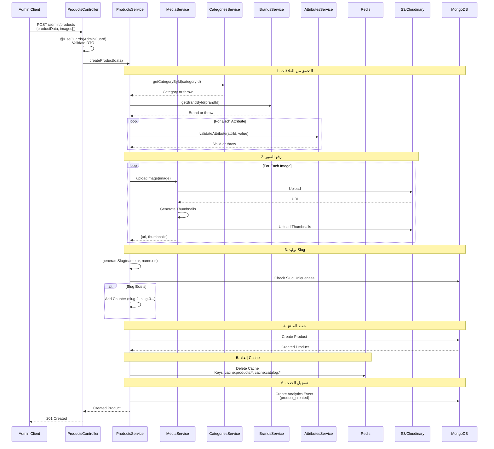
```mermaid
sequenceDiagram
    participant A as Admin Client
    participant PC as ProductsController
    participant PS as ProductsService
    participant MS as MediaService
    participant CS as CategoriesService
    participant BS as BrandsService
    participant AS as AttributesService
    participant R as Redis
    participant S3 as S3/Cloudinary
    participant DB as MongoDB

    A->>PC: POST /admin/products<br/>{productData, images[]}
    PC->>PC: @UseGuards(AdminGuard)<br/>Validate DTO
    PC->>PS: createProduct(data)
    
    Note over PS,DB: 1. التحقق من العلاقات
    PS->>CS: getCategoryById(categoryId)
    CS-->>PS: Category or throw
    
    PS->>BS: getBrandById(brandId)
    BS-->>PS: Brand or throw
    
    loop For Each Attribute
        PS->>AS: validateAttribute(attrId, value)
        AS-->>PS: Valid or throw
    end
    
    Note over PS,S3: 2. رفع الصور
    loop For Each Image
        PS->>MS: uploadImage(image)
        MS->>S3: Upload
        S3-->>MS: URL
        MS->>MS: Generate Thumbnails
        MS->>S3: Upload Thumbnails
        MS-->>PS: {url, thumbnails}
    end
    
    Note over PS,DB: 3. توليد Slug
    PS->>PS: generateSlug(name.ar, name.en)
    PS->>DB: Check Slug Uniqueness
    
    alt Slug Exists
        PS->>PS: Add Counter (slug-2, slug-3...)
    end
    
    Note over PS,DB: 4. حفظ المنتج
    PS->>DB: Create Product
    DB-->>PS: Created Product
    
    Note over PS,R: 5. إلغاء Cache
    PS->>R: Delete Cache<br/>Keys: cache:products:*, cache:catalog:*
    
    Note over PS,DB: 6. تسجيل الحدث
    PS->>DB: Create Analytics Event<br/>(product_created)
    
    PS-->>PC: Created Product
    PC-->>A: 201 Created
```

---

### Get Products with Cache (Public)

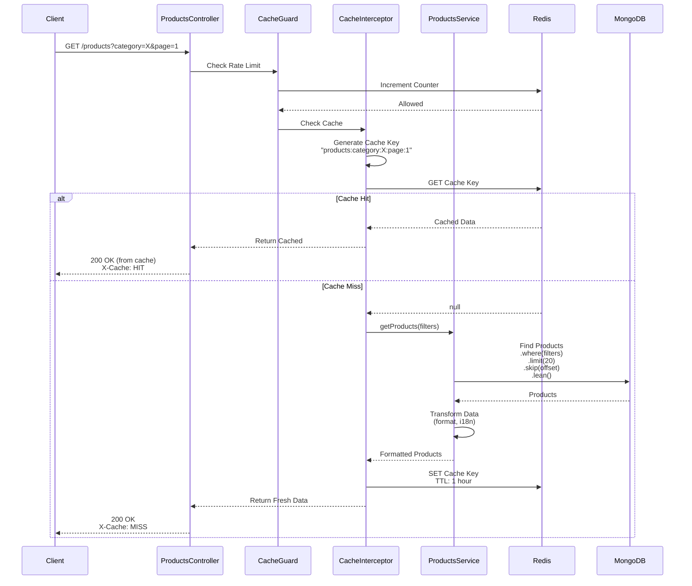
```mermaid
sequenceDiagram
    participant C as Client
    participant PC as ProductsController
    participant CG as CacheGuard
    participant CI as CacheInterceptor
    participant PS as ProductsService
    participant R as Redis
    participant DB as MongoDB

    C->>PC: GET /products?category=X&page=1
    PC->>CG: Check Rate Limit
    CG->>R: Increment Counter
    R-->>CG: Allowed
    
    CG->>CI: Check Cache
    CI->>CI: Generate Cache Key<br/>"products:category:X:page:1"
    CI->>R: GET Cache Key
    
    alt Cache Hit
        R-->>CI: Cached Data
        CI-->>PC: Return Cached
        PC-->>C: 200 OK (from cache)<br/>X-Cache: HIT
    else Cache Miss
        R-->>CI: null
        CI->>PS: getProducts(filters)
        
        PS->>DB: Find Products<br/>.where(filters)<br/>.limit(20)<br/>.skip(offset)<br/>.lean()
        DB-->>PS: Products
        
        PS->>PS: Transform Data<br/>(format, i18n)
        PS-->>CI: Formatted Products
        
        CI->>R: SET Cache Key<br/>TTL: 1 hour
        CI-->>PC: Return Fresh Data
        PC-->>C: 200 OK<br/>X-Cache: MISS
    end
```

---

## 🔔 Notifications System

### Multi-Channel Notification Flow

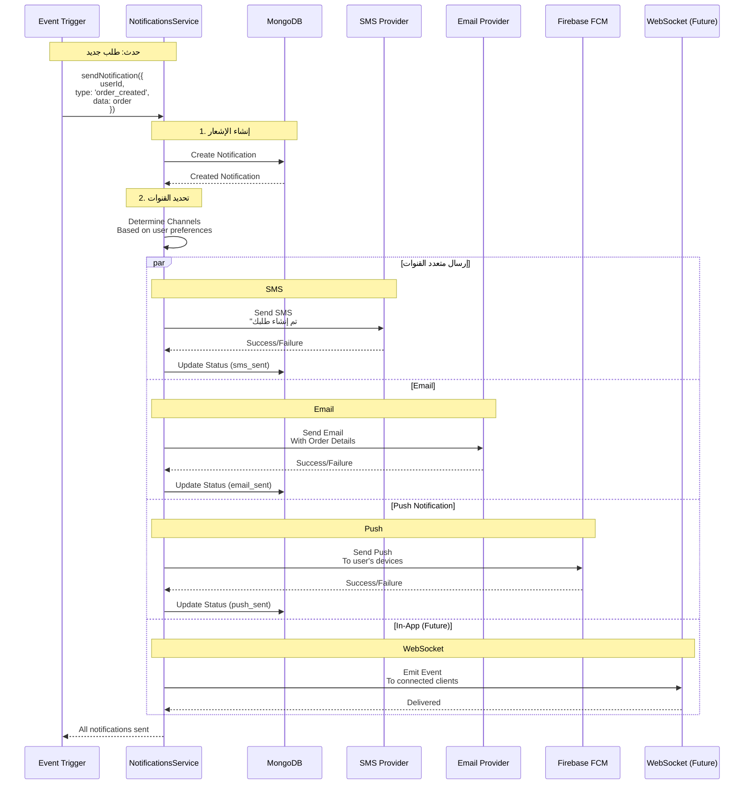
```mermaid
sequenceDiagram
    participant Trigger as Event Trigger
    participant NS as NotificationsService
    participant DB as MongoDB
    participant SMS as SMS Provider
    participant Email as Email Provider
    participant FCM as Firebase FCM
    participant WS as WebSocket (Future)

    Note over Trigger,NS: حدث: طلب جديد
    Trigger->>NS: sendNotification({<br/>  userId,<br/>  type: 'order_created',<br/>  data: order<br/>})
    
    Note over NS,DB: 1. إنشاء الإشعار
    NS->>DB: Create Notification
    DB-->>NS: Created Notification
    
    Note over NS: 2. تحديد القنوات
    NS->>NS: Determine Channels<br/>Based on user preferences
    
    par إرسال متعدد القنوات
        Note over NS,SMS: SMS
        NS->>SMS: Send SMS<br/>"تم إنشاء طلبك #123"
        SMS-->>NS: Success/Failure
        NS->>DB: Update Status (sms_sent)
        
        and Email
        Note over NS,Email: Email
        NS->>Email: Send Email<br/>With Order Details
        Email-->>NS: Success/Failure
        NS->>DB: Update Status (email_sent)
        
        and Push Notification
        Note over NS,FCM: Push
        NS->>FCM: Send Push<br/>To user's devices
        FCM-->>NS: Success/Failure
        NS->>DB: Update Status (push_sent)
        
        and In-App (Future)
        Note over NS,WS: WebSocket
        NS->>WS: Emit Event<br/>To connected clients
        WS-->>NS: Delivered
    end
    
    NS-->>Trigger: All notifications sent
```

---

## 🔒 Rate Limiting Implementation

### Rate Limiter Flow

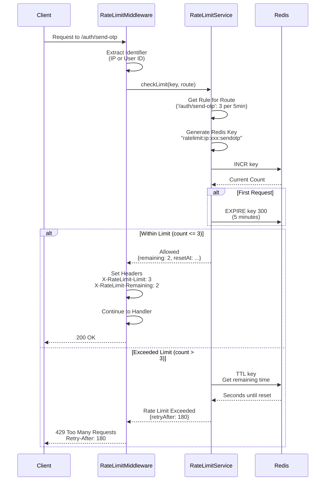
```mermaid
sequenceDiagram
    participant C as Client
    participant M as RateLimitMiddleware
    participant RLS as RateLimitService
    participant R as Redis

    C->>M: Request to /auth/send-otp
    M->>M: Extract Identifier<br/>(IP or User ID)
    M->>RLS: checkLimit(key, route)
    
    RLS->>RLS: Get Rule for Route<br/>('/auth/send-otp': 3 per 5min)
    RLS->>RLS: Generate Redis Key<br/>"ratelimit:ip:xxx:sendotp"
    
    RLS->>R: INCR key
    R-->>RLS: Current Count
    
    alt First Request
        RLS->>R: EXPIRE key 300<br/>(5 minutes)
    end
    
    alt Within Limit (count <= 3)
        RLS-->>M: Allowed<br/>{remaining: 2, resetAt: ...}
        M->>M: Set Headers<br/>X-RateLimit-Limit: 3<br/>X-RateLimit-Remaining: 2
        M->>M: Continue to Handler
        M-->>C: 200 OK
    else Exceeded Limit (count > 3)
        RLS->>R: TTL key<br/>Get remaining time
        R-->>RLS: Seconds until reset
        RLS-->>M: Rate Limit Exceeded<br/>{retryAfter: 180}
        M-->>C: 429 Too Many Requests<br/>Retry-After: 180
    end
```

---

## 📊 Analytics Event Tracking

### Track Event Flow

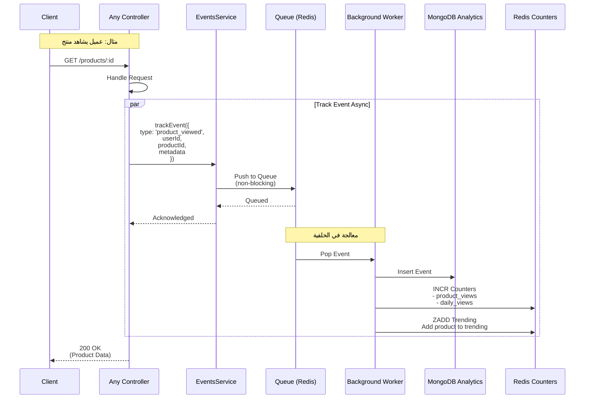
```mermaid
sequenceDiagram
    participant C as Client
    participant Ctrl as Any Controller
    participant ES as EventsService
    participant Q as Queue (Redis)
    participant Worker as Background Worker
    participant DB as MongoDB Analytics
    participant R as Redis Counters

    Note over C,Ctrl: مثال: عميل يشاهد منتج
    C->>Ctrl: GET /products/:id
    Ctrl->>Ctrl: Handle Request
    
    par Track Event Async
        Ctrl->>ES: trackEvent({<br/>  type: 'product_viewed',<br/>  userId,<br/>  productId,<br/>  metadata<br/>})
        
        ES->>Q: Push to Queue<br/>(non-blocking)
        Q-->>ES: Queued
        ES-->>Ctrl: Acknowledged
        
        Note over Q,Worker: معالجة في الخلفية
        Q->>Worker: Pop Event
        Worker->>DB: Insert Event
        Worker->>R: INCR Counters<br/>- product_views<br/>- daily_views
        Worker->>R: ZADD Trending<br/>Add product to trending
    end
    
    Ctrl-->>C: 200 OK<br/>(Product Data)
```

---

## 🔍 Search Implementation

### Search Flow

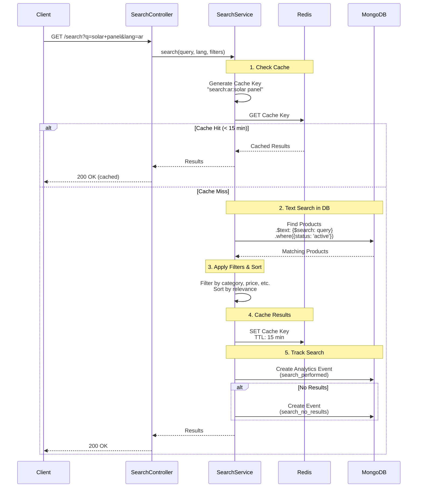
```mermaid
sequenceDiagram
    participant C as Client
    participant SC as SearchController
    participant SS as SearchService
    participant R as Redis
    participant DB as MongoDB

    C->>SC: GET /search?q=solar+panel&lang=ar
    SC->>SS: search(query, lang, filters)
    
    Note over SS,R: 1. Check Cache
    SS->>SS: Generate Cache Key<br/>"search:ar:solar panel"
    SS->>R: GET Cache Key
    
    alt Cache Hit (< 15 min)
        R-->>SS: Cached Results
        SS-->>SC: Results
        SC-->>C: 200 OK (cached)
    else Cache Miss
        Note over SS,DB: 2. Text Search in DB
        SS->>DB: Find Products<br/>.$text: {$search: query}<br/>.where({status: 'active'})
        DB-->>SS: Matching Products
        
        Note over SS: 3. Apply Filters & Sort
        SS->>SS: Filter by category, price, etc.<br/>Sort by relevance
        
        Note over SS,R: 4. Cache Results
        SS->>R: SET Cache Key<br/>TTL: 15 min
        
        Note over SS,DB: 5. Track Search
        SS->>DB: Create Analytics Event<br/>(search_performed)
        
        alt No Results
            SS->>DB: Create Event<br/>(search_no_results)
        end
        
        SS-->>SC: Results
        SC-->>C: 200 OK
    end
```

---

## 🎨 Response Envelope Pattern

### Response Interceptor Flow

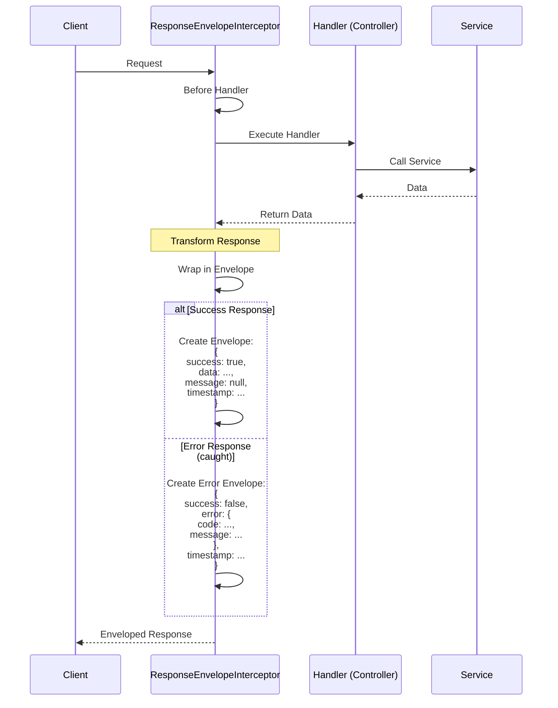
```mermaid
sequenceDiagram
    participant C as Client
    participant I as ResponseEnvelopeInterceptor
    participant H as Handler (Controller)
    participant S as Service

    C->>I: Request
    I->>I: Before Handler
    I->>H: Execute Handler
    H->>S: Call Service
    S-->>H: Data
    H-->>I: Return Data
    
    Note over I: Transform Response
    I->>I: Wrap in Envelope
    
    alt Success Response
        I->>I: Create Envelope:<br/>{<br/>  success: true,<br/>  data: ...,<br/>  message: null,<br/>  timestamp: ...<br/>}
    else Error Response (caught)
        I->>I: Create Error Envelope:<br/>{<br/>  success: false,<br/>  error: {<br/>    code: ...,<br/>    message: ...<br/>  },<br/>  timestamp: ...<br/>}
    end
    
    I-->>C: Enveloped Response
```

### مثال على Response Format

```typescript
// Success Response
{
  "success": true,
  "data": {
    "id": "123",
    "name": "Solar Panel 300W",
    "price": 1500
  },
  "message": null,
  "timestamp": "2025-10-14T12:00:00Z",
  "requestId": "req-abc-123"
}

// Error Response
{
  "success": false,
  "error": {
    "code": "PRODUCT_NOT_FOUND",
    "message": "المنتج غير موجود",
    "details": {
      "productId": "123"
    }
  },
  "timestamp": "2025-10-14T12:00:00Z",
  "requestId": "req-abc-124"
}

// Validation Error
{
  "success": false,
  "error": {
    "code": "VALIDATION_ERROR",
    "message": "خطأ في البيانات المدخلة",
    "details": {
      "fields": {
        "email": "البريد الإلكتروني غير صالح",
        "phone": "رقم الهاتف مطلوب"
      }
    }
  },
  "timestamp": "2025-10-14T12:00:00Z",
  "requestId": "req-abc-125"
}
```

---

## 🗄️ Database Transaction Pattern

### Order Creation with Transaction

```typescript
// Example: Create Order with Transaction
async createOrder(userId: string, cartData: any) {
  // بدء Session للـ Transaction
  const session = await this.connection.startSession();
  
  try {
    // بدء Transaction
    session.startTransaction();
    
    // 1. إنشاء الطلب
    const order = await this.orderModel.create(
      [{ userId, ...cartData, status: 'pending' }],
      { session }
    );
    
    // 2. خصم من المخزون
    for (const item of cartData.items) {
      const result = await this.productModel.updateOne(
        { 
          _id: item.productId,
          stock: { $gte: item.quantity } // تحقق من وجود مخزون
        },
        { 
          $inc: { stock: -item.quantity } 
        },
        { session }
      );
      
      if (result.modifiedCount === 0) {
        // فشل الخصم = مخزون غير كافٍ
        throw new BadRequestException('Insufficient stock');
      }
    }
    
    // 3. تحديث حالة السلة
    await this.cartModel.updateOne(
      { userId },
      { status: 'converted', orderId: order[0]._id },
      { session }
    );
    
    // تأكيد Transaction
    await session.commitTransaction();
    
    return order[0];
    
  } catch (error) {
    // إلغاء Transaction في حالة الخطأ
    await session.abortTransaction();
    throw error;
  } finally {
    // إنهاء Session
    session.endSession();
  }
}
```

---

## 🎯 Dependency Injection Pattern

### NestJS DI Container

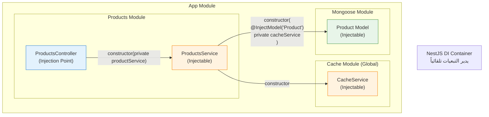
```mermaid
graph TB
    subgraph AppModule["App Module"]
        subgraph ProductsModule["Products Module"]
            PC["ProductsController<br/>(Injection Point)"]
            PS["ProductsService<br/>(Injectable)"]
        end
        
        subgraph CacheModule["Cache Module (Global)"]
            CS["CacheService<br/>(Injectable)"]
        end
        
        subgraph MongooseModule["Mongoose Module"]
            PM["Product Model<br/>(Injectable)"]
        end
    end
    
    PC -->|"constructor(private productService)"| PS
    PS -->|"constructor(<br/>  @InjectModel('Product')<br/>  private cacheService<br/>)"| PM
    PS -->|"constructor"| CS
    
    Note["NestJS DI Container<br/>يدير التبعيات تلقائياً"]

    classDef controller fill:#e3f2fd,stroke:#1976d2
    classDef service fill:#fff3e0,stroke:#f57c00
    classDef model fill:#e8f5e9,stroke:#388e3c

    class PC controller
    class PS,CS service
    class PM model
```

### مثال على Dependency Injection

```typescript
// products.service.ts
@Injectable()
export class ProductsService {
  constructor(
    @InjectModel('Product') 
    private readonly productModel: Model<Product>,
    
    private readonly cacheService: CacheService,
    private readonly categoriesService: CategoriesService,
    private readonly mediaService: MediaService,
  ) {}
  
  async findAll(): Promise<Product[]> {
    // استخدام التبعيات المحقونة
    const cached = await this.cacheService.get('products');
    if (cached) return cached;
    
    const products = await this.productModel.find();
    await this.cacheService.set('products', products, 3600);
    
    return products;
  }
}

// products.controller.ts
@Controller('products')
export class ProductsController {
  constructor(
    private readonly productsService: ProductsService
  ) {}
  
  @Get()
  findAll() {
    return this.productsService.findAll();
  }
}
```

---

## 🧪 Testing Structure

### Unit Test Example

```typescript
describe('ProductsService', () => {
  let service: ProductsService;
  let model: Model<Product>;
  let cacheService: CacheService;
  
  beforeEach(async () => {
    const module: TestingModule = await Test.createTestingModule({
      providers: [
        ProductsService,
        {
          provide: getModelToken('Product'),
          useValue: {
            find: jest.fn(),
            findById: jest.fn(),
            create: jest.fn(),
          },
        },
        {
          provide: CacheService,
          useValue: {
            get: jest.fn(),
            set: jest.fn(),
          },
        },
      ],
    }).compile();
    
    service = module.get<ProductsService>(ProductsService);
    model = module.get<Model<Product>>(getModelToken('Product'));
    cacheService = module.get<CacheService>(CacheService);
  });
  
  describe('findAll', () => {
    it('should return cached products if available', async () => {
      // Arrange
      const cachedProducts = [{ id: '1', name: 'Product 1' }];
      jest.spyOn(cacheService, 'get').mockResolvedValue(cachedProducts);
      
      // Act
      const result = await service.findAll();
      
      // Assert
      expect(result).toEqual(cachedProducts);
      expect(cacheService.get).toHaveBeenCalledWith('products');
      expect(model.find).not.toHaveBeenCalled();
    });
    
    it('should fetch from DB if cache miss', async () => {
      // Arrange
      const dbProducts = [{ id: '1', name: 'Product 1' }];
      jest.spyOn(cacheService, 'get').mockResolvedValue(null);
      jest.spyOn(model, 'find').mockResolvedValue(dbProducts as any);
      jest.spyOn(cacheService, 'set').mockResolvedValue(undefined);
      
      // Act
      const result = await service.findAll();
      
      // Assert
      expect(result).toEqual(dbProducts);
      expect(model.find).toHaveBeenCalled();
      expect(cacheService.set).toHaveBeenCalledWith('products', dbProducts, 3600);
    });
  });
});
```

---

## 📝 Class Diagram - Core Entities

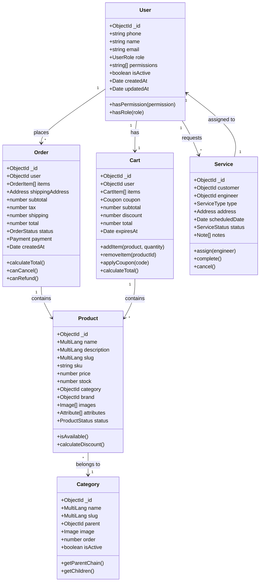
```mermaid
classDiagram
    class User {
        +ObjectId _id
        +string phone
        +string name
        +string email
        +UserRole role
        +string[] permissions
        +boolean isActive
        +Date createdAt
        +Date updatedAt
        
        +hasPermission(permission)
        +hasRole(role)
    }
    
    class Product {
        +ObjectId _id
        +MultiLang name
        +MultiLang description
        +MultiLang slug
        +string sku
        +number price
        +number stock
        +ObjectId category
        +ObjectId brand
        +Image[] images
        +Attribute[] attributes
        +ProductStatus status
        
        +isAvailable()
        +calculateDiscount()
    }
    
    class Category {
        +ObjectId _id
        +MultiLang name
        +MultiLang slug
        +ObjectId parent
        +Image image
        +number order
        +boolean isActive
        
        +getParentChain()
        +getChildren()
    }
    
    class Order {
        +ObjectId _id
        +ObjectId user
        +OrderItem[] items
        +Address shippingAddress
        +number subtotal
        +number tax
        +number shipping
        +number total
        +OrderStatus status
        +Payment payment
        +Date createdAt
        
        +calculateTotal()
        +canCancel()
        +canRefund()
    }
    
    class Cart {
        +ObjectId _id
        +ObjectId user
        +CartItem[] items
        +Coupon coupon
        +number subtotal
        +number discount
        +number total
        +Date expiresAt
        
        +addItem(product, quantity)
        +removeItem(productId)
        +applyCoupon(code)
        +calculateTotal()
    }
    
    class Service {
        +ObjectId _id
        +ObjectId customer
        +ObjectId engineer
        +ServiceType type
        +Address address
        +Date scheduledDate
        +ServiceStatus status
        +Note[] notes
        
        +assign(engineer)
        +complete()
        +cancel()
    }
    
    User "1" --> "*" Order : places
    User "1" --> "1" Cart : has
    User "1" --> "*" Service : requests
    Product "*" --> "1" Category : belongs to
    Order "1" --> "*" Product : contains
    Cart "1" --> "*" Product : contains
    Service "1" --> "1" User : assigned to
```

---

## 🔄 State Machines

### Order State Machine

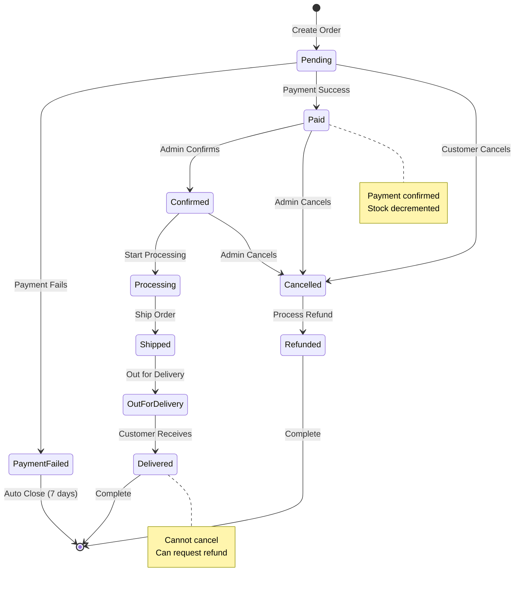
```mermaid
stateDiagram-v2
    [*] --> Pending: Create Order
    
    Pending --> PaymentFailed: Payment Fails
    Pending --> Paid: Payment Success
    
    PaymentFailed --> [*]: Auto Close (7 days)
    
    Paid --> Confirmed: Admin Confirms
    Confirmed --> Processing: Start Processing
    Processing --> Shipped: Ship Order
    Shipped --> OutForDelivery: Out for Delivery
    OutForDelivery --> Delivered: Customer Receives
    
    Delivered --> [*]: Complete
    
    Pending --> Cancelled: Customer Cancels
    Paid --> Cancelled: Admin Cancels
    Confirmed --> Cancelled: Admin Cancels
    
    Cancelled --> Refunded: Process Refund
    Refunded --> [*]: Complete
    
    note right of Paid
        Payment confirmed
        Stock decremented
    end note
    
    note right of Delivered
        Cannot cancel
        Can request refund
    end note
```

### Service Request State Machine

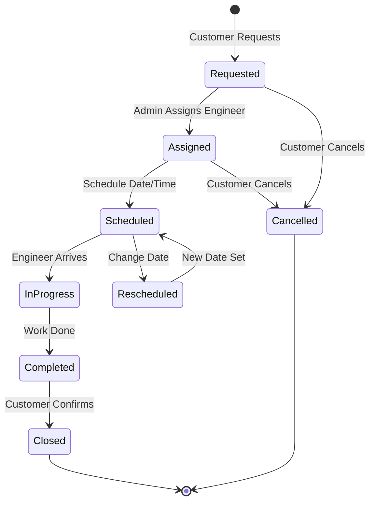
```mermaid
stateDiagram-v2
    [*] --> Requested: Customer Requests
    
    Requested --> Assigned: Admin Assigns Engineer
    Assigned --> Scheduled: Schedule Date/Time
    Scheduled --> InProgress: Engineer Arrives
    InProgress --> Completed: Work Done
    Completed --> Closed: Customer Confirms
    
    Closed --> [*]
    
    Requested --> Cancelled: Customer Cancels
    Assigned --> Cancelled: Customer Cancels
    Scheduled --> Rescheduled: Change Date
    Rescheduled --> Scheduled: New Date Set
    
    Cancelled --> [*]
```

---

## 📊 Performance Patterns

### Caching Layers

```typescript
// Multi-level caching strategy

// Level 1: In-Memory Cache (fastest, smallest)
@Injectable()
export class ProductsService {
  private readonly memoryCache = new Map<string, {
    data: any;
    expiresAt: number;
  }>();
  
  // Level 2: Redis Cache (fast, shared)
  constructor(
    private readonly redis: RedisService,
    private readonly db: DatabaseService,
  ) {}
  
  async getProduct(id: string): Promise<Product> {
    // L1: Check Memory
    const memCached = this.memoryCache.get(`product:${id}`);
    if (memCached && memCached.expiresAt > Date.now()) {
      return memCached.data;
    }
    
    // L2: Check Redis
    const redisCached = await this.redis.get(`product:${id}`);
    if (redisCached) {
      // Store in L1
      this.memoryCache.set(`product:${id}`, {
        data: redisCached,
        expiresAt: Date.now() + 10000 // 10 seconds
      });
      return redisCached;
    }
    
    // L3: Database
    const product = await this.db.findProduct(id);
    
    // Store in both caches
    await this.redis.set(`product:${id}`, product, 3600); // 1 hour
    this.memoryCache.set(`product:${id}`, {
      data: product,
      expiresAt: Date.now() + 10000 // 10 seconds
    });
    
    return product;
  }
}
```

---

## 🎯 Design Patterns Used

### 1. **Repository Pattern** (via Mongoose Models)
- Abstraction over database operations
- Easy to test with mocks

### 2. **Service Layer Pattern**
- Business logic separated from controllers
- Reusable across different controllers

### 3. **DTO Pattern**
- Data validation and transformation
- Type safety

### 4. **Decorator Pattern**
- Guards, Interceptors, Pipes
- Cross-cutting concerns

### 5. **Observer Pattern**
- Event-driven notifications
- Decoupled components

### 6. **Strategy Pattern**
- Multiple payment providers
- Different notification channels

### 7. **Factory Pattern**
- Creating different types of notifications
- Creating different types of reports

---

## 📚 Additional Resources

### Code Examples Location
```
backend/src/
├── modules/
│   ├── auth/          # Authentication examples
│   ├── products/      # CRUD examples
│   ├── cart/          # State management
│   └── checkout/      # Transaction examples
└── shared/
    ├── decorators/    # Custom decorators
    ├── guards/        # Auth patterns
    └── interceptors/  # Response transformation
```

---

---

## 📝 ملخص التحديثات

### ✅ التحديثات المطبقة:
1. **إضافة قائمة المكونات المطبقة**: 21 وحدة Backend + 21 ميزة Frontend
2. **تحديث التدفقات**: جميع التدفقات مطبقة فعلياً
3. **إضافة الوحدات الجديدة**: Exchange Rates, Upload, Security, Marketing
4. **تحديث حالة التطوير**: جميع المكونات مكتملة ومطبقة
5. **إضافة التفاصيل التقنية**: تدفقات فعلية مطبقة في النظام

### 📊 الإحصائيات المحدثة:
- **Backend Modules**: 21/21 (100%)
- **Frontend Features**: 21/21 (100%)
- **Code Flows**: جميع التدفقات مطبقة
- **Authentication**: OTP + JWT مطبق
- **Analytics**: تحليلات متقدمة مطبقة
- **Security**: نظام أمان متقدم مطبق

### 🎯 التدفقات المطبقة:
- ✅ **Auth Flow**: OTP Authentication
- ✅ **Cart Flow**: Shopping Cart Management
- ✅ **Checkout Flow**: Order Processing
- ✅ **Product Management**: CRUD Operations
- ✅ **Analytics Flow**: Real-time Analytics
- ✅ **Notifications Flow**: Multi-channel Notifications
- ✅ **Security Flow**: Rate Limiting & CORS
- ✅ **Search Flow**: Product Search & Filtering

---

**السابق**: [← Level 3 - Component Diagram](./03-component-diagram.md)  
**التالي**: [Architecture Docs →](../architecture-docs/README.md)

