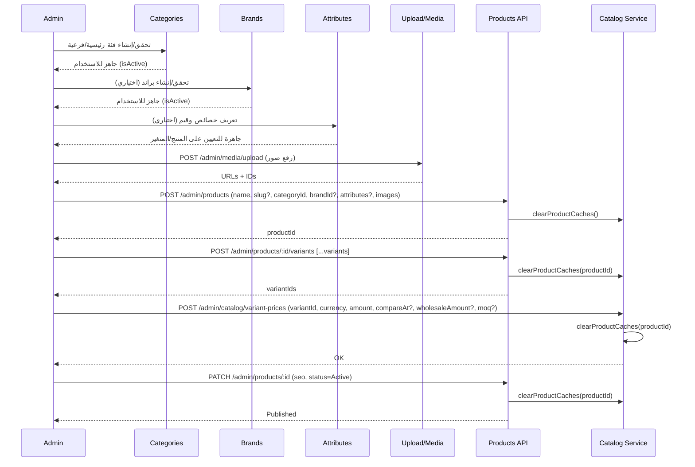

## تدفّق كامل: إضافة منتج جديد (Prerequisites → نشر المنتج)

هذا المستند يوضّح تسلسل الخطوات العملية لإضافة منتج جديد بشكل صحيح، مع المتطلبات المسبقة والتكامل مع الموديولات ذات الصلة: الفئات، البراندات، الخصائص (Attributes)، الوسائط، المتغيرات، والأسعار.

### 1) المتطلبات المسبقة (قبل إنشاء المنتج)
- فئة واحدة على الأقل موجودة ومفعّلة (Category) ليُنسب إليها المنتج.
- براند (Brand) إن كان منتجك يتطلب علامة تجارية محددة (اختياري لكنه مُستحسن للتصفية والبحث).
- خصائص/سمات (Attributes) إن كنت ستعرض مرشحات مثل اللون/المقاس/... وتخزينها ضمن `attributes` للمنتج والمتغير.
- صور/وسائط جاهزة للرفع (يفضل عبر موديول `upload/media`).

نصيحة: ابدأ بتهيئة الفئات الرئيسية والفرعية والبراندات الأكثر استخدامًا، ثم أنشئ مجموعة الخصائص القياسية (مثل اللون، المقاس، الخامة).

### 2) مخطط تدفّق عام (Mermaid)
```mermaid
flowchart TD
  A[Admin: تأكيد المتطلبات] --> B{فئات موجودة؟}
  B -- لا --> B1[إنشاء فئة/فئات]
  B -- نعم --> C{براندات موجودة؟}
  C -- لا --> C1[إنشاء براند]
  C -- نعم --> D{خصائص مطلوبة؟}
  D -- نعم --> D1[تعريف Attributes وقيمها]
  D -- لا --> E[رفع صور إلى مكتبة الوسائط]
  D1 --> E
  E --> F[إنشاء المنتج الأساسي]
  F --> G[إضافة المتغيرات (Variants)]
  G --> H[تسعير المتغيرات لكل عملة]
  H --> I[مراجعة SEO والبيانات]
  I --> J[نشر المنتج (Active)]
```

### 3) تسلسل زمني تفصيلي (Sequence)


### 4) خطوات عملية مُفصّلة
- الفئات (Categories):
  - أنشئ الهيكل (رئيسية/فرعية) وحدد `isActive` وترتيب العرض.
  - استخدم المعرّف `categoryId` عند إنشاء المنتج.

- البراندات (Brands):
  - أنشئ البراند وحدد صورته/وصفه و`isActive`.
  - استخدم `brandId` في المنتج (اختياري لكنه مهم للبحث والفلاتر).

- الخصائص (Attributes):
  - عرّف الخصائص (مثال: اللون، المقاس) وقيمها المتاحة.
  - خزّن قيم السمات ضمن حقل `attributes` على مستوى المنتج أو المتغير حسب الحاجة.

- الوسائط (Media):
  - ارفع الصور عبر `POST /admin/media/upload` واحفظ `url` و`id`.
  - اربط الصور في `images` المنتج، وصورة رئيسية `mainImage`.

- إنشاء المنتج (Product):
  - الحقول الشائعة: `name`, `nameEn`, `description`, `categoryId`, `brandId?`, `tags?`, `mainImage`, `images[]`, `status`.
  - يتم توليد `slug` تلقائيًا (راجِع `slugify`) ويمكن تحديثه مع تغيير الاسم.

- المتغيرات (Variants):
  - لكل تنويعة (مثلاً لون/مقاس): أنشئ Variant مع `productId` وخصائصه المميِّزة.
  - احتفِظ بربط الـ SKU والمخزون إن توفر.

- الأسعار (Variant Prices):
  - لكل متغير وعملة، حدّد السعر `amount` و(اختياريًا) `compareAt`, `wholesaleAmount`, `moq`.
  - أي تحديث للسعر ينظّف كاش تفاصيل المنتج.

- SEO والبيانات:
  - حدث عناوين SEO والوصف والكلمات المفتاحية و`slug` إن لزم.
  - اجعل حالة المنتج `Active` للنشر.

### 5) اعتبارات التكامل
- البحث (Search): يعتمد على أسماء/أوصاف/وسوم المنتج؛ تأكد من ملء الحقول باللغتين عند الحاجة.
- التسعير والعروض (Pricing/Promotions): يعتمد على وجود `VariantPrice` صالح لكل عملة و`variantId`.
- البنرات/الكوبونات: يمكن إبراز المنتج في الحملات، لكن التسعير النهائي يأتي من الكتالوج + العروض.
- الكاش (Catalog): أي تعديل على منتج/متغير/سعر يستدعي `clearProductCaches` تلقائيًا.

### 6) قائمة تحقق سريعة (Admin)
- [ ] فئة مناسبة موجودة ومفعّلة
- [ ] براند (إن لزم)
- [ ] خصائص/قيم مُعرّفة
- [ ] صور مرفوعة وجاهزة
- [ ] منتج مُنشأ ومكتمل البيانات
- [ ] متغيرات مضافة (إن وُجدت)
- [ ] أسعار لكل متغير/عملة
- [ ] SEO وحالة المنتج Active


