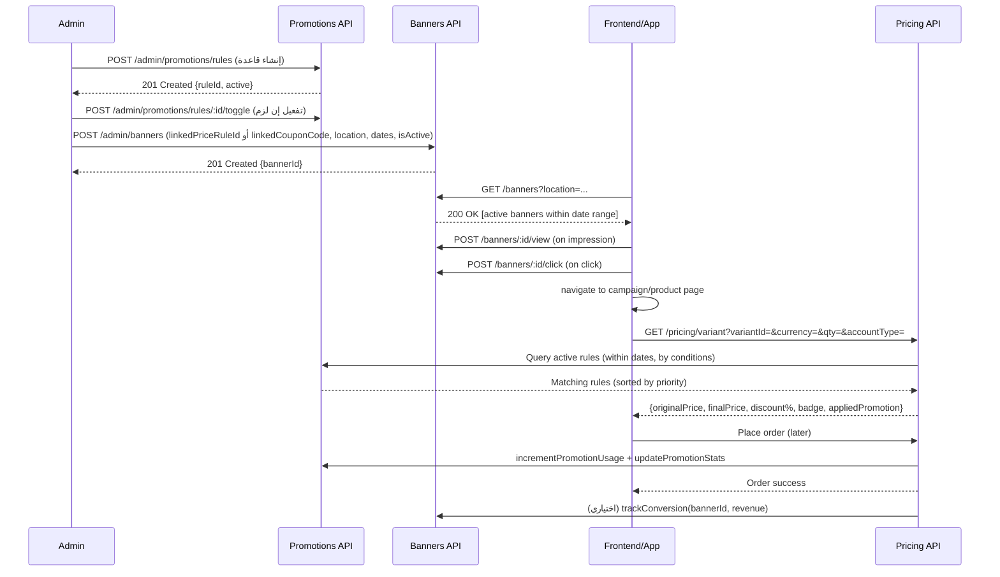

## تدفّق عملي: إنشاء عرض سعري يظهر في بنر (Admin Flow)

يوضح هذا المستند التسلسل الفعلي لخطوات المسؤول لإنشاء قاعدة تسعير (Promotion) وربطها ببنر ليظهر للمستخدمين، مع نقاط التكامل بين `Promotions`, `Banners`, و`Pricing`، وكيف تُحدّث الإحصائيات بعد الشراء.

### ملخص الخطوات
1) ينشئ المسؤول قاعدة سعرية (PriceRule) ويحدد شروطها وتأثيرها ومدة سريانها ويُفعّلها.
2) يربط المسؤول بنرًا بهذه القاعدة (أو بكوبون) ويحدد موقع العرض ومدة ظهوره ويُفعّله.
3) الواجهة العامة تعرض البنر وتُسجل المشاهدات/النقرات، والمستخدم يُوجّه لصفحات المنتجات أو حملة معينة.
4) تسعير المنتجات يُحسب عبر `Pricing` بالاعتماد على قواعد `Promotions` الفعّالة.
5) عند إتمام الطلب، تُحدّث إحصائيات القاعدة (الاستخدام، الإيراد، التوفير) ويمكن تتبع تحويل البنر.

### مخطط تدفّق (Mermaid)
```mermaid
flowchart TD
  A[Admin: إنشاء Price Rule] -->|POST /admin/promotions/rules| B[Rule Created]
  B --> C{تفعيل القاعدة؟}
  C -- نعم --> D[Active Rule]
  C -- لا --> CX[أعد التفعيل: POST /admin/promotions/rules/:id/toggle]

  D --> E[Admin: إنشاء Banner]
  E -->|POST /admin/banners (linkedPriceRuleId أو linkedCouponCode)| F[Banner Created]
  F --> G{البنر مفعّل وضمن المدة؟}
  G -- نعم --> H[Public UI: GET /banners]
  G -- لا --> GX[تعديل البنر/المدة/الحالة]

  H --> I[عرض البنر + تتبع مشاهدة POST /banners/:id/view]
  I --> J{نقر المستخدم؟}
  J -- نعم --> K[POST /banners/:id/click ثم توجيه]
  J -- لا --> L[استمرار التصفح]

  K --> M[صفحة منتج/قائمة]
  M -->|GET /pricing/variant?variantId&currency&qty&accountType| N[تطبيق قواعد التسعير الفعّالة]
  N --> O[إظهار السعر النهائي + الشارة]
  O --> P{اكتمال طلب الشراء؟}
  P -- نعم --> Q[updatePromotionStats + incrementPromotionUsage]
  Q --> R[اختياري: trackConversion للبنر]
  P -- لا --> L
```

### تسلسل زمني تفصيلي (Sequence)


### تفاصيل عملية المسؤول (Admin) خطوة بخطوة
- إنشاء قاعدة تسعير:
  - Endpoint: `POST /admin/promotions/rules`
  - الحقول النموذجية: `priority`, `startAt`, `endAt`, `conditions{ categoryId|productId|variantId|brandId|currency|minQty|accountType }`, `effects{ specialPrice|percentOff|amountOff|badge|giftSku }`, `active`.
  - التحقق/المعاينة (اختياري): `POST /admin/promotions/preview`.
  - التفعيل/التعطيل: `POST /admin/promotions/rules/:id/toggle`.

- إنشاء بنر وربطه بالقاعدة:
  - Endpoint: `POST /admin/banners`
  - الحقول النموذجية: `title`, `image|video|carousel`, `location`, `linkUrl`, `isActive`, `sortOrder`, `startDate`, `endDate`, `metadata`.
  - الربط بالعروض:
    - عبر `linkedPriceRuleId` لقاعدة معيّنة من Promotions.
    - أو عبر `linkedCouponCode` لعرضٍ قائم على كوبون.

### ما يحدث للمستخدم النهائي
- الواجهة تستدعي `GET /banners?location=...` لعرض البنرات النشطة ضمن المدة.
- يتم تسجيل المشاهدة/النقرة. عند النقر يُوجّه المستخدم للحملة/المنتج.
- عند عرض الأسعار، تستدعي الواجهة `GET /pricing/variant?...` لحساب السعر الفعّال.
- تظهر الشارة `badge` إن كانت ضمن تأثير القاعدة.

### التتبع والإحصائيات بعد الشراء
- عند نجاح الطلب:
  - Pricing يقوم بـ `incrementPromotionUsage(promotionId)` و`updatePromotionStats(promotionId, revenue, savings)`.
  - يمكن استدعاء `trackConversion(bannerId, revenue)` لتسجيل التحويل المنسوب للبنر.

### ملاحظات فنية سريعة
- صلاحية القاعدة تعتمد على: `active` + إطار زمني صالح + مطابقة الشروط.
- ظهور البنر يعتمد على: `isActive` + إطار زمني صالح + موقع العرض.
- اختيار القاعدة الأفضل يكون حسب أكبر توفير ثم أعلى `priority` (بحسب منطق التسعير لديك).


