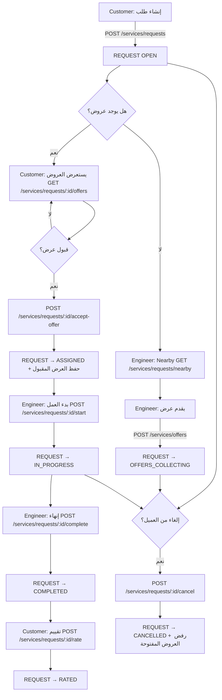
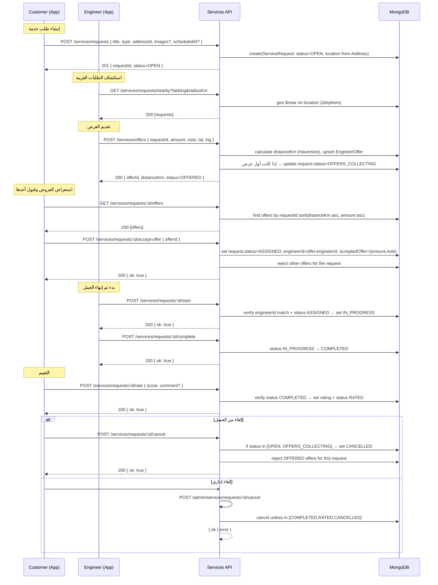

## تدفّق كامل: إنشاء طلب من العميل وتقديم عرض من المهندس

يوضح هذا المستند رحلة النظام كاملة من لحظة إنشاء العميل لطلب الخدمة، مرورًا بعرض المهندس وقبول العرض وبدء/إنهاء العمل، مع حالات الإلغاء والتقييم.

### 1) مخطط تدفّق شامل (Flowchart)

### 2) تسلسل زمني تفصيلي (Sequence Diagram)

### 3) حالات الطلب والعرض (State Reference)
- حالات الطلب: `OPEN → OFFERS_COLLECTING → ASSIGNED → IN_PROGRESS → COMPLETED → RATED` (مع `CANCELLED`).
- حالات العرض: `OFFERED → ACCEPTED` (وإلا تُرفض عند قبول عرض آخر أو الإلغاء).

### 4) قواعد العمل الرئيسية
- ترتيب العروض للعرض على العميل: الأقرب (`distanceKm`) ثم الأرخص (`amount`).
- منع المهندس من رؤية طلباته الخاصة.
- أول عرض يجعل الطلب ينتقل إلى `OFFERS_COLLECTING`.
- قبول عرض واحد يحدد `engineerId` ويرفض بقية العروض المفتوحة.
- بدء/إنهاء العمل مقيدان بمالك العرض المقبول وحالة الطلب الصحيحة.
- الإلغاء مسموح للعميل في حالتي `OPEN` و`OFFERS_COLLECTING` فقط.

### 5) ملاحظات تكامل
- حساب المسافة: دالة Haversine لتعبئة `distanceKm` عند إنشاء/تحديث العرض.
- البحث المكاني: `$near` مع فهرس `2dsphere` على `location` في `ServiceRequest`.
- إشعارات اختيارية عبر `NotificationsPort` لأحداث رئيسية (فتح الطلب، عرض جديد، قبول العرض، بدء/إنهاء، تقييم).

