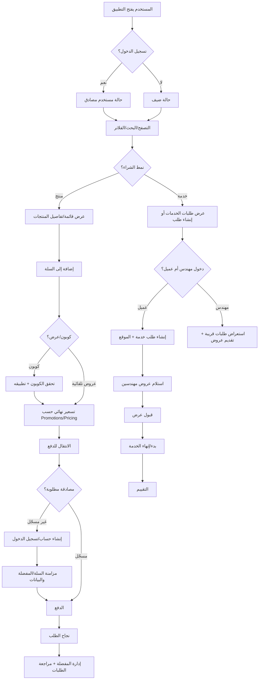
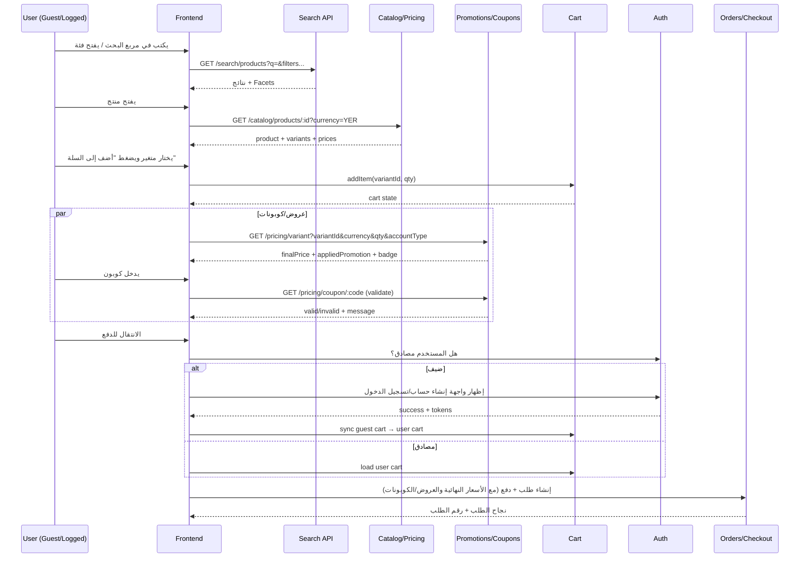
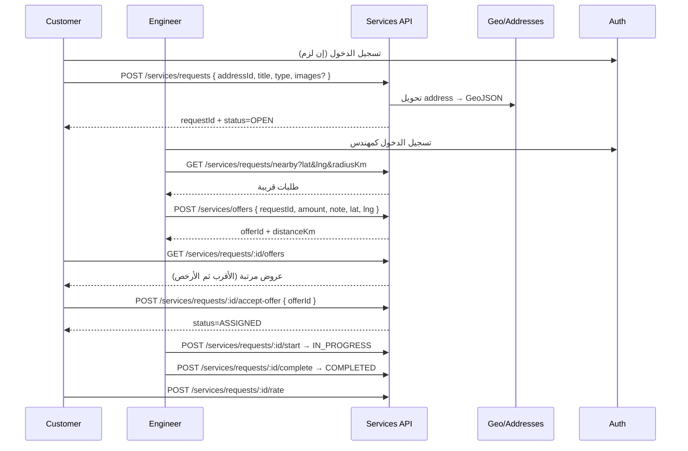

## رحلة المستخدم الشاملة: من فتح التطبيق حتى إتمام الطلب (منتج/خدمة)

يشرح هذا المستند تدفّق تجربة المستخدم بكافة الحالات الواقعية: تصفّح كضيف، البحث والتصفية، التسعير والعروض والكوبونات، السلة، إنشاء/تسجيل الدخول، المزامنة بين الأجهزة، الطلبات للخدمات والمنتجات، والمفضلة.

### 1) مخطط شامل عالي المستوى

### 2) تسلسل تفصيلي لمسار المنتجات

### 3) تسلسل تفصيلي لمسار الخدمات (عميل/مهندس)

### 4) أين تظهر العروض والكوبونات؟
- عند عرض السعر في صفحة المنتج/السلة: يستدعي الواجهة `GET /pricing/variant...` لتطبيق قواعد العروض (Promotions) تلقائيًا واختيار أفضل توفير.
- عند إدخال الكوبون: `GET /pricing/coupon/:code` للتحقق قبل تأكيد الطلب. إن كان صالحًا، يُطبق في التسعير النهائي.
- البنرات: تعرض الحملات بصريًا ويمكن ربطها بقاعدة سعر أو كوبون؛ لكنها لا تستبدل منطق التسعير.

### 5) متى نطلب من المستخدم إنشاء حساب/تسجيل الدخول؟
- كضيف: يُسمح بالتصفح، البحث، الإضافة للسلة، وإدارة مفضلة محلية.
- عند الانتقال للدفع: يُطلب المصادقة (إنشاء/تسجيل الدخول) لضمان العناوين، طرق الدفع، والسجل.
- مزامنة بعد المصادقة: تُدمج سلة الضيف والمفضلة المحلية ضمن حساب المستخدم.

### 6) المزامنة بين الأجهزة
- عند المصادقة: تُرفع سلة/مفضلة الجهاز الحالي وتُدمج مع السحابة (سلة ومفضلة الحساب).
- على الأجهزة الأخرى: عند تسجيل الدخول، يستدعي العميل API لاسترجاع سلة/مفضلة المستخدم.
- تعارضات: سياسة الدمج تفضّل الجمع مع إزالة التكرارات وتجميع الكميات.

### 7) تجربة المفضّلة (Favorites)
- للضيف: حفظ محلي (localStorage/IndexedDB) بعناصر المنتج/الخدمة المفضلة.
- للمستخدم المصادق: حفظ في قاعدة البيانات وربط بـ userId.
- عند المصادقة: دمج المفضلة المحلية في مفضلة الحساب (مع إزالة التكرار)، وتحديث عدادات الاستخدام إن لزم.

### 8) حالات إضافية واقعية
- تغيّر السعر أثناء التصفح: إعادة طلب تسعير قبيل الدفع لضمان السعر النهائي.
- كوبون غير صالح/انتهى: عرض رسالة واضحة وتفاصيل السبب.
- نفاذ مخزون متغير: منع الإضافة للسلة أو اقتراح متغير بديل.
- فشل الدفع: إبقاء السلة كما هي وعرض خيارات دفع بديلة.
- إلغاء خدمة قبل قبول عرض: يسمح الإلغاء، وتُرفض العروض المفتوحة تلقائيًا.

### 9) نقاط تكامل مع الموديولات
- Search: للاكتشاف وواجهات الاقتراحات.
- Catalog: لجلب تفاصيل المنتج/المتغير والسعر الأساس.
- Pricing/Promotions/Coupons: لحساب السعر النهائي والتحقق من الكوبونات.
- Banners: لإبراز الحملات وتسويقها.
- Upload/Media: لعرض صور المنتجات والبنرات.
- Services: لمسار الطلبات الميدانية للمهندسين.
- Auth: للمصادقة وتوليد الرموز ومزامنة السلة/المفضلة.

### 10) قائمة تحقق UX مختصرة
- وضوح حالة المستخدم (ضيف/مسجّل) وأثرها على المزايا.
- عرض شارات العروض `badge` بجانب الأسعار المتأثرة.
- واجهة إدخال كوبون بسيطة مع رسائل خطأ دقيقة.
- حفظ مؤقت للسلة/المفضلة للضيف مع دمج ذكي عند تسجيل الدخول.
- إعادة تسعير قبل الدفع النهائي لتجنّب المفاجآت.

